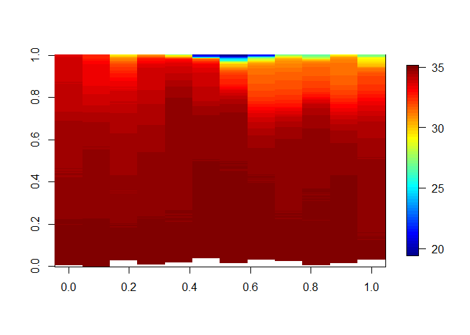
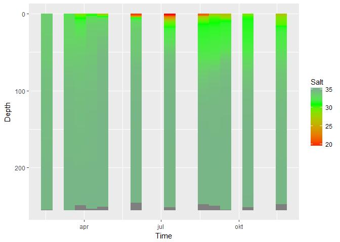
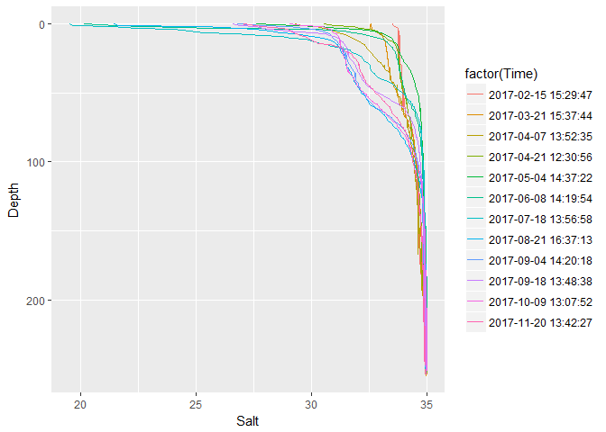
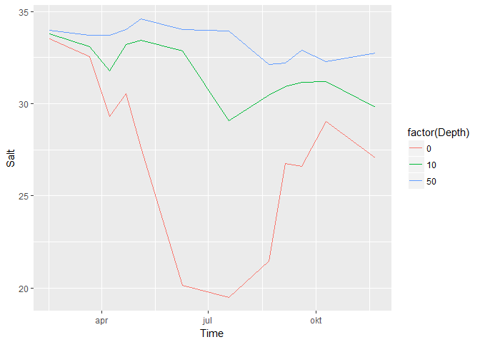
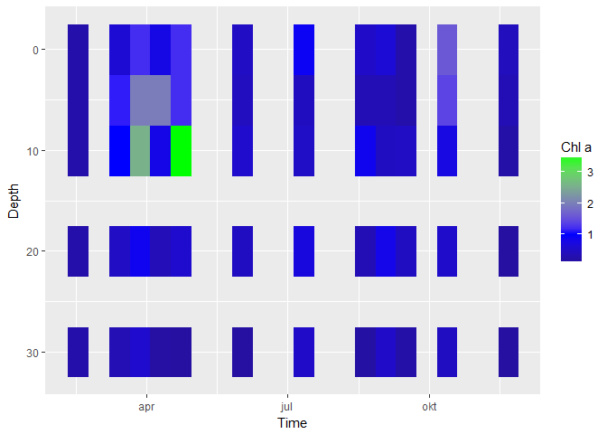
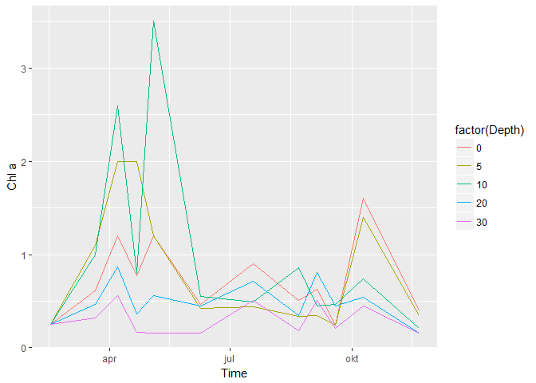

Reading NettCDF (nc) files from the data repository  
`K:\Avdeling\214-Oseanografi\DATABASER\OKOKYST_2017\ncbase_OKOKYST`.   
  
Based on [this guide](http://geog.uoregon.edu/GeogR/topics/netCDF-read-ncdf4.html) for NTCD4.
  
Reads just two variables from one station as example (station 9: VR51 Korsen)


```r
library(ncdf4)

# Function that needs to be run for plotting using image() or image.plot()
transpose_for_image <- function(x) t(x[seq(nrow(x),1,-1),])
library(tidyverse)
```

```
## -- Attaching packages ------------------------------------------------------- tidyverse 1.2.1 --
```

```
## v ggplot2 2.2.1     v purrr   0.2.4
## v tibble  1.4.2     v dplyr   0.7.5
## v tidyr   0.8.1     v stringr 1.3.1
## v readr   1.1.1     v forcats 0.3.0
```

```
## -- Conflicts ---------------------------------------------------------- tidyverse_conflicts() --
## x dplyr::filter() masks stats::filter()
## x dplyr::lag()    masks stats::lag()
```


```r
folder_data <- "K:/Avdeling/214-Oseanografi/DATABASER/OKOKYST_2017/ncbase_OKOKYST"
dir(folder_data)
```

```
##  [1] "Map_Saiv_CTDs.pdf"     "nutrient_statistics.m"
##  [3] "Tools"                 "update.bat"           
##  [5] "VR31.nc"               "VR51.nc"              
##  [7] "VR52.nc"               "VT10.nc"              
##  [9] "VT16.nc"               "VT2.nc"               
## [11] "VT3.nc"                "VT42.nc"              
## [13] "VT52.nc"               "VT53.nc"              
## [15] "VT65.nc"               "VT66.nc"              
## [17] "VT67.nc"               "VT69.nc"              
## [19] "VT70.nc"               "VT71.nc"              
## [21] "VT74.nc"               "VT75.nc"              
## [23] "VT79.nc"
```

Station list (from `print(ncin)` output, see below)
```
    22 global attributes:
        station01: VT3   Torbjoernskjaer   68936
        station02: VT10  Breiangen         31650
        station03: VT70  Bjoernafjorden    68910
        station04: VT69  Korsfjorden       68908
        station05: VT74  Maurangerfjorden  68913
        station06: VT53  Tveitneset        68911
        station07: VT16  Kyrkjeboe         68915
        station08: VT79  Naersnes          68914
        station09: VR51  Korsen            68871
        station10: VT71  Skinnbrokleia     63018
        station11: VT42  Korsfjorden       59644
        station12: VR52  Broemsneset       68869
        station13: VR31  Tilremsfjorden    68870
        station14: VT81  Alvenes           68950
        station15: VT82  Setsaa            68951
        station16: VT43  Kongsbakkneset    68937
        station17: VT28  Tjukkeneset       68933
        station18: VR54  Straumsfjorden    68938
        station19: VR7   Langfjordnes      68971
        station20: VR24  Tanafjorden       68972
        station21: VR21  Bugoeynes         68973
```

## Open file

```r
fn <- "VR51.nc"
ncin <- nc_open(paste0(folder_data, "/", fn))
# This makes a pretty long output:
# print(ncin)
# but it does 
```

## List dimensions and variables
Variables: depth1, depth2, lat, lon, ProjectId, StationId, temp, salt, turb, fluor, O2mg, O2sat, TotP, PO4, TotN, NO3, NH4, SiO2, TSM, KlfA, CFYT, CFYT1, CFYT2, CFYT3, FYT, FYT1, FYT2, FYT3, secchi, Sd  
Dimensions: depth, depth_nut, station, time  

### Position of station
Longitude, latitude: 7.0061, 62.0944

### Dimensions
For depth, there are two types of dimensions:
  - for CTD variables (e.g. salinity), use 'depth'
  - for water sample varibles (e.g. Chl a, nutrients), use 'depth_nut'
#### Read dimensions

```r
time <- ncvar_get(ncin, "time")
depth <- ncvar_get(ncin, "depth")
depth_nut <- ncvar_get(ncin, "depth_nut")
```
#### Dimensions of time, depth, depth of nutrient samples
  - time: 12  
  - depth: 256
  - depth_nut: 5  
  
#### Range of time, depth, depth of nutrient samples:

```r
range(time)
```

```
## [1] 1487172588 1511185347
```

```r
range(depth)
```

```
## [1]   0 255
```

```r
range(depth_nut)
```

```
## [1]  0 30
```

#### Turn time into time object

```r
time <- as.POSIXct(time, tz = "UTC", origin = "1970-01-01")
```
Time range: 2017-02-15 15:29:47, 2017-11-20 13:42:27

## Salinity (as example of CTD variable) - read data

```r
salt <- ncvar_get(ncin, "salt")
dim(salt)
```

```
## [1] 256  12
```
### Salinity, plot using fields

```r
fields::image.plot(transpose_for_image(salt))
```

<!-- -->
### Make tidy data (for ggplot + anlysis)

```r
df <- data.frame(Depth = depth, salt)
colnames(df)[-1] <- paste0("t_", time)
df2 <- gather(df, "Time", "Salt", -Depth)
df2$Time <- lubridate::ymd_hms(sub("t_","",df2$Time))
head(df2, 3)
```

```
##   Depth                Time     Salt
## 1     0 2017-02-15 15:29:47 33.51111
## 2     1 2017-02-15 15:29:47 33.54590
## 3     2 2017-02-15 15:29:47 33.63703
```

### Salinity, plot using ggplot

```r
ggplot(df2, aes(Time, Depth, fill = Salt)) + 
  geom_raster() +
  scale_fill_gradient2(low = "red", mid = "green", high = "blue", midpoint = 31) +
  scale_y_reverse()
```

<!-- -->
### Salinity, plot profiles

```r
ggplot(df2, aes(Salt, Depth, color = factor(Time))) +
  geom_line() + 
  scale_y_reverse()
```

```
## Warning: Removed 56 rows containing missing values (geom_path).
```

<!-- -->
### Salinity, plot time series

```r
ggplot(df2 %>% filter(Depth %in% c(0,10,50)), aes(Time, Salt, color = factor(Depth))) +
  geom_line()
```

<!-- -->

## Chlorophyll a (as example of a water sample variable)

```r
chla <- ncvar_get(ncin, "KlfA")
df <- data.frame(Depth = depth_nut, chla)        # using depth_nut instead of depth
colnames(df)[-1] <- paste0("t_", time)
df2 <- gather(df, "Time", "Chl a", -Depth)
df2$Time <- lubridate::ymd_hms(sub("t_","",df2$Time))
head(df2, 3)
```

```
##   Depth                Time Chl a
## 1     0 2017-02-15 15:29:47  0.25
## 2     5 2017-02-15 15:29:47  0.25
## 3    10 2017-02-15 15:29:47  0.25
```

### Chlorophyll a, image plot

```r
ggplot(df2, aes(Time, Depth, fill = `Chl a`)) + 
  geom_raster() +
  scale_fill_gradient2(low = "black", mid = "blue", high = "green", midpoint = 1) +
  scale_y_reverse()
```

<!-- -->
### Chlorophyll a, time series plot

```r
ggplot(df2, aes(Time, `Chl a`, color = factor(Depth))) +
  geom_line()
```

<!-- -->

