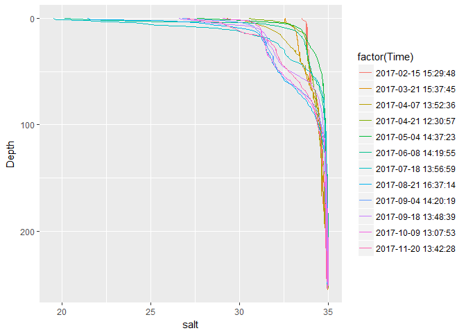
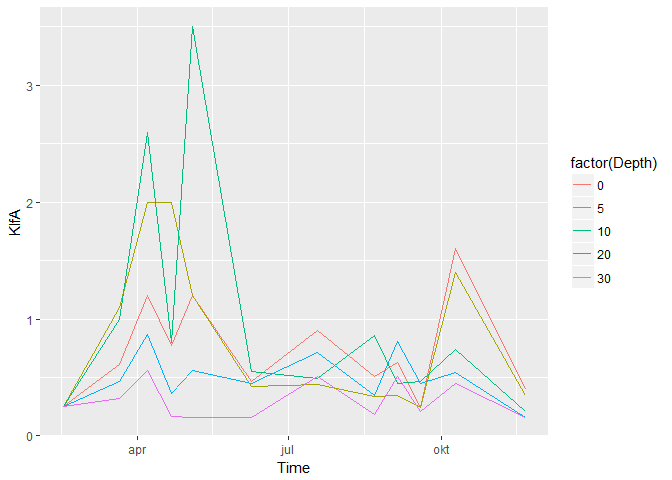
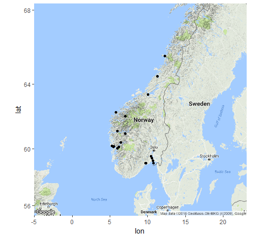

## Libraries and functions

```r
library(ncdf4)
library(tidyverse)
```

```
## -- Attaching packages ---------------------------------------------------------------------- tidyverse 1.2.1 --
```

```
## v ggplot2 2.2.1     v purrr   0.2.4
## v tibble  1.4.2     v dplyr   0.7.5
## v tidyr   0.8.1     v stringr 1.3.1
## v readr   1.1.1     v forcats 0.3.0
```

```
## -- Conflicts ------------------------------------------------------------------------- tidyverse_conflicts() --
## x dplyr::filter() masks stats::filter()
## x dplyr::lag()    masks stats::lag()
```

```r
library(ggmap)
library(readxl)

# Function that needs to be run for plotting using image() or image.plot()
transpose_for_image <- function(x) t(x[seq(nrow(x),1,-1),])

# Load function okokyst_read_nc()
source("02_Read_all_functions.R")

# Maps for used with ggplot
map1 <- get_googlemap(c(lon=9, lat=62.5), zoom=4) %>% ggmap()
```

```
## Map from URL : http://maps.googleapis.com/maps/api/staticmap?center=62.5,9&zoom=4&size=640x640&scale=2&maptype=terrain&sensor=false
```

```r
map2 <- get_googlemap(c(lon=9, lat=62.5), zoom=5) %>% ggmap()
```

```
## Map from URL : http://maps.googleapis.com/maps/api/staticmap?center=62.5,9&zoom=5&size=640x640&scale=2&maptype=terrain&sensor=false
```

```r
# Specify folder for nc files
folder_data <- "K:/Avdeling/214-Oseanografi/DATABASER/OKOKYST_2017/ncbase_OKOKYST"
```

## Get station attributes

```r
fn <- "K:/Avdeling/214-Oseanografi/DATABASER/OKOKYST_2017/OKOKYST_Hydrografi_Stasjoner_v5.xlsx"
df_stations <- read_excel(fn) %>% 
  rename(ProjectName = ProjcetName)
df_stations$StationName[9] <- "Korsfjorden_Hord"
df_stations$StationName[18] <- "Korsfjorden_Trønd"
```

## Test reads
### Test read 1

```r
df <- okokyst_read_nc("VR51.nc", "salt", ctd_variable = TRUE)
ggplot(df, aes(salt, Depth, color = factor(Time))) +
  geom_line() + 
  scale_y_reverse()
```

```
## Warning: Removed 56 rows containing missing values (geom_path).
```

<!-- -->

### Test read 2

```r
# debugonce(okokyst_read_nc)
df <- okokyst_read_nc("VR51.nc", "KlfA", ctd_variable = FALSE)
ggplot(df, aes(Time, KlfA, color = factor(Depth))) +
  geom_line()
```

<!-- -->

## Read chlorophyll KlfA from all files

```r
# Filenames
fn_nc <- grep(".nc", dir(folder_data), fixed = TRUE, value = TRUE)

# For checking for errors:
# df_chla <- fn_nc %>% map_df(~okokyst_read_nc(., "KlfA", ctd_variable = FALSE, report = TRUE))
df_data <- fn_nc %>% map_df(~okokyst_read_nc(., "KlfA", ctd_variable = FALSE))

xtabs(~is.na(KlfA) + Filename, df_data)
```

```
##            Filename
## is.na(KlfA) VR31.nc VR51.nc VR52.nc VT10.nc VT16.nc VT2.nc VT3.nc VT42.nc
##       FALSE      59      60      60      65      60     60     65      55
##       TRUE        1       0       0       0       0      5      0       5
##            Filename
## is.na(KlfA) VT52.nc VT53.nc VT65.nc VT66.nc VT67.nc VT69.nc VT70.nc
##       FALSE      55      60      60      60      60      12      60
##       TRUE        5       0       5       5       5      48       0
##            Filename
## is.na(KlfA) VT71.nc VT74.nc VT75.nc VT79.nc
##       FALSE      60      60      55      60
##       TRUE        0       0       5       0
```

### Add ProjectName, StationName

```r
df_chla <- df_data %>%
  mutate(StationCode = sub(".nc", "", Filename, fixed = TRUE)) %>%
  left_join(df_stations %>% select(StationCode, StationName, ProjectName)) %>% 
  select(ProjectName, StationName, StationCode, Long, Lat, Time, Depth, KlfA)
```

```
## Joining, by = "StationCode"
```

```r
# Test (should be empty, i.e. 0 rows)
df_chla %>%
  filter(is.na(StationName)) %>%
  group_by(StationCode) %>%
  summarize(N = n())
```

```
## # A tibble: 0 x 2
## # ... with 2 variables: StationCode <chr>, N <int>
```

## Plot of stations

```r
map2 + 
  scale_shape_identity() + scale_fill_identity() +
  geom_point(data = df_chla, aes(x = Long, y = Lat))
```

<!-- -->

## Test plot of all data

```r
ggplot(df_chla %>% 
         mutate(StationName = factor(StationName, levels = df_stations$StationName)), 
       aes(Time, KlfA, color = factor(Depth))) +
  geom_line() +
  scale_color_brewer("Depth", type = "seq") +
  facet_wrap(~StationName) +
  theme_dark()
```

```
## Warning: Removed 1 rows containing missing values (geom_path).
```

<!-- -->

## Save data

```r
saveRDS(df_chla, "Data/02_df_chla.RData")
```


