## Library

```r
library(tidyverse)
```

```
## -- Attaching packages --------------------------------------- tidyverse 1.2.1 --
```

```
## v ggplot2 2.2.1     v purrr   0.2.4
## v tibble  1.4.2     v dplyr   0.7.5
## v tidyr   0.8.1     v stringr 1.3.1
## v readr   1.1.1     v forcats 0.3.0
```

```
## -- Conflicts ------------------------------------------ tidyverse_conflicts() --
## x dplyr::filter() masks stats::filter()
## x dplyr::lag()    masks stats::lag()
```

```r
library(lubridate)
```

```
## 
## Attaching package: 'lubridate'
```

```
## The following object is masked from 'package:base':
## 
##     date
```

## Data
Saved in script 02

```r
df_chla <- readRDS("Data/02_df_chla.RData")
df_stations <- readRDS("Data/02_df_stations.RData")
```

## Make data set for plots
Pick 0 and 5 m and rearrange so 

```r
df_chla2 <- df_chla %>% 
  filter(Depth >= 5 & Depth <= 10) %>%
  spread(Depth, KlfA) %>%
  rename(Depth_10_m = `10`, Depth_05_m = `5`) %>%
  mutate(Abs_difference_10m_vs_05m = Depth_10_m - Depth_05_m,
         Perc_difference_10m_vs_05m = 100*(Depth_10_m - Depth_05_m)/Depth_05_m,
         StationName = factor(StationName, levels = df_stations$StationName))

# Adding 'StationCodeName' for graphs
df_chla$StationCodeName  <- with(df_chla, paste(StationCode, StationName))
df_chla2$StationCodeName  <- with(df_chla2, paste(StationCode, StationName))

# Checking (line 1 should be 2x line 2)
df_chla %>% filter(Depth <= 5) %>% nrow()
```

```
## [1] 468
```

```r
df_chla2 %>% nrow()
```

```
## [1] 234
```

### Summary of data

```
## Summary of data
```

```
##    Depth_10_m       Depth_05_m    Abs_difference_10m_vs_05m
##  Min.   :0.1600   Min.   :0.160   Min.   :-7.4000          
##  1st Qu.:0.3900   1st Qu.:0.580   1st Qu.:-0.4850          
##  Median :0.7400   Median :0.970   Median :-0.1000          
##  Mean   :0.9835   Mean   :1.165   Mean   :-0.2018          
##  3rd Qu.:1.3000   3rd Qu.:1.500   3rd Qu.: 0.0550          
##  Max.   :5.8000   Max.   :9.300   Max.   : 3.8000          
##  NA's   :19       NA's   :7       NA's   :19               
##  Perc_difference_10m_vs_05m
##  Min.   :-82.353           
##  1st Qu.:-36.285           
##  Median :-16.129           
##  Mean   : -9.117           
##  3rd Qu.:  6.695           
##  Max.   :191.667           
##  NA's   :19
```

```
## Abs_difference_10m_vs_05m, percentiles
```

```
##     0%    20%    40%    60%    80%   100% 
## -7.400 -0.570 -0.200 -0.046  0.100  3.800
```

```
## Abs_difference_10m_vs_05m, percentiles of absolute values
```

```
##    0%   20%   40%   60%   80%  100% 
## 0.000 0.070 0.166 0.320 0.676 7.400
```

```
## Perc_difference_10m_vs_05m, percentiles
```

```
##         0%        20%        40%        60%        80%       100% 
## -82.352941 -40.235294 -25.000000  -6.952381  12.396396 191.666667
```

```
## Perc_difference_10m_vs_05m, percentiles of absolute values
```

```
##         0%        20%        40%        60%        80%       100% 
##   0.000000   9.072727  22.888889  35.155280  48.644377 191.666667
```

## Absolute difference
### Absolute difference, 5 m vs 10 m {.tabset}

#### Full x and y scales
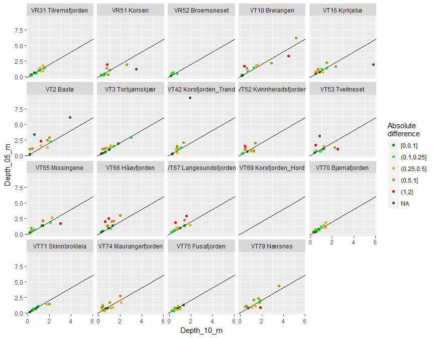<!-- -->

#### Restricted x and y scales (not showing all points)
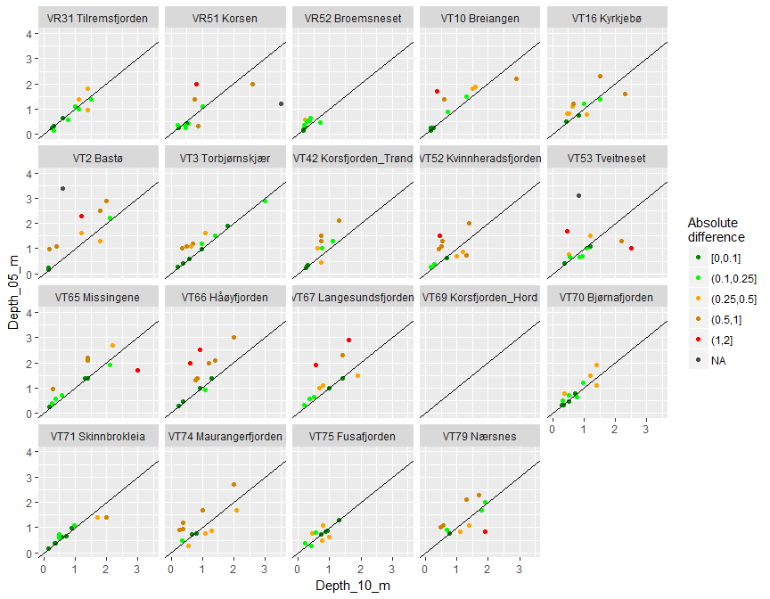<!-- -->

### Absolute difference, time series {.tabset}
#### Full y scale
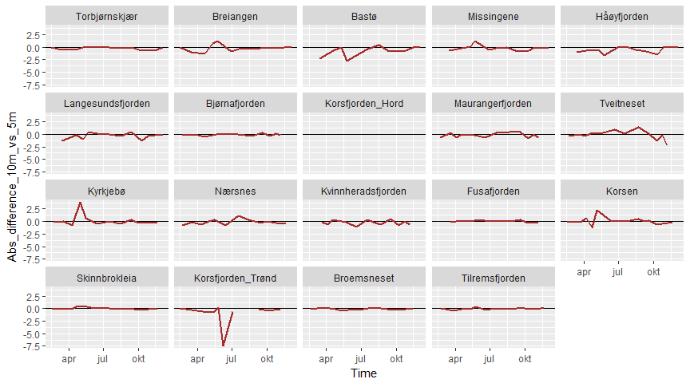<!-- -->

#### Restricted y scale
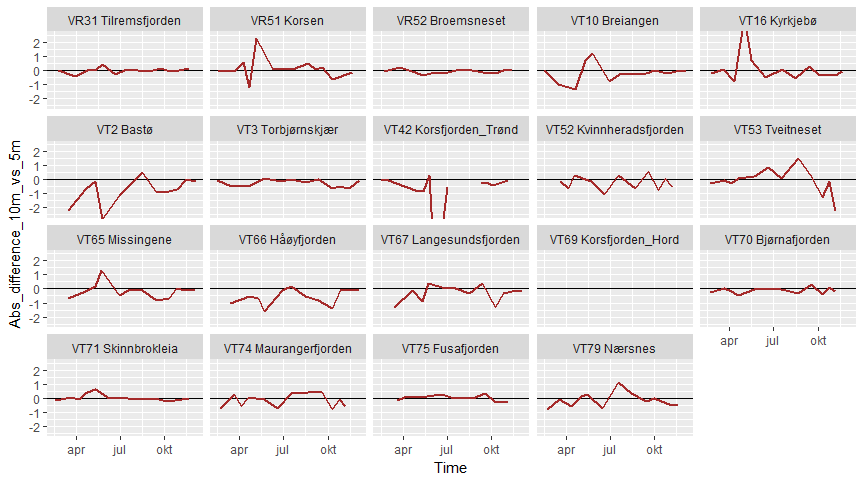<!-- -->

### Time series of Chl a at 5 m, absolute difference as colour {.tabset}
  * Coloured/connected dots: Chl a at 5 m  
  * Blue crosses: Chl a at 10 m
  
#### Full y scale
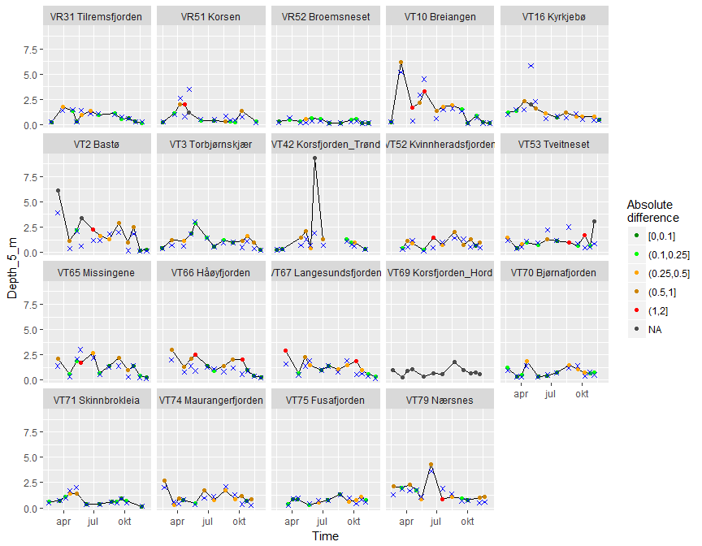<!-- -->

#### Restricted y scale
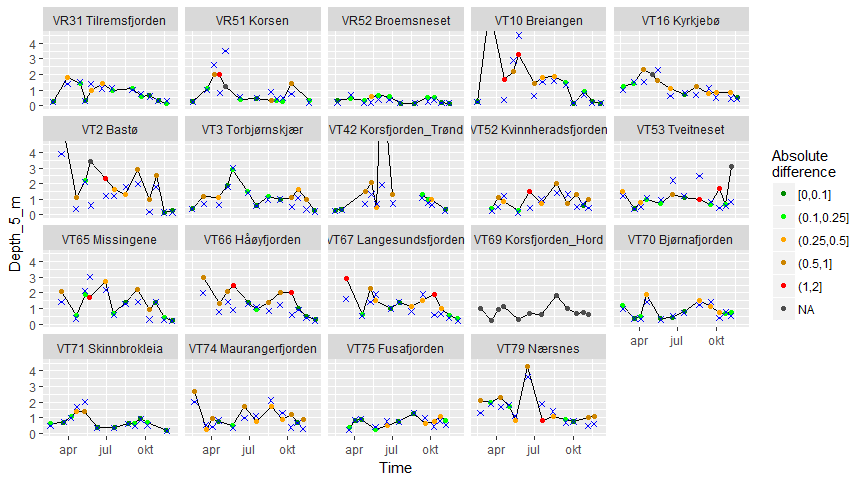<!-- -->

## Percent difference
### Percent difference, 5 m vs 10 m {.tabset}

#### Full x and y scales
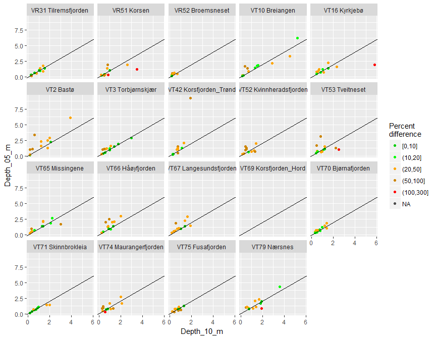<!-- -->


#### Restricted x and y scales (not showing all points)
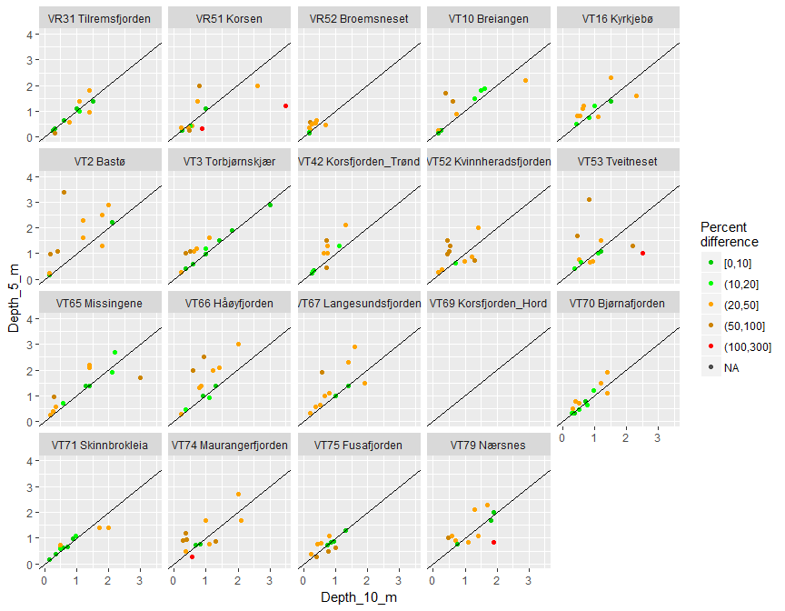<!-- -->

### Percent difference, time series {.tabset}

#### Full y scale
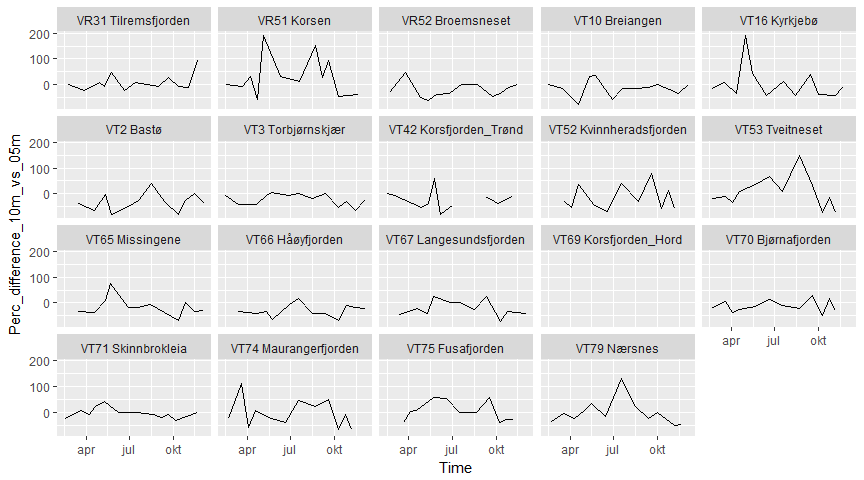<!-- -->

### Time series of Chl a at 5 m, percent difference as colour {.tabset}
  * Coloured/connected dots: Chl a at 5 m  
  * Blue crosses: Chl a at 10 m

#### Full y scale
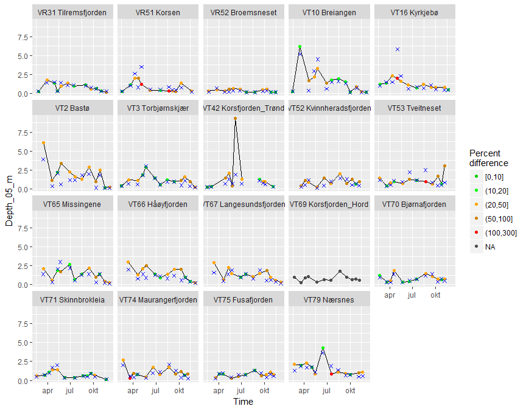<!-- -->

#### Restricted y scale
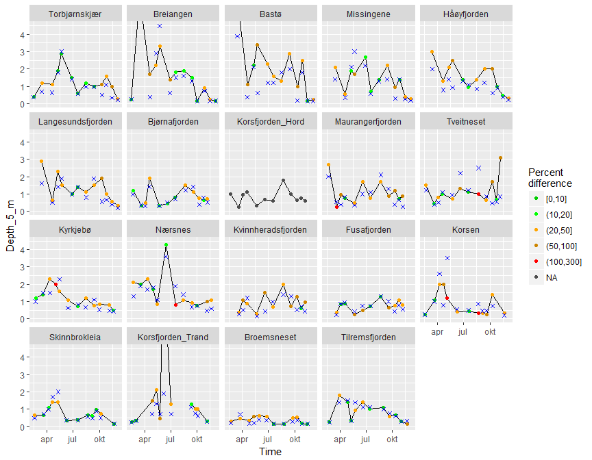<!-- -->


# Absolute difference, plots for each station   
### Define stations  

```r
# unique(df_chla2$StationCodeName) %>% dput()
stations_oceanic <- c("VT70 Bjørnafjorden", 
                   "VT71 Skinnbrokleia",
                   "VR31 Tilremsfjorden", 
                   "VT3 Torbjørnskjær")

stations_fjord <- c("VT75 Fusafjorden", 
  "VT52 Kvinnheradsfjorden", "VT16 Kyrkjebø", "VT74 Maurangerfjorden", 
  "VT79 Nærsnes", "VT53 Tveitneset", "VR51 Korsen",
  "VR52 Broemsneset", "VT42 Korsfjorden_Trønd",  
  "VT2 Bastø", "VT10 Breiangen", "VT66 Håøyfjorden", 
  "VT67 Langesundsfjorden",   "VT65 Missingene")
```
  
### Scatter plot (10 m vs 5 m), function  
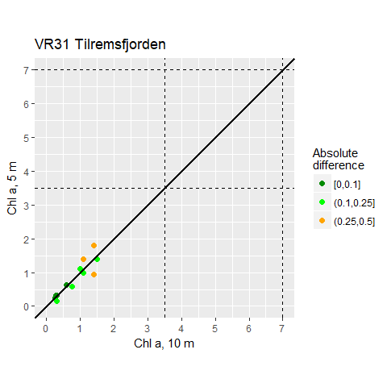<!-- -->

#### Scatter, oceanic stations

```r
# For showing in notebook
# stations_oceanic %>% walk(~print(plot_scatter(.)))

# For saving
stations_oceanic %>% walk(~save_scatter(., "Oceanic"))
```

#### Scatter, closed stations

```r
stations_fjord %>% walk(~save_scatter(., "Fjord"))
```


### Time series plot, function
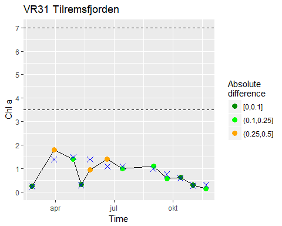<!-- -->

#### Time series plots, oceanic stations

```r
stations_oceanic %>% walk(~save_time(., "Oceanic"))
```

#### Time series plots, fjord stations

```r
stations_fjord %>% walk(~save_time(., "Fjord"))
```
