## Library

```r
library(tidyverse)
```

```
## -- Attaching packages -------------------------------------------------------- tidyverse 1.2.1 --
```

```
## v ggplot2 2.2.1     v purrr   0.2.4
## v tibble  1.4.2     v dplyr   0.7.5
## v tidyr   0.8.1     v stringr 1.3.1
## v readr   1.1.1     v forcats 0.3.0
```

```
## -- Conflicts ----------------------------------------------------------- tidyverse_conflicts() --
## x dplyr::filter() masks stats::filter()
## x dplyr::lag()    masks stats::lag()
```

## Data
Saved in script 02

```r
df_chla <- readRDS("Data/02_df_chla.RData")
df_stations <- readRDS("Data/02_df_stations.RData")
```

## Make data set for plots
Pick 0 and 5 m and rearrange so 

```r
df_chla2 <- df_chla %>% 
  filter(Depth >= 0 & Depth <= 5) %>%
  spread(Depth, KlfA) %>%
  rename(Depth_00_m = `0`, Depth_05_m = `5`) %>%
  mutate(Abs_difference_00m_vs_05m = Depth_00_m - Depth_05_m,
         Perc_difference_00m_vs_05m = 100*(Depth_00_m - Depth_05_m)/Depth_05_m,
         StationName = factor(StationName, levels = df_stations$StationName))
df_chla2$StationCodeName  <- with(df_chla2, paste(StationCode, StationName))
# Checking (line 1 should be 2x line 2)
df_chla %>% filter(Depth <= 5) %>% nrow()
```

```
## [1] 468
```

```r
df_chla2 %>% nrow()
```

```
## [1] 234
```

### Summary of data

```
## Summary of data
```

```
##    Depth_00_m      Depth_05_m    Abs_difference_00m_vs_05m
##  Min.   :0.120   Min.   :0.160   Min.   :-8.5800          
##  1st Qu.:0.610   1st Qu.:0.580   1st Qu.:-0.2000          
##  Median :0.980   Median :0.970   Median : 0.0000          
##  Mean   :1.203   Mean   :1.165   Mean   : 0.0173          
##  3rd Qu.:1.500   3rd Qu.:1.500   3rd Qu.: 0.2700          
##  Max.   :6.200   Max.   :9.300   Max.   : 2.5000          
##  NA's   :19      NA's   :7       NA's   :19               
##  Perc_difference_00m_vs_05m
##  Min.   :-92.26            
##  1st Qu.:-17.91            
##  Median :  0.00            
##  Mean   : 23.77            
##  3rd Qu.: 36.04            
##  Max.   :775.00            
##  NA's   :19
```

```
## Abs_difference_00m_vs_05m, percentiles
```

```
##     0%    20%    40%    60%    80%   100% 
## -8.580 -0.300 -0.020  0.070  0.404  2.500
```

```
## Abs_difference_00m_vs_05m, percentiles of absolute values
```

```
##    0%   20%   40%   60%   80%  100% 
## 0.000 0.048 0.162 0.350 0.772 8.580
```

```
## Perc_difference_00m_vs_05m, percentiles
```

```
##         0%        20%        40%        60%        80%       100% 
## -92.258065 -24.310345  -3.742857  10.690789  50.927885 775.000000
```

```
## Perc_difference_00m_vs_05m, percentiles of absolute values
```

```
##         0%        20%        40%        60%        80%       100% 
##   0.000000   7.692308  16.511628  35.974026  64.019324 775.000000
```

## Absolute difference
### Absolute difference, 5 m vs 0 m {.tabset}

#### Full x and y scales
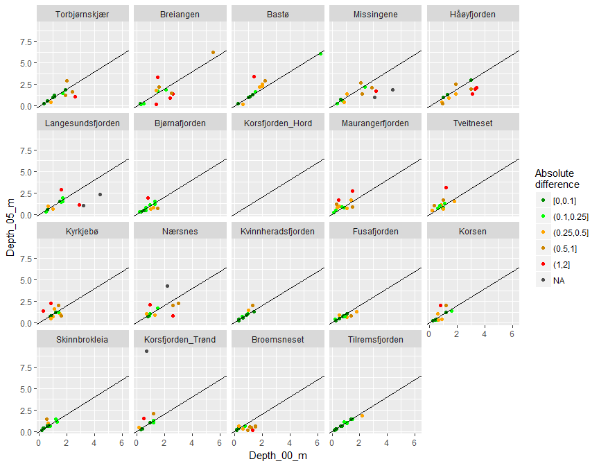<!-- -->

#### Restricted x and y scales (not showing all points)
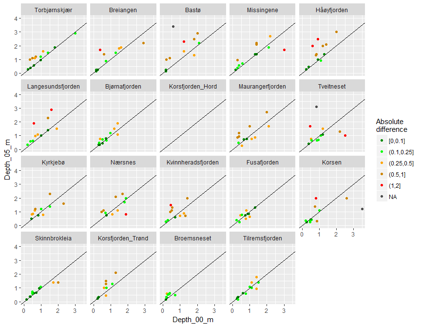<!-- -->

### Absolute difference, time series {.tabset}
#### Full y scale
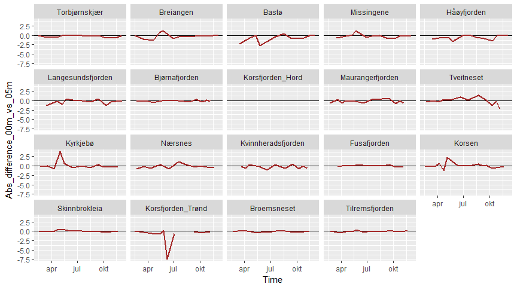<!-- -->

#### Restricted y scale
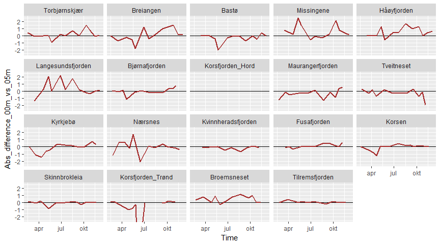<!-- -->

### Time series of Chl a at 5 m, absolute difference as colour {.tabset}
  * Co loured/connected dots: Chl a at 5 m  
  * Blue crosses: Chl a at 0 m
  
#### Full y scale
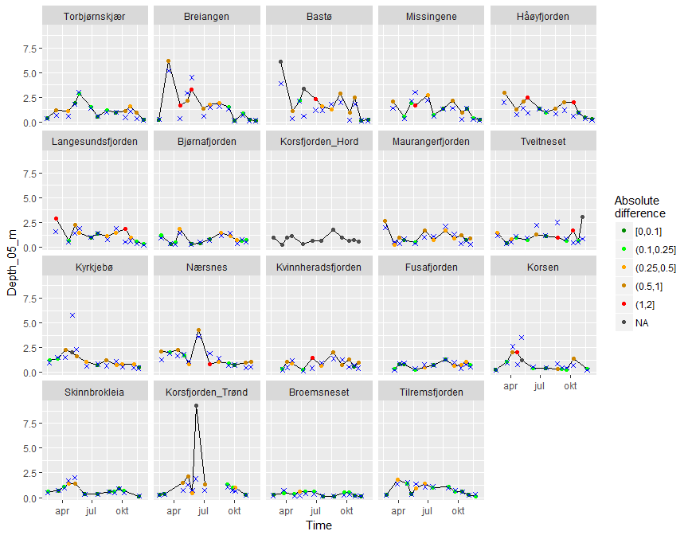<!-- -->

#### Restricted y scale
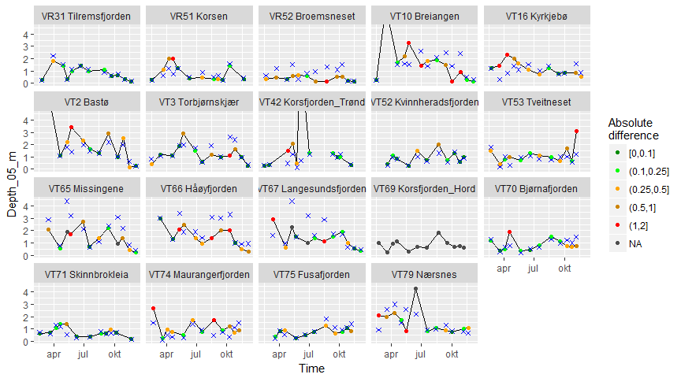<!-- -->

## Percent difference
### Percent difference, 5 m vs 0 m {.tabset}

#### Full x and y scales
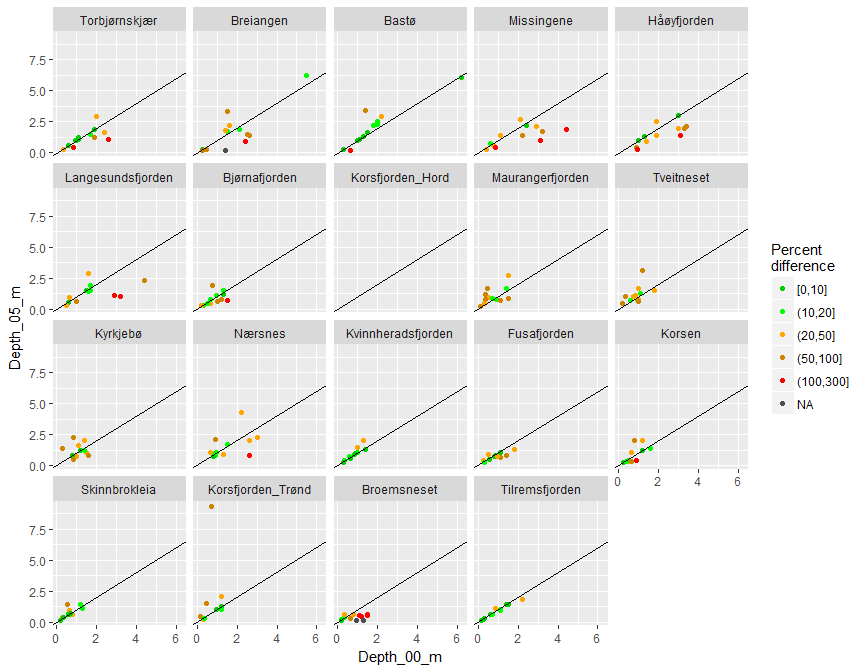<!-- -->


#### Restricted x and y scales (not showing all points)
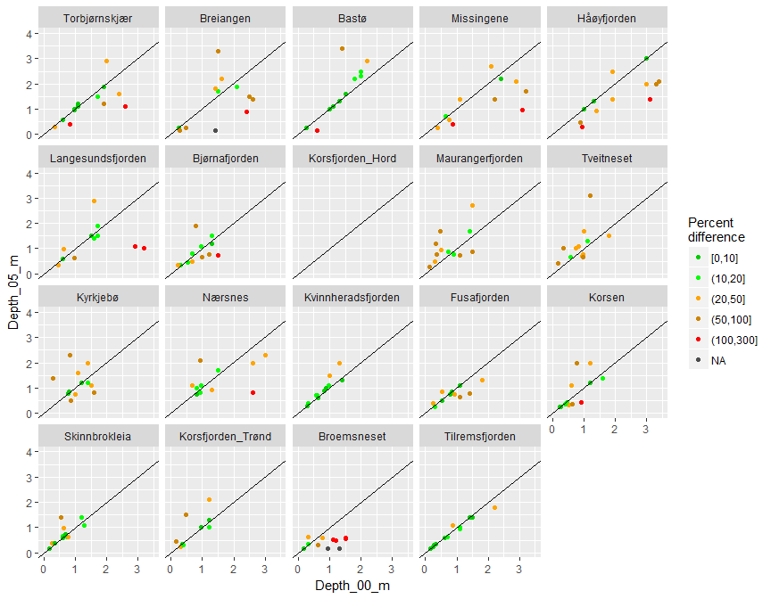<!-- -->

### Percent difference, time series {.tabset}

#### Full y scale
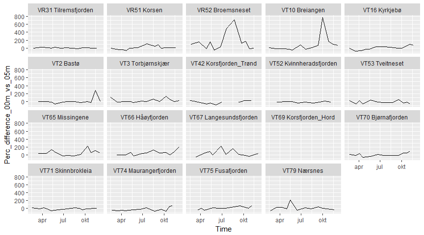<!-- -->

### Time series of Chl a at 5 m, percent difference as colour {.tabset}
  * Coloured/connected dots: Chl a at 5 m  
  * Blue crosses: Chl a at 0 m

#### Full y scale
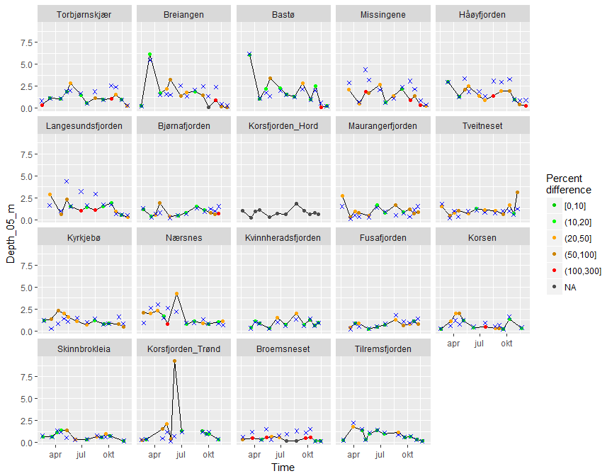<!-- -->

#### Restricted y scale
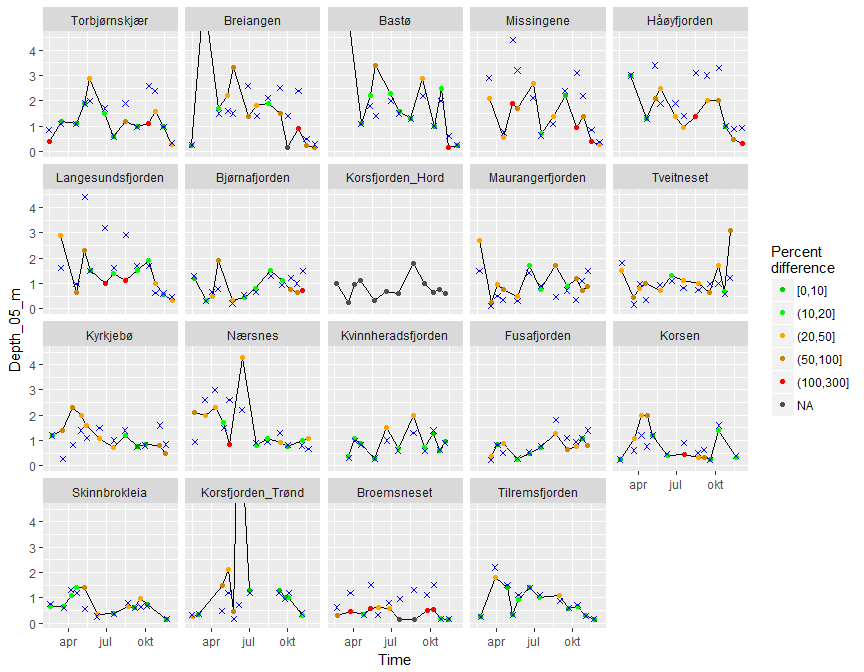<!-- -->

