### QC done January 2020   
- Only CTDs with salinity + temp only    
- See mail from Caroline Mengeot <caroline.mengeot@niva.no> tirsdag 28. januar 2020 10:33  


## 1. Read file   
Only one file in this case, as in script 16 (and in contrast to script 15)  

```
## Joining, by = c("ProjectId", "StationId")
```


## 2. Tables of stations    

```
## # A tibble: 6 x 2
##   StationCode     n
##   <chr>       <int>
## 1 Gl_1         1942
## 2 Gl_2         2019
## 3 Gl_3         1980
## 4 Gl_4         1933
## 5 Gl_5         1337
## 6 Gl_6          631
```


## 3. Salinity  
_NOTE: also see plots for top 20 m further down._  
   
- Gl_5: Profile looks strange at 20-30 m in April 2019 (and no pattern in temperature)  
   
- Very low salinity at 0-1 meter:     
    + Dec 2018 at Gl_3 and Gl_5: Dubious? no indication of top freshwater layer in temperature  
    + 4. April 2019 Gl_5: Dubious? no indication of top freshwater layer in temperature  
    + 21 June 2019 at Gl_6: Dubious? little indication of top freshwater layer in temperature  
    + July 2019 at Gl_2 and Gl_3: probably OK - temperature also indicates top freshwater layer  
    + 15 Aug 2019 at Gl_2 and Gl_4: Dubious? little indication of top freshwater layer in temperature  

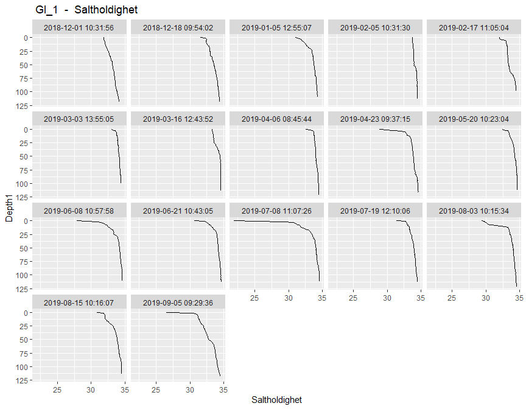<!-- --><!-- -->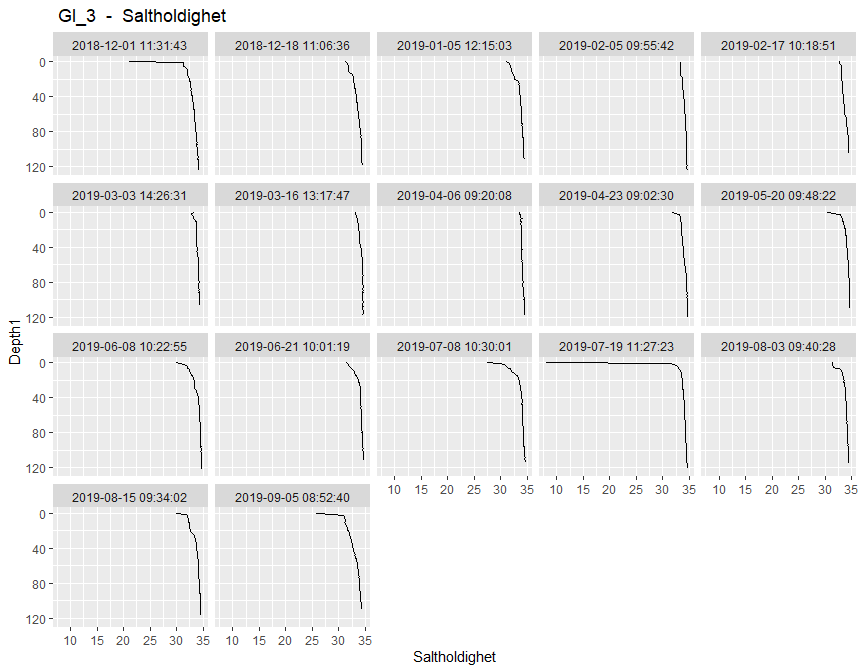<!-- --><!-- -->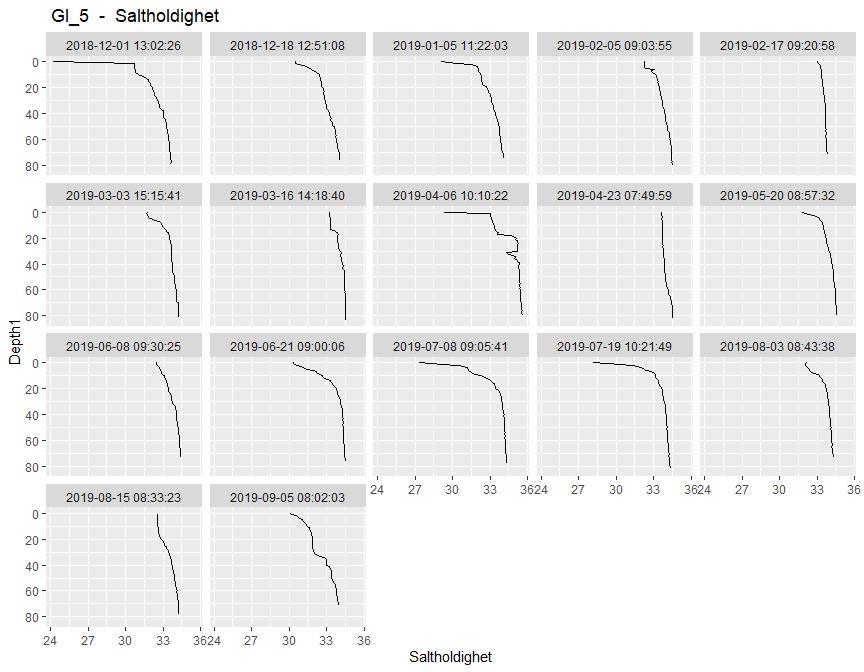<!-- -->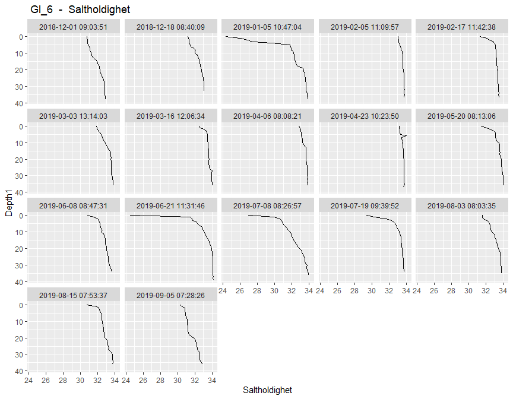<!-- -->


## 4. Temperature    
_NOTE: also see plots for top 20 m further down._  
  
- Gl_5: 23. April 2019 - Both salinity and temperature looks almost stuck during the top 20 m, but both do in fact vary  
  
<!-- -->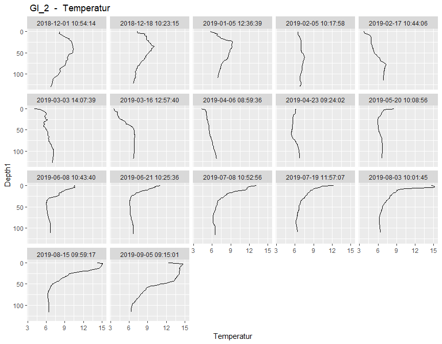<!-- -->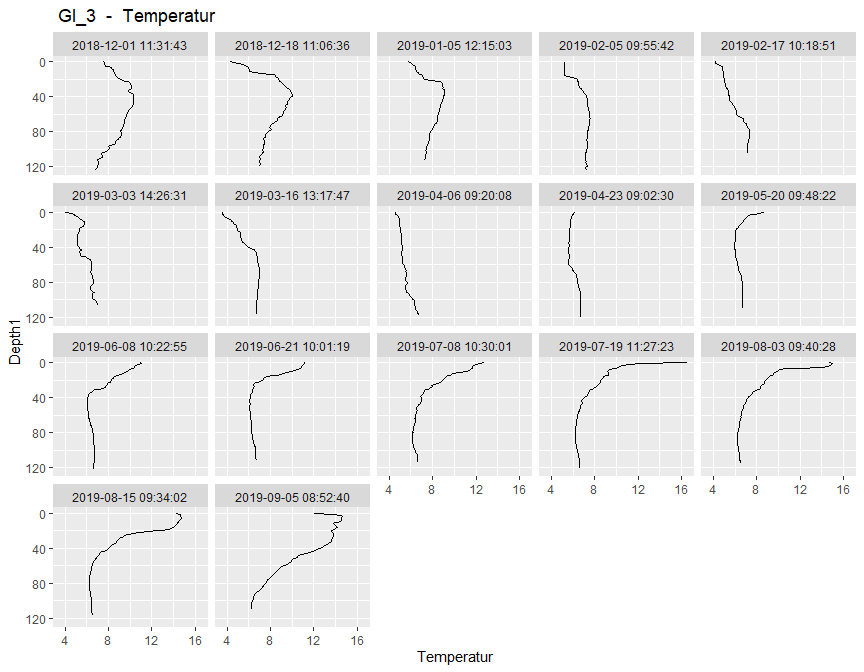<!-- -->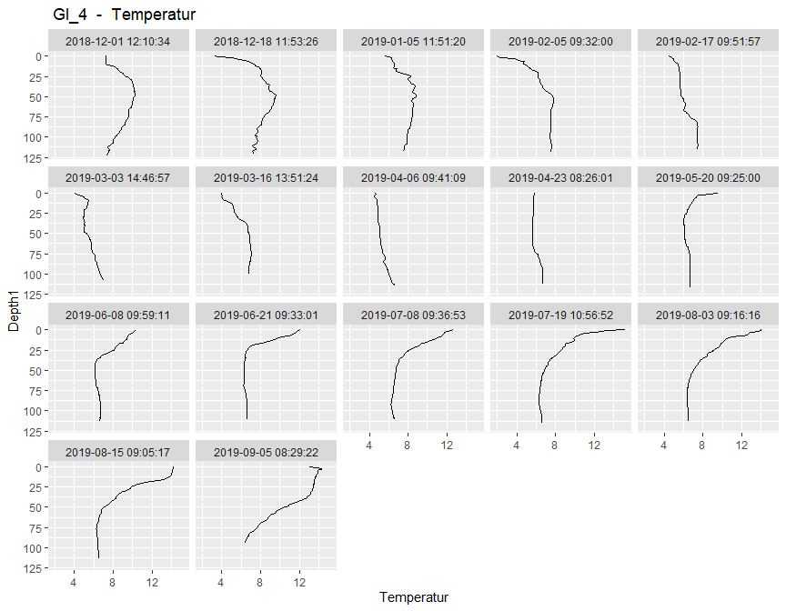<!-- -->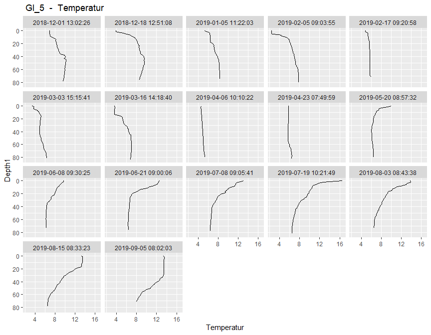<!-- --><!-- -->

## 5. Salinity top 20 m 
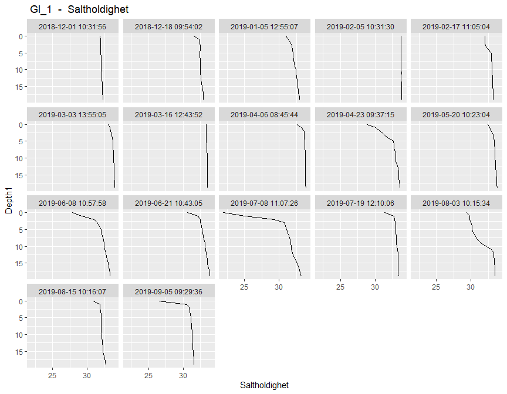<!-- --><!-- -->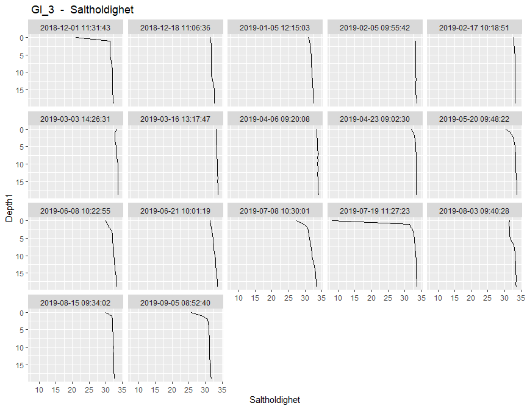<!-- --><!-- -->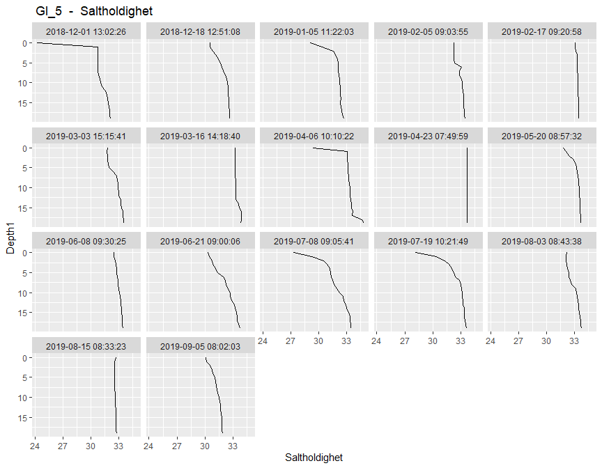<!-- -->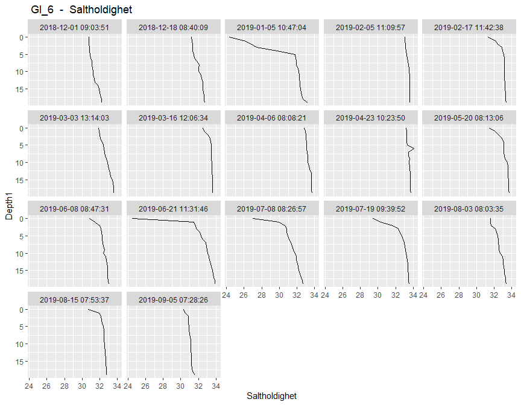<!-- -->

## 6. Temperature top 20 m 
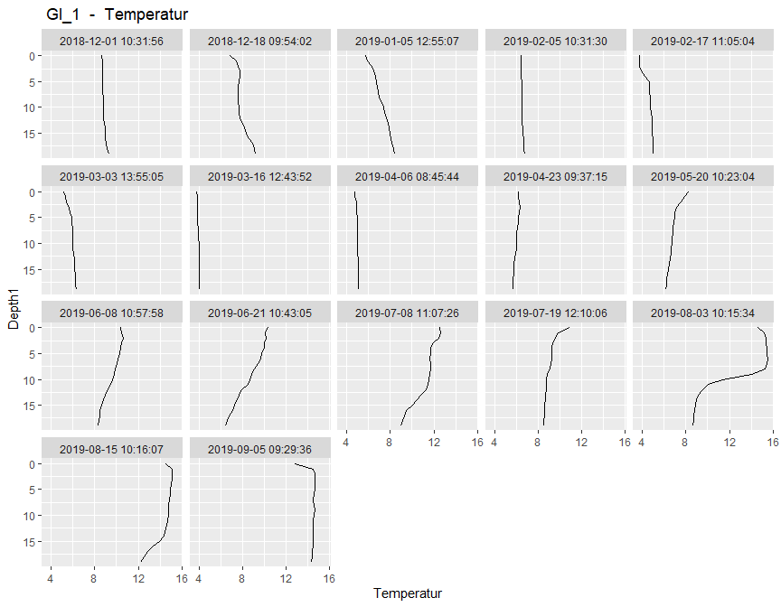<!-- -->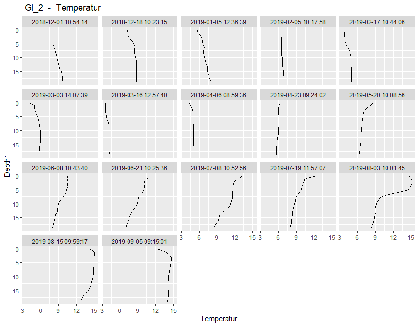<!-- --><!-- --><!-- --><!-- --><!-- -->

## 7. Check Gl_5 at 23. April 2019   
Both salinity and temperature looks almost stuck during the top 20 m   
- but both do in fact vary   

```r
dat %>%
   filter(StationCode %in% "Gl_5" & 
            Date > ymd("2019-04-23") & Date < ymd("2019-04-24") &
            Depth1 < 20) %>%
  select(Depth1:Temperatur) %>%
  as.data.frame()
```

```
##    Depth1 Depth2 Saltholdighet Temperatur
## 1       0      1      33.66000   5.804500
## 2       1      2      33.65500   5.797667
## 3       2      3      33.65000   5.796000
## 4       3      4      33.66600   5.791800
## 5       4      5      33.66500   5.790750
## 6       5      6      33.66333   5.790333
## 7       6      7      33.67500   5.772000
## 8       7      8      33.67667   5.768667
## 9       8      9      33.67500   5.764750
## 10      9     10      33.67500   5.760500
## 11     10     11      33.68500   5.757500
## 12     11     12      33.68667   5.756667
## 13     12     13      33.67000   5.758000
## 14     13     14      33.69000   5.753000
## 15     14     15      33.69000   5.745000
## 16     15     16      33.71000   5.744500
## 17     16     17      33.72000   5.743000
## 18     17     18      33.70000   5.745000
## 19     18     19      33.71000   5.745000
## 20     19     20      33.72000   5.743000
```

