## QC done January 2021    
- Only CTDs with salinity + temp only    
- See mail from Caroline Mengeot <caroline.mengeot@niva.no> tirsdag 28. januar 2020 10:33  


## 1. Read files   

### New data (2020)  
- Read from excel files in folder `K:/Avdeling/214-Oseanografi/DATABASER/OKOKYST_2017/OKOKYST_NH_Sor1_RMS/xlsbase`  
- Only two file in this case (in contrast to script 15)  


### Old data (2017-2019)    
Read from excel files in folder `old`

```
##  [1] "Siktdyp-Okokyst-NH-S-IOK.xlsx"     "Siktdyp_NorskehavetSør1_2017.xlsx"
##  [3] "VR51_2017_CTD_kalibrert.xlsm"      "VR51_2018_CTD_kalibrert.xlsm"     
##  [5] "VR51_2019_CTD.xlsm"                "VR51_2020_CTDold.xlsm"            
##  [7] "VT71_2017_CTD_kalibrert.xlsm"      "VT71_2018_CTD_kalibrert.xlsm"     
##  [9] "VT71_2019_CTD.xlsm"                "VT71_2020_CTDold.xlsm"
```


## 2. Data       

### Check sample dates   
- `dat_old`= 2017-2019   
- `dat` = last part of 2019 + 2020  

```
## -------------------------------------------------------------------------------------- 
## dat_old 
## -------------------------------------------------------------------------------------- 
## Number of dates:  72 
## First and last date:  2017-02-15 15:29:48 - 2019-11-19 14:32:16 
## Missing dates:  0 
## -------------------------------------------------------------------------------------- 
## dat: 
## -------------------------------------------------------------------------------------- 
## Number of dates:  24 
## First and last date:  2019-12-16 14:53:17 - 2020-11-10 11:28:55 
## Missing dates:  0
```


### Dates and max depth of new data    
<table class="table table-striped" style="width: auto !important; ">
 <thead>
  <tr>
   <th style="text-align:left;"> StationCode </th>
   <th style="text-align:left;"> Date </th>
   <th style="text-align:right;"> n </th>
   <th style="text-align:right;"> Max_depth </th>
  </tr>
 </thead>
<tbody>
  <tr>
   <td style="text-align:left;"> VR51 </td>
   <td style="text-align:left;"> 2019-12-16 14:53:17 </td>
   <td style="text-align:right;"> 255 </td>
   <td style="text-align:right;"> 254 </td>
  </tr>
  <tr>
   <td style="text-align:left;"> VR51 </td>
   <td style="text-align:left;"> 2020-01-29 14:53:21 </td>
   <td style="text-align:right;"> 255 </td>
   <td style="text-align:right;"> 254 </td>
  </tr>
  <tr>
   <td style="text-align:left;"> VR51 </td>
   <td style="text-align:left;"> 2020-02-19 14:41:40 </td>
   <td style="text-align:right;"> 250 </td>
   <td style="text-align:right;"> 249 </td>
  </tr>
  <tr>
   <td style="text-align:left;"> VR51 </td>
   <td style="text-align:left;"> 2020-03-20 14:51:49 </td>
   <td style="text-align:right;"> 253 </td>
   <td style="text-align:right;"> 252 </td>
  </tr>
  <tr>
   <td style="text-align:left;"> VR51 </td>
   <td style="text-align:left;"> 2020-04-22 14:51:56 </td>
   <td style="text-align:right;"> 256 </td>
   <td style="text-align:right;"> 255 </td>
  </tr>
  <tr>
   <td style="text-align:left;"> VR51 </td>
   <td style="text-align:left;"> 2020-05-18 14:20:30 </td>
   <td style="text-align:right;"> 256 </td>
   <td style="text-align:right;"> 255 </td>
  </tr>
  <tr>
   <td style="text-align:left;"> VR51 </td>
   <td style="text-align:left;"> 2020-06-15 14:11:44 </td>
   <td style="text-align:right;"> 254 </td>
   <td style="text-align:right;"> 253 </td>
  </tr>
  <tr>
   <td style="text-align:left;"> VR51 </td>
   <td style="text-align:left;"> 2020-07-16 13:45:35 </td>
   <td style="text-align:right;"> 255 </td>
   <td style="text-align:right;"> 254 </td>
  </tr>
  <tr>
   <td style="text-align:left;"> VR51 </td>
   <td style="text-align:left;"> 2020-08-18 10:49:54 </td>
   <td style="text-align:right;"> 256 </td>
   <td style="text-align:right;"> 255 </td>
  </tr>
  <tr>
   <td style="text-align:left;"> VR51 </td>
   <td style="text-align:left;"> 2020-09-17 10:58:15 </td>
   <td style="text-align:right;"> 256 </td>
   <td style="text-align:right;"> 255 </td>
  </tr>
  <tr>
   <td style="text-align:left;"> VR51 </td>
   <td style="text-align:left;"> 2020-10-15 11:05:50 </td>
   <td style="text-align:right;"> 253 </td>
   <td style="text-align:right;"> 252 </td>
  </tr>
  <tr>
   <td style="text-align:left;"> VR51 </td>
   <td style="text-align:left;"> 2020-11-09 15:40:37 </td>
   <td style="text-align:right;"> 253 </td>
   <td style="text-align:right;"> 252 </td>
  </tr>
  <tr>
   <td style="text-align:left;"> VT71 </td>
   <td style="text-align:left;"> 2019-12-17 12:36:02 </td>
   <td style="text-align:right;"> 61 </td>
   <td style="text-align:right;"> 61 </td>
  </tr>
  <tr>
   <td style="text-align:left;"> VT71 </td>
   <td style="text-align:left;"> 2020-01-22 13:53:12 </td>
   <td style="text-align:right;"> 74 </td>
   <td style="text-align:right;"> 73 </td>
  </tr>
  <tr>
   <td style="text-align:left;"> VT71 </td>
   <td style="text-align:left;"> 2020-02-24 14:32:01 </td>
   <td style="text-align:right;"> 77 </td>
   <td style="text-align:right;"> 76 </td>
  </tr>
  <tr>
   <td style="text-align:left;"> VT71 </td>
   <td style="text-align:left;"> 2020-03-19 15:29:04 </td>
   <td style="text-align:right;"> 75 </td>
   <td style="text-align:right;"> 74 </td>
  </tr>
  <tr>
   <td style="text-align:left;"> VT71 </td>
   <td style="text-align:left;"> 2020-04-20 12:09:09 </td>
   <td style="text-align:right;"> 76 </td>
   <td style="text-align:right;"> 75 </td>
  </tr>
  <tr>
   <td style="text-align:left;"> VT71 </td>
   <td style="text-align:left;"> 2020-05-19 11:38:22 </td>
   <td style="text-align:right;"> 76 </td>
   <td style="text-align:right;"> 75 </td>
  </tr>
  <tr>
   <td style="text-align:left;"> VT71 </td>
   <td style="text-align:left;"> 2020-06-16 11:47:49 </td>
   <td style="text-align:right;"> 74 </td>
   <td style="text-align:right;"> 73 </td>
  </tr>
  <tr>
   <td style="text-align:left;"> VT71 </td>
   <td style="text-align:left;"> 2020-07-14 13:29:21 </td>
   <td style="text-align:right;"> 71 </td>
   <td style="text-align:right;"> 70 </td>
  </tr>
  <tr>
   <td style="text-align:left;"> VT71 </td>
   <td style="text-align:left;"> 2020-08-19 08:40:33 </td>
   <td style="text-align:right;"> 71 </td>
   <td style="text-align:right;"> 70 </td>
  </tr>
  <tr>
   <td style="text-align:left;"> VT71 </td>
   <td style="text-align:left;"> 2020-09-15 12:21:56 </td>
   <td style="text-align:right;"> 75 </td>
   <td style="text-align:right;"> 74 </td>
  </tr>
  <tr>
   <td style="text-align:left;"> VT71 </td>
   <td style="text-align:left;"> 2020-10-14 08:46:05 </td>
   <td style="text-align:right;"> 76 </td>
   <td style="text-align:right;"> 75 </td>
  </tr>
  <tr>
   <td style="text-align:left;"> VT71 </td>
   <td style="text-align:left;"> 2020-11-10 11:28:55 </td>
   <td style="text-align:right;"> 76 </td>
   <td style="text-align:right;"> 75 </td>
  </tr>
</tbody>
</table>


## 3. Profiles of 2020 data  

### Salinity  
_NOTE: also see plots for top 20 m further down._  
   
- Gl_5: Profile looks strange at 20-30 m in April 2019 (and no pattern in temperature)  
   
- Very low salinity at 0-1 meter:     
    + Dec 2018 at Gl_3 and Gl_5: Dubious? no indication of top freshwater layer in temperature  
    + 4. April 2019 Gl_5: Dubious? no indication of top freshwater layer in temperature  
    + 21 June 2019 at Gl_6: Dubious? little indication of top freshwater layer in temperature  
    + July 2019 at Gl_2 and Gl_3: probably OK - temperature also indicates top freshwater layer  
    + 15 Aug 2019 at Gl_2 and Gl_4: Dubious? little indication of top freshwater layer in temperature  

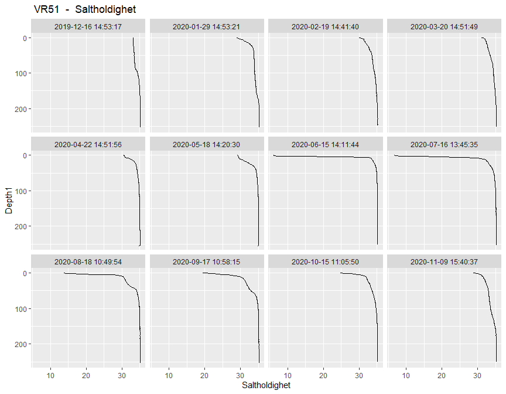<!-- --><!-- -->

### Salinity top 50 m 
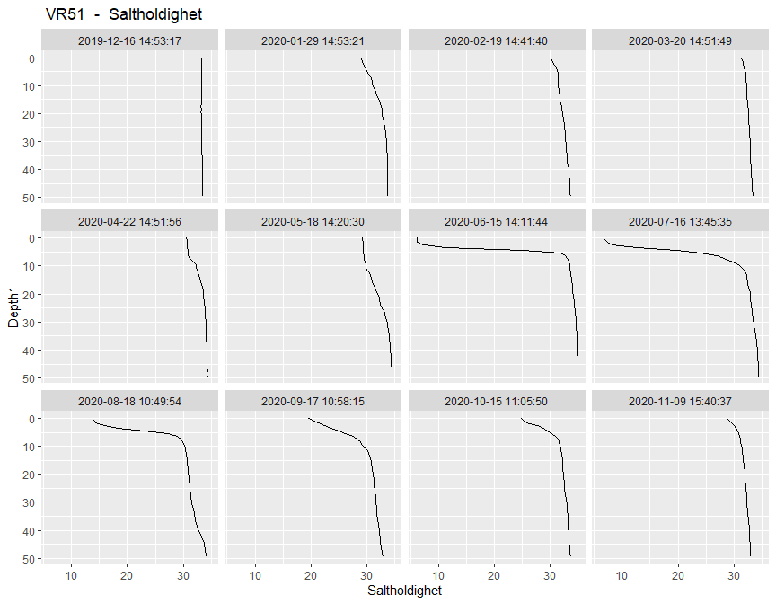<!-- --><!-- -->


### Temperature    
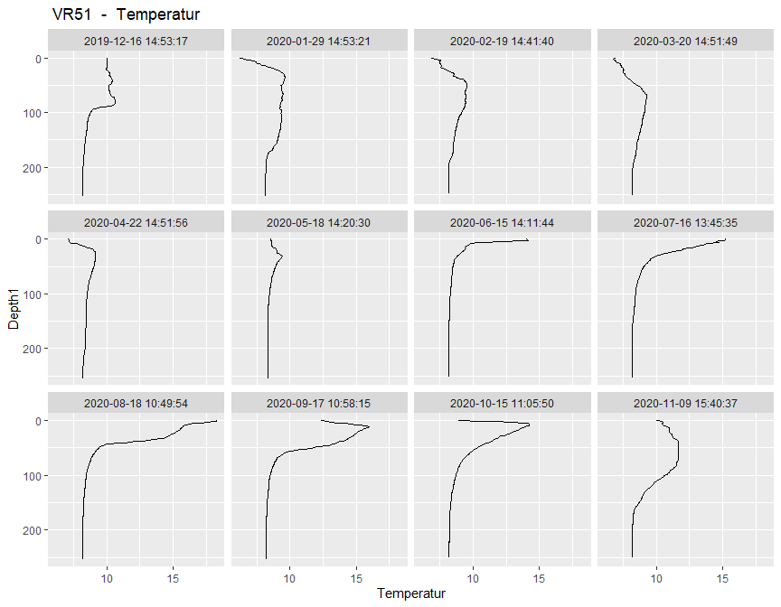<!-- --><!-- -->

### Temperature top 50 m 
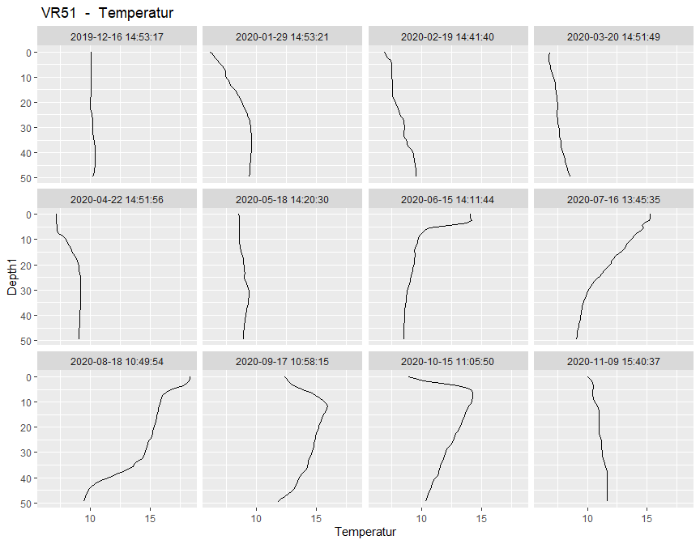<!-- --><!-- -->

### Oxygen volume      
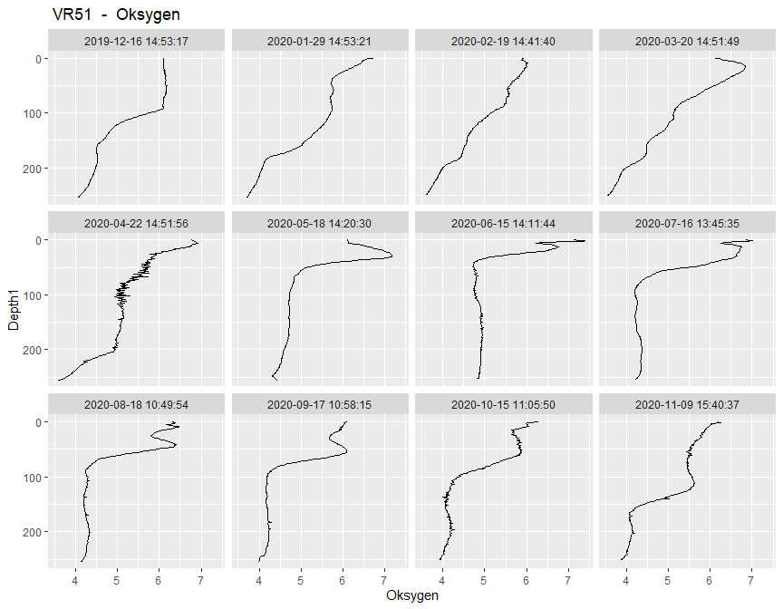<!-- -->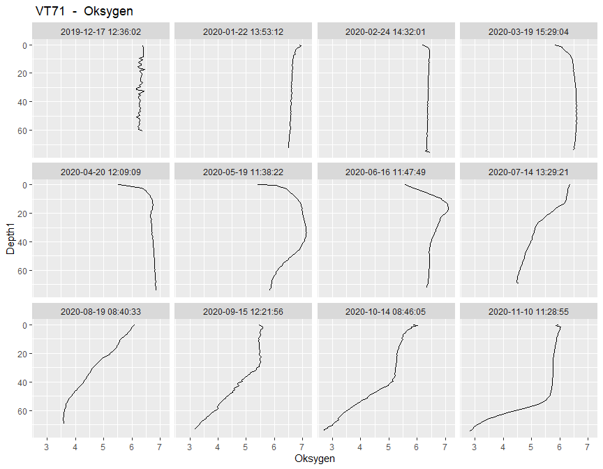<!-- -->

### Oxygen saturation        
<!-- -->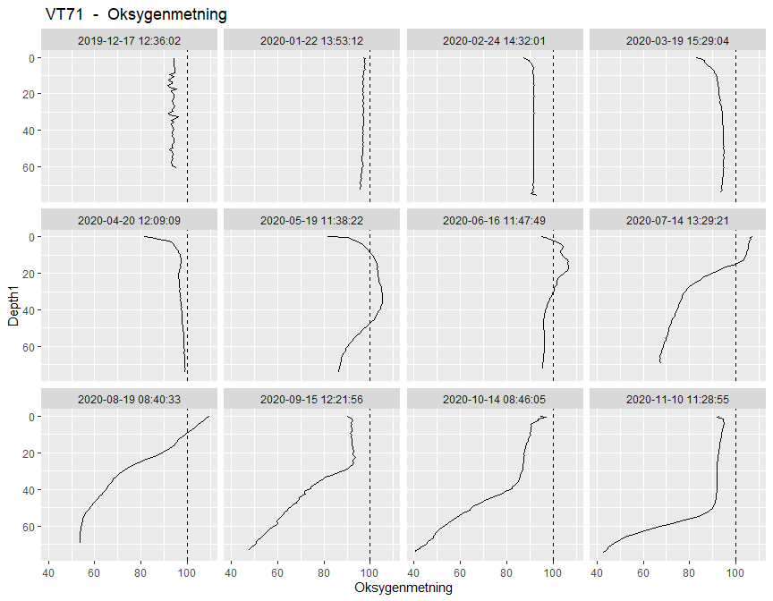<!-- -->


## 4. Times series (since 2017)  


### Combined data

```
##       StationCode
## Year   VR51 VT71
##   2017   13   13
##   2018   12   12
##   2019   12   12
##   2020   11   11
```

### Station VR51 Korsen    
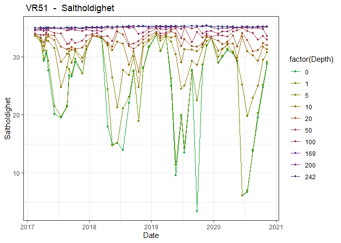<!-- -->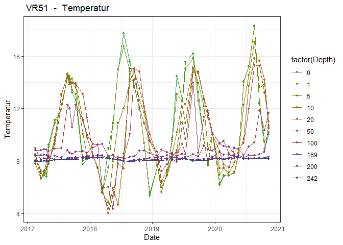<!-- -->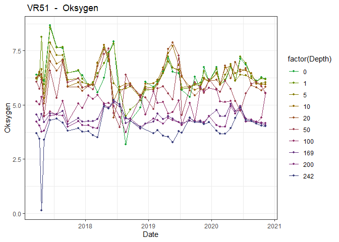<!-- -->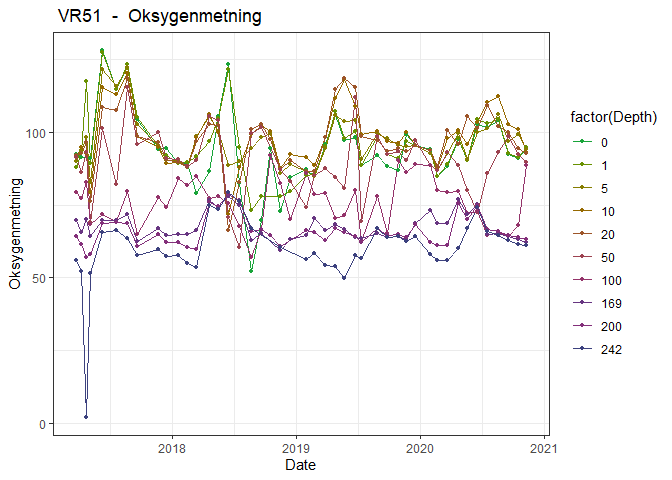<!-- -->

### Station VT71 Skinnbrokleia    
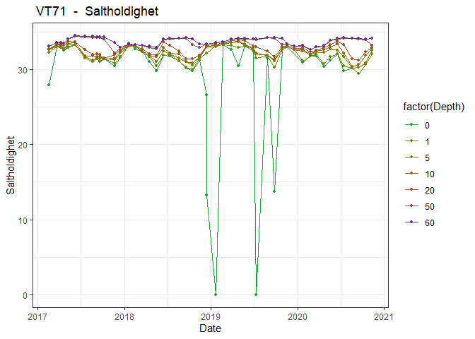<!-- -->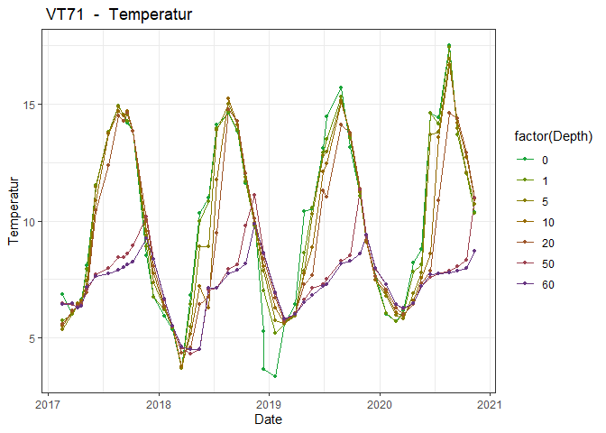<!-- -->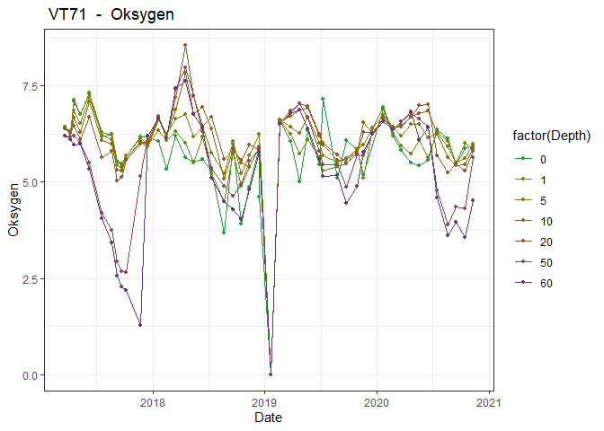<!-- --><!-- -->

