## QC done January 2021    
- CTDs with salinity + temp + oxygen      
- Excel files from Trond Kristansen's dropbox (29.01.2021)
- Stations:    
    * VT53 - Hardangerfjorden  
    * VT69 - Hardangerfjorden  
    * VT70 - Hardangerfjorden  
    * VT74 - Hardangerfjorden  
    * VT16 - Sognefjorden  
    * VT79 - Sognefjorden  

    


## 1. Read files   

### New data (2020)  
- Read from excel files in folders under `K:/Avdeling/214-Oseanografi/DATABASER/OKOKYST_2017s`  
- 3 files in 3 separate folders in this case    


### Old data (2017-2019)    

```
## 64790 records 
## 163 records with oxygen < -100 deleted
```


## 2. Data       

### Check sample dates   
- `dat_old`= 2017-2019   
- `dat` = last part of 2019 + 2020  

```
## -------------------------------------------------------------------------------------- 
## dat_old: 
## -------------------------------------------------------------------------------------- 
## Number of dates:  37 
## First and last date:  2017-02-21 - 2019-11-17 
## Missing dates:  0 
## -------------------------------------------------------------------------------------- 
## dat: 
## -------------------------------------------------------------------------------------- 
## Number of dates:  12 
## First and last date:  2019-12-15 - 2020-11-10 
## Missing dates:  0
```


### Dates and max depth of new data    
<table class="table table-striped" style="width: auto !important; ">
 <thead>
  <tr>
   <th style="text-align:left;"> StationCode </th>
   <th style="text-align:left;"> Date </th>
   <th style="text-align:right;"> n </th>
   <th style="text-align:right;"> Max_depth </th>
  </tr>
 </thead>
<tbody>
  <tr>
   <td style="text-align:left;"> VT16 </td>
   <td style="text-align:left;"> 2019-12-15 </td>
   <td style="text-align:right;"> 1279 </td>
   <td style="text-align:right;"> 1278 </td>
  </tr>
  <tr>
   <td style="text-align:left;"> VT16 </td>
   <td style="text-align:left;"> 2020-01-19 </td>
   <td style="text-align:right;"> 1279 </td>
   <td style="text-align:right;"> 1278 </td>
  </tr>
  <tr>
   <td style="text-align:left;"> VT16 </td>
   <td style="text-align:left;"> 2020-02-19 </td>
   <td style="text-align:right;"> 1279 </td>
   <td style="text-align:right;"> 1278 </td>
  </tr>
  <tr>
   <td style="text-align:left;"> VT16 </td>
   <td style="text-align:left;"> 2020-03-12 </td>
   <td style="text-align:right;"> 1279 </td>
   <td style="text-align:right;"> 1278 </td>
  </tr>
  <tr>
   <td style="text-align:left;"> VT16 </td>
   <td style="text-align:left;"> 2020-04-14 </td>
   <td style="text-align:right;"> 1279 </td>
   <td style="text-align:right;"> 1278 </td>
  </tr>
  <tr>
   <td style="text-align:left;"> VT16 </td>
   <td style="text-align:left;"> 2020-05-13 </td>
   <td style="text-align:right;"> 1279 </td>
   <td style="text-align:right;"> 1278 </td>
  </tr>
  <tr>
   <td style="text-align:left;"> VT16 </td>
   <td style="text-align:left;"> 2020-06-14 </td>
   <td style="text-align:right;"> 1279 </td>
   <td style="text-align:right;"> 1278 </td>
  </tr>
  <tr>
   <td style="text-align:left;"> VT16 </td>
   <td style="text-align:left;"> 2020-07-15 </td>
   <td style="text-align:right;"> 1279 </td>
   <td style="text-align:right;"> 1278 </td>
  </tr>
  <tr>
   <td style="text-align:left;"> VT16 </td>
   <td style="text-align:left;"> 2020-08-16 </td>
   <td style="text-align:right;"> 1279 </td>
   <td style="text-align:right;"> 1278 </td>
  </tr>
  <tr>
   <td style="text-align:left;"> VT16 </td>
   <td style="text-align:left;"> 2020-09-13 </td>
   <td style="text-align:right;"> 1279 </td>
   <td style="text-align:right;"> 1278 </td>
  </tr>
  <tr>
   <td style="text-align:left;"> VT16 </td>
   <td style="text-align:left;"> 2020-10-18 </td>
   <td style="text-align:right;"> 1279 </td>
   <td style="text-align:right;"> 1278 </td>
  </tr>
  <tr>
   <td style="text-align:left;"> VT16 </td>
   <td style="text-align:left;"> 2020-11-10 </td>
   <td style="text-align:right;"> 1279 </td>
   <td style="text-align:right;"> 1278 </td>
  </tr>
  <tr>
   <td style="text-align:left;"> VT79 </td>
   <td style="text-align:left;"> 2019-12-15 </td>
   <td style="text-align:right;"> 508 </td>
   <td style="text-align:right;"> 507 </td>
  </tr>
  <tr>
   <td style="text-align:left;"> VT79 </td>
   <td style="text-align:left;"> 2020-01-19 </td>
   <td style="text-align:right;"> 508 </td>
   <td style="text-align:right;"> 507 </td>
  </tr>
  <tr>
   <td style="text-align:left;"> VT79 </td>
   <td style="text-align:left;"> 2020-02-19 </td>
   <td style="text-align:right;"> 508 </td>
   <td style="text-align:right;"> 507 </td>
  </tr>
  <tr>
   <td style="text-align:left;"> VT79 </td>
   <td style="text-align:left;"> 2020-03-12 </td>
   <td style="text-align:right;"> 508 </td>
   <td style="text-align:right;"> 507 </td>
  </tr>
  <tr>
   <td style="text-align:left;"> VT79 </td>
   <td style="text-align:left;"> 2020-04-14 </td>
   <td style="text-align:right;"> 508 </td>
   <td style="text-align:right;"> 507 </td>
  </tr>
  <tr>
   <td style="text-align:left;"> VT79 </td>
   <td style="text-align:left;"> 2020-05-13 </td>
   <td style="text-align:right;"> 508 </td>
   <td style="text-align:right;"> 507 </td>
  </tr>
  <tr>
   <td style="text-align:left;"> VT79 </td>
   <td style="text-align:left;"> 2020-06-14 </td>
   <td style="text-align:right;"> 508 </td>
   <td style="text-align:right;"> 507 </td>
  </tr>
  <tr>
   <td style="text-align:left;"> VT79 </td>
   <td style="text-align:left;"> 2020-08-16 </td>
   <td style="text-align:right;"> 508 </td>
   <td style="text-align:right;"> 507 </td>
  </tr>
  <tr>
   <td style="text-align:left;"> VT79 </td>
   <td style="text-align:left;"> 2020-09-13 </td>
   <td style="text-align:right;"> 508 </td>
   <td style="text-align:right;"> 507 </td>
  </tr>
  <tr>
   <td style="text-align:left;"> VT79 </td>
   <td style="text-align:left;"> 2020-10-18 </td>
   <td style="text-align:right;"> 508 </td>
   <td style="text-align:right;"> 507 </td>
  </tr>
  <tr>
   <td style="text-align:left;"> VT79 </td>
   <td style="text-align:left;"> 2020-11-10 </td>
   <td style="text-align:right;"> 508 </td>
   <td style="text-align:right;"> 507 </td>
  </tr>
</tbody>
</table>


## 3. Profiles of 2020 data  

### Salinity  
_NOTE: also see plots for top 20 m further down._  
   
- VT16: 
    - Shallow CTDs in Dec 2019, Feb 2020 and especially July 2020   
    - July 2020: something is wrong with this, check temperature and oxygen saturation   
- VT16: Shallow CTDs in Dec 2019, Feb 2020 and especially July 2020   

   


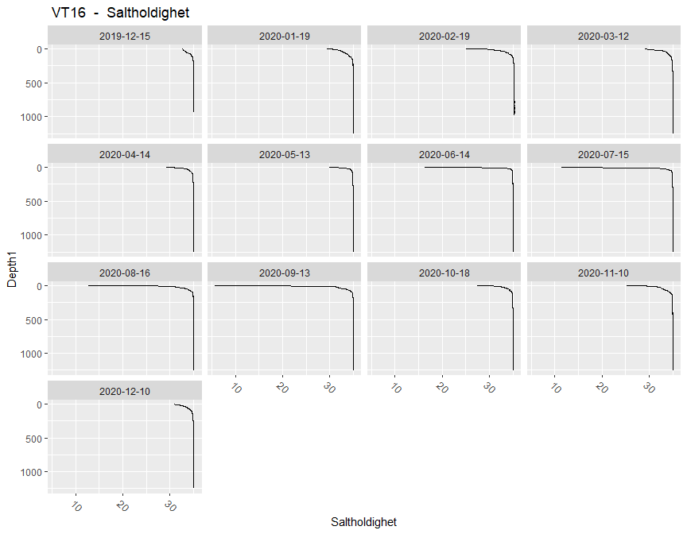<!-- -->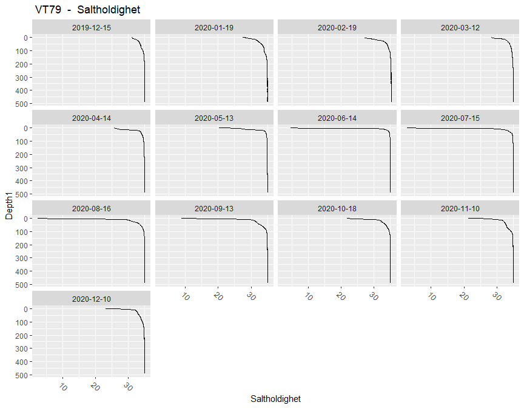<!-- -->

### Salinity top 50 m 
<!-- -->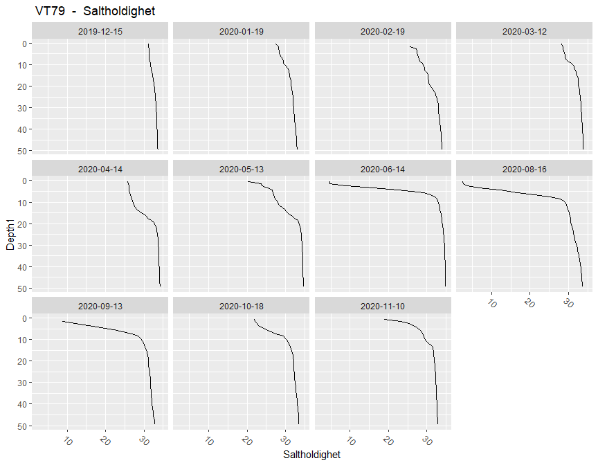<!-- -->


### Temperature    
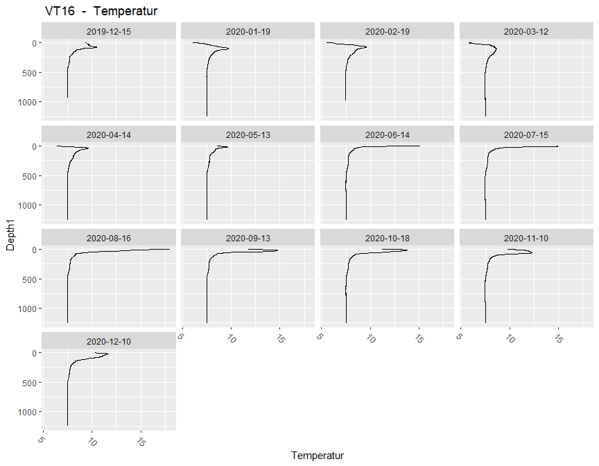<!-- -->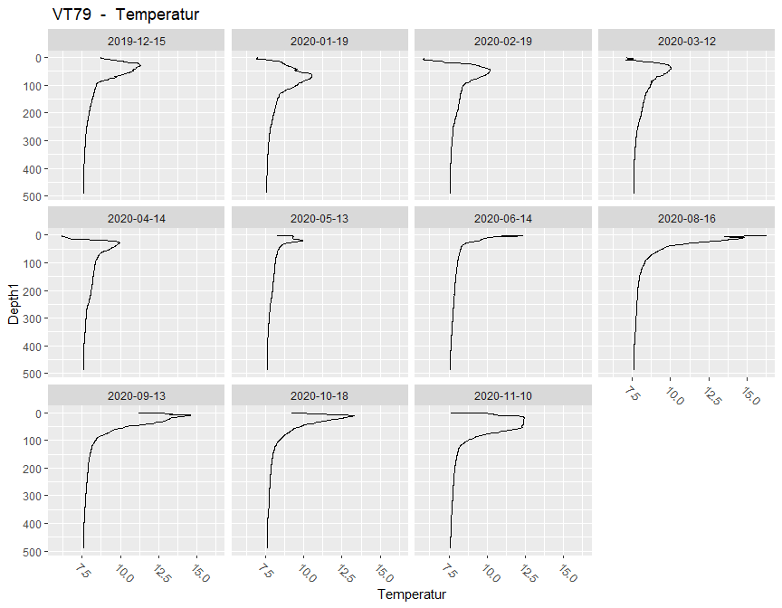<!-- -->

### Temperature top 50 m 
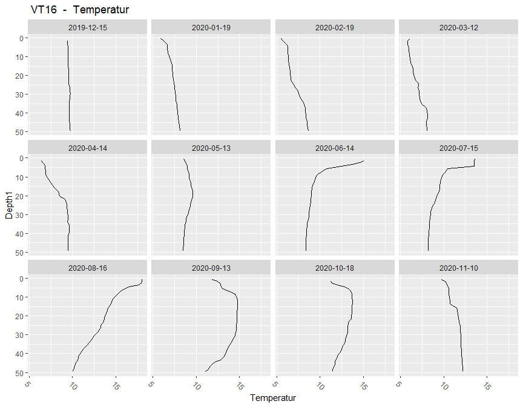<!-- -->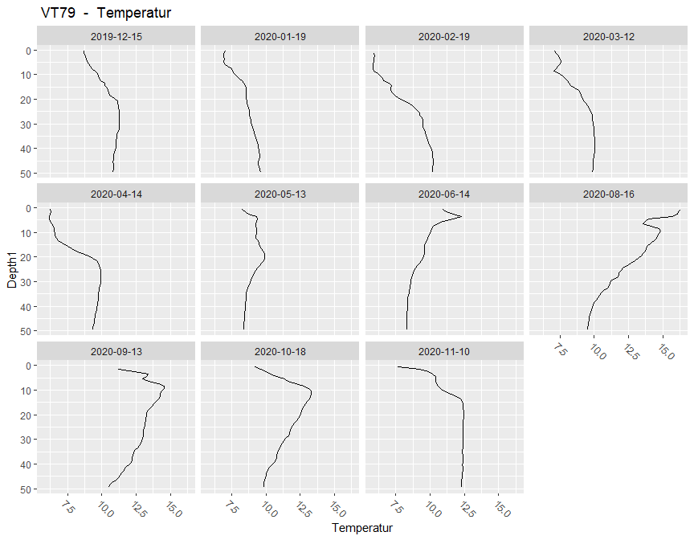<!-- -->

### Oxygen volume      
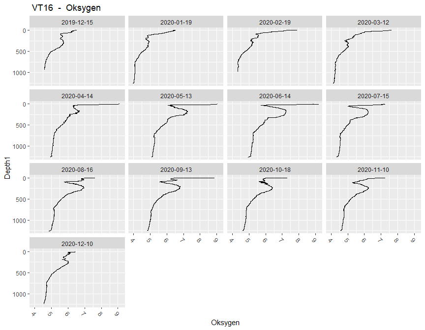<!-- -->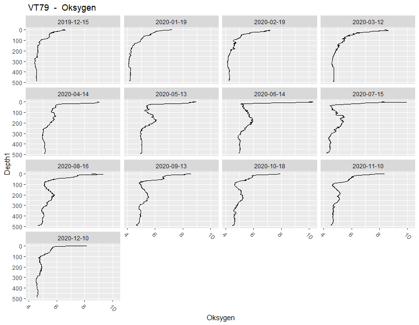<!-- -->

### Oxygen saturation        
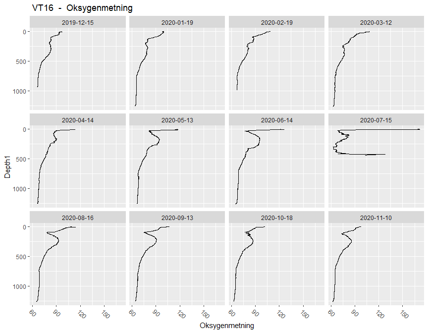<!-- -->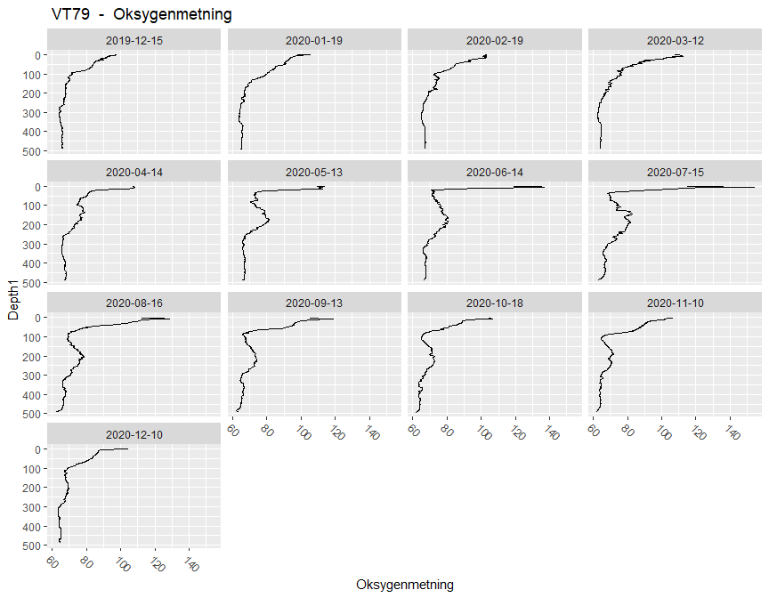<!-- -->


## 4. Times series (since 2017)  

### Combined data

```
##       addNA(StationCode)
## Year   VT16 VT79 <NA>
##   2017   13   13    0
##   2018   12   11    0
##   2019   13   12    0
##   2020   11   10    0
```

### All stations  


### Station VT16       
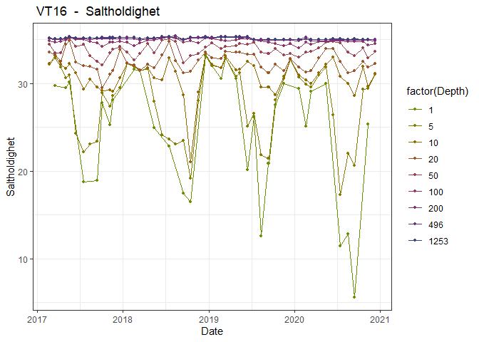<!-- -->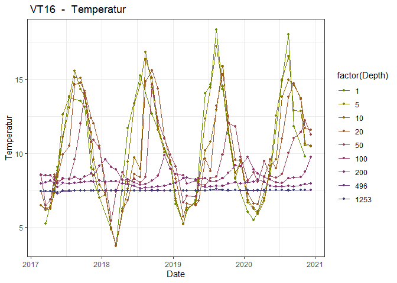<!-- -->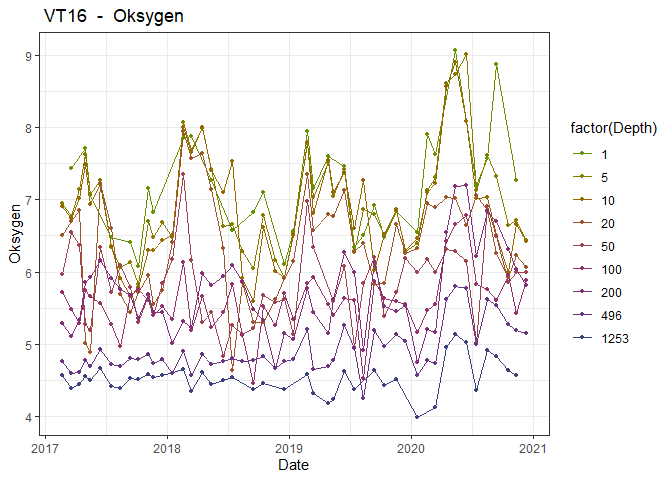<!-- -->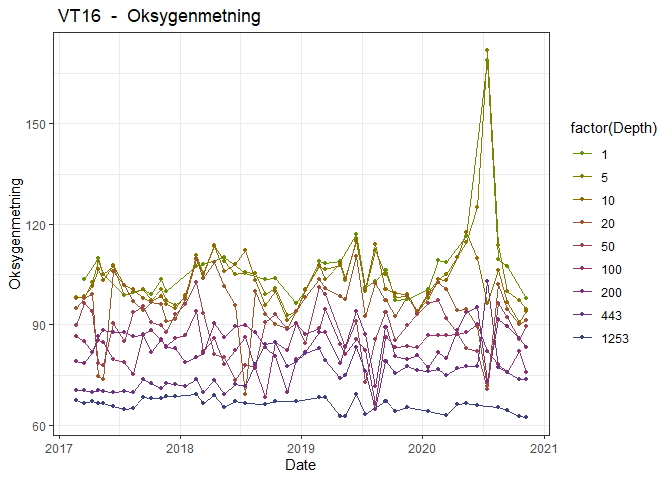<!-- -->


### Station VT79       
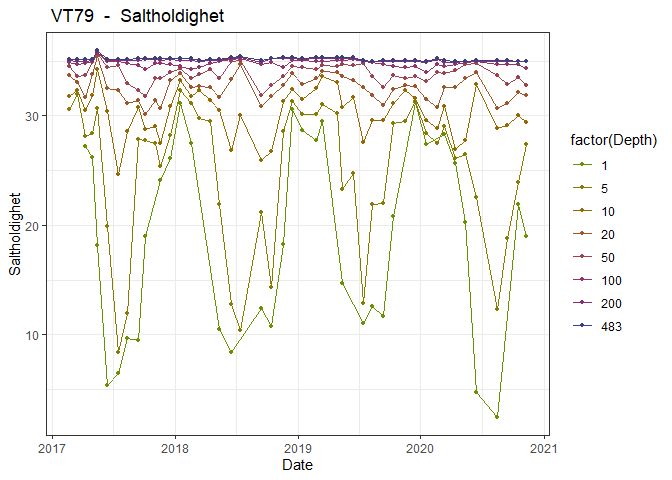<!-- -->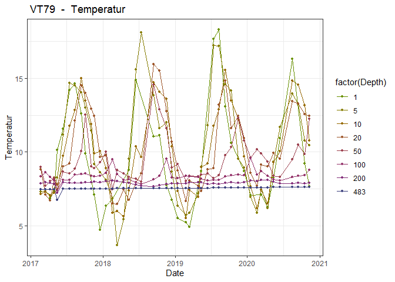<!-- -->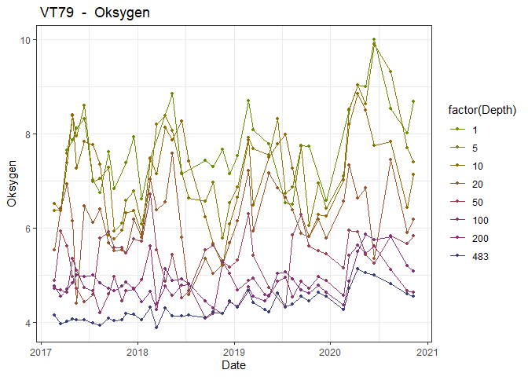<!-- -->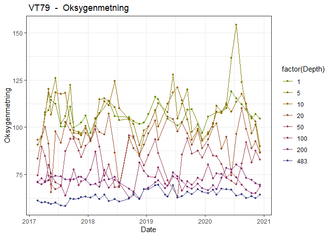<!-- -->


