**QC of Norskehavet Sør I (Caroline + Lars)**      
- Checked input to these files:  
`K:\Prosjekter\Sjøvann\KYSTOVERVÅKING ØKOKYST\KYSTOVERVÅKING ØKOKYST 2017-2020\ØKOKYST DP Norskehavet Sør I O-17091_18091_19091_200091\Rapport 2019-data\klassification`
- Stations:
    + VT71 Skinnbrokleia
    + VR51 Korsen
    + VT72 Herøyfjorden (Ferrybox station)


   
**Veileder:**  
- `Documents\artikler\veiledere etc\02_2013_klassifiserings-veileder_.pdf`  
- Chlorophyll: page 91.   
"I SørNorge (til Stadt) anbefales det at innsamlingen starter i februar og avsluttes ved utgangen av oktober."   
"Nord for Stadt anbefales det at innsamlingsperioden strekker seg fra mars til og med september."   
90% percentiles should be used   
  
- Also see calculation example on on page 187-189, and the comment on page 189:  
"Det gjøres oppmerksom på at dataprogrammene som beregner 90-persentil, gjerne benytter ulike metoder". We use the Excel method PERCENTILE.EXC, corresponding to type 6 quantiles in R  
  
- Nutrients: page 102 in veileder  
Vinter er november til og med februar   
Sommer er juni til og med august  

  
## 0. Libraries   
If you ony want to look at Norskehavet Sør 1  you can skip to 11 after this chunk      

```r
library(dplyr)
```

```
## 
## Attaching package: 'dplyr'
```

```
## The following objects are masked from 'package:stats':
## 
##     filter, lag
```

```
## The following objects are masked from 'package:base':
## 
##     intersect, setdiff, setequal, union
```

```r
library(purrr)
library(ggplot2)
library(lubridate)
```

```
## 
## Attaching package: 'lubridate'
```

```
## The following object is masked from 'package:base':
## 
##     date
```

```r
library(readxl)
library(tidyr)
library(knitr)         
```

```
## Warning: package 'knitr' was built under R version 3.6.2
```

```r
library(RColorBrewer)

# library(niRvana)

source("12_QA_2019_from_excel_functions.R")
source("13_QA_CTD_2019_functions.R")          # used in section 15  


# RColorBrewer::display.brewer.all()
```


## 1. Read Norskehavet Nord I files   
Used by Caroline     

```r
# Based on section 5 above

fn <- "K:/Avdeling/214-Oseanografi/DATABASER/OKOKYST_2017/AqM_download_2019/AqM_2019_NH_Sor1_des2019.xlsx"

dat_broad <- AqMexport_read_waterchemistry(fn, reformat_long = FALSE)   # 30 seconds
dat1 <- AqMexport_reformat_long(dat_broad, remove_duplicates = FALSE)
dat2 <- AqMexport_remove_duplicates(dat1)

xtabs(~StationCode + ProjectId, dat2)
```

```
##                ProjectId
## StationCode     10446 10446,10446 6342,11946 6342,6342,11946,11946
##   Skinnbrokleia     0           0      18331                  1775
##   VR51          23041        1146          0                     0
##   VT71          18331        1775          0                     0
```

```r
# Skinnbrokleia = VT71!
# delete duplicate data in ProjectID "6342,11946", "6342,6342,11946,11946" 
dat2 <- dat2 %>%
  filter(StationCode != "Skinnbrokleia")   
```

### Checks

```r
# Check
xtabs(~Variable, dat2)
```

```
## Variable
##            Ca           DOC          KlfA         NH4-N Nitrogen part 
##            46           124           585           635           113 
##     NO3+NO2-N            O2  O2 (metning)         PO4-P           POC 
##           635          7107          6997           635           113 
##     Salinitet       Siktdyp          SiO2    Temperatur          TOTN 
##         12376            97           635         12380           635 
##          TOTP        TOTP_P           TSM    Turbiditet 
##           635           116           357            72
```

```r
xtabs(~Variable + StationCode, dat2)
```

```
##                StationCode
## Variable        VR51 VT71
##   Ca               0   46
##   DOC              0  124
##   KlfA           180  405
##   NH4-N          179  456
##   Nitrogen part    0  113
##   NO3+NO2-N      179  456
##   O2            5176 1931
##   O2 (metning)  5186 1811
##   PO4-P          179  456
##   POC              0  113
##   Salinitet     6184 6192
##   Siktdyp         25   72
##   SiO2           179  456
##   Temperatur    6184 6196
##   TOTN           179  456
##   TOTP           179  456
##   TOTP_P           0  116
##   TSM            178  179
##   Turbiditet       0   72
```

```r
# Check - note that 0.5 m was used instead of 0 m before 2017  
dat2 %>%
  filter(Variable %in% "NO3+NO2-N") %>%
  xtabs(~Depth1 + year(Time), .)
```

```
##       year(Time)
## Depth1 2013 2014 2015 2016 2017 2018 2019
##    0      0    0    0    0   26   24   21
##    0.5   11    1   12   12    0    0    0
##    5     12   12   12   12   26   24   22
##    10    12   12   12   12   26   24   22
##    20    12   12   12   12   26   24   22
##    30    12   12   12   12   26   24   22
##    50    12   12   12   12    0    0    0
```

```r
# Check
# NO3+NO2-N and NH4-N used all years  
# NO2 + NO3 not used
dat2 %>%
  filter(Variable %in% c("TOTN", "NH4-N", "NO3+NO2-N", "NO2-N", "NO3-N", "PON") & !is.na(Value)) %>%
  xtabs(~Variable + year(Time), .)
```

```
##            year(Time)
## Variable    2013 2014 2015 2016 2017 2018 2019
##   NH4-N       71   61   72   72  130  120  109
##   NO3+NO2-N   71   61   72   72  130  120  109
##   TOTN        71   61   72   72  130  120  109
```

```r
# Check
dat2 %>%
  filter(Variable %in% "NO3+NO2-N" & Depth1 %in% c(0,5,10) & year(Time) == 2017 & month(Time) == 2)
```

```
## # A tibble: 6 x 11
##   StationId StationCode StationName Time                Depth1 Depth2 Variable
##   <chr>     <chr>       <chr>       <dttm>               <dbl>  <dbl> <chr>   
## 1 63018     VT71        Skinnbrokl~ 2017-02-16 00:00:00      0      0 NO3+NO2~
## 2 63018     VT71        Skinnbrokl~ 2017-02-16 00:00:00      5      5 NO3+NO2~
## 3 63018     VT71        Skinnbrokl~ 2017-02-16 00:00:00     10     10 NO3+NO2~
## 4 68871     VR51        Korsen      2017-02-15 00:00:00      0      0 NO3+NO2~
## 5 68871     VR51        Korsen      2017-02-15 00:00:00      5      5 NO3+NO2~
## 6 68871     VR51        Korsen      2017-02-15 00:00:00     10     10 NO3+NO2~
## # ... with 4 more variables: ProjectId <chr>, ProjectName <chr>, Value <dbl>,
## #   Flag <chr>
```

```r
dat2 %>%
  mutate(Depth1 = ifelse(Depth1 == 0.5, 0, Depth1)) %>%
  filter(Variable %in% "NO3+NO2-N" & Depth1 %in% c(0, 30)) %>%
  ggplot(aes(Time, Value, color = factor(Depth1))) +
  geom_line() + geom_point() +
  facet_grid(vars(StationCode), vars(Depth1))
```

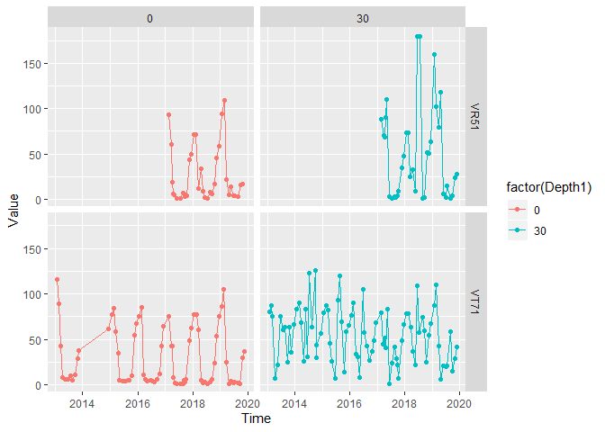<!-- -->

## 2. Nutrients, check sums
### N, plot biggest discrepancy   
- Plots all N variables (colors/circles), plus the sum of inorganic N (NH4 + NO3 + NO2) in black  
- Dotted vertical line(s) indicates where the sum is 15% higher than TOTN (example: VT67, 0 m)  

```r
nutrient_plot_n("VT71", 0)
```

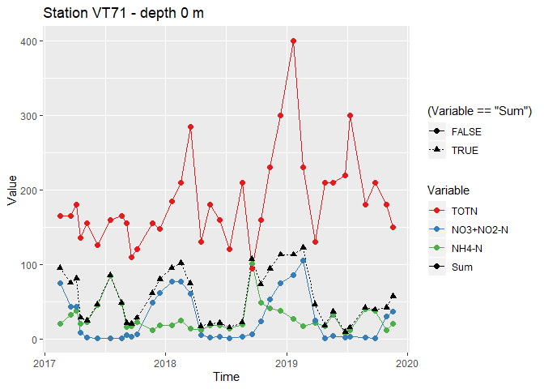<!-- -->

```r
nutrient_plot_n("VR51", 0)
```

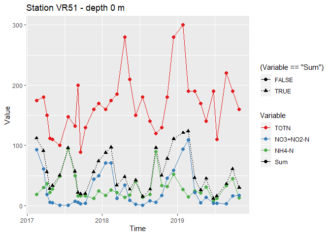<!-- -->


### Check sums of P variables   
Check whether  
1) TotP is smaller or equal to phosphate + particular P (TOTP_P)   
2) TotP is smaller or equal to phosphate     
None are a lot off

```r
check_sums_p1(dat2, max_n = 1000)
```

```
## ======================================================================
## Check whether TotP is smaller or equal to inorganic P + TOTP_P
## Observations per year:
## 
## 2017 2018 2019 
##   13   47   36 
## TotP smaller than inorganic P + TOTP_P in 2 cases ( 2.1 percent )
## 
## Cases where total < sum are given in table
##   StationCode       Time Depth1 PO4-P TOTP TOTP_P      Check
## 1        VT71 2017-08-21      0     6   11    5.1 -0.9090909
## 2        VT71 2017-08-21      5     7   11    4.2 -1.8181818
```

```r
check_sums_p2(dat2)
```

```
## ======================================================================
## Check whether TotP is smaller or equal to inorganic P
## Observations per year:
## 
## 2013 2014 2015 2016 2017 2018 2019 
##   71   61   72   72  130  120  109 
## TotP smaller than inorganic P in 5 cases ( 0.8 percent )
## 
## Cases where total < sum are given in table
##   StationCode       Time Depth1 PO4-P TOTP     Check
## 1        VT71 2014-02-27   10.0    21   20  -5.00000
## 2        VT71 2014-02-27   30.0    21   20  -5.00000
## 3        VT71 2014-02-27   50.0    21   20  -5.00000
## 4        VT71 2014-07-10   20.0    38   34 -11.76471
## 5        VT71 2014-12-12    0.5    11    8 -37.50000
```

### P, plot biggest discrepancy   
-170%   


```r
nutrient_plot_p("VT71", 0)
```

```
## Warning: Removed 10 rows containing missing values (geom_path).
```

```
## Warning: Removed 34 rows containing missing values (geom_point).
```

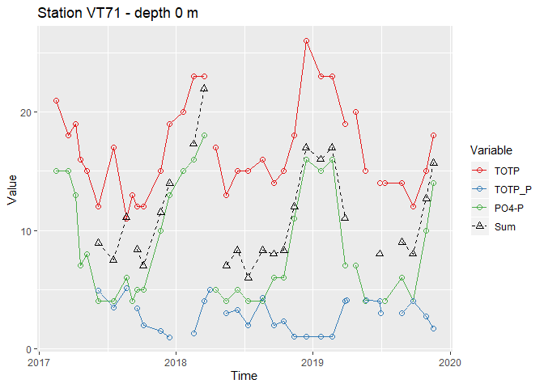<!-- -->

```r
# Doesn't have TOTP_P:
nutrient_plot_p("VR51", 0, nutrients = c("TOTP", "PO4-P"))
```

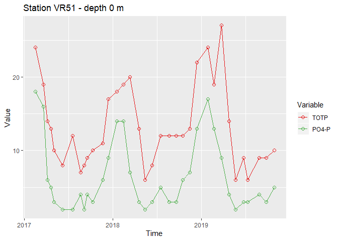<!-- -->


## 3. Nutrients, compare with values in Excel sheet  
  
- Compares mean values calculated from raw data with values in the "NIVAKlass" excel sheets  
- Also see the sheet 'VT71_stats' in the AqM excel file that we read in section 11  
  
### Nutrients, get mean values from raw data   
- Compare with vallues used in NIVAclass excel sheets here:  
`K:\Prosjekter\Sjøvann\KYSTOVERVÅKING ØKOKYST\KYSTOVERVÅKING ØKOKYST 2017-2020\ØKOKYST DP Norskehavet Sør I O-17091_18091_19091_200091\Rapport 2019-data\klassification`    
- VT71: Results not equal to the numbers used for VT71, but so close that none of them change class  
- VR51: Got exactly same numbers as those used
### Plot surface values for each depth/station over time  

```r
# order_as_excel <- c("VT71", "VR51")

plotdata <- dat2
nrow(plotdata)
```

```
## [1] 44293
```

```r
depths <- c(0, 0.5, 5, 10)
vars <- c("TOTP", "PO4-P", "TOTN", "NO3+NO2-N", "NH4-N")
stations <- unique(plotdata$StationCode)

years <- 2017:2019
months <- list(c(6,7,8), c(1,2,12))
names(months) <- c("Summer", "Winter")

for (station in stations){
  for (i in seq_along(months)){
    df <- plotdata %>%
      mutate(Depth1 = ifelse(Depth1 == 0.5, 0, Depth1)) %>%
      mutate(Depth1 = factor(Depth1)) %>%
      filter(Variable %in% vars & 
               Depth1 %in% depths &
               month(Time) %in% months[[i]] & 
               year(Time) %in% years &
               StationCode %in% station)
    gg <- ggplot(df, aes(Time, Value, color = Depth1)) +
      geom_point() +
      geom_line() +
      facet_wrap(vars(Variable), scales = "free_y") + 
      labs(title = paste0(station, ", ", 
                         names(months)[[i]])) +
      scale_x_datetime(breaks = "1 year", date_labels = "%d.%m.%y") +
      theme(axis.text.x = element_text(hjust = 0, angle = -45))
    print(gg)
  }
}
```

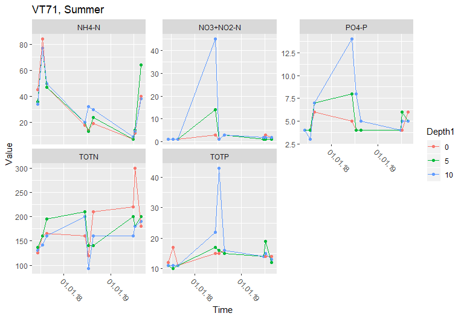<!-- -->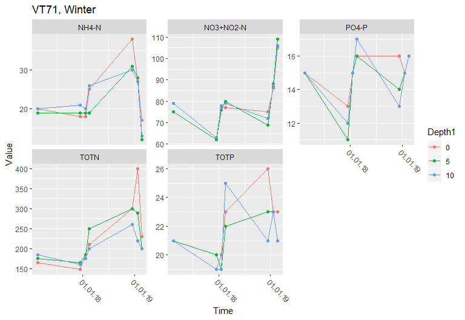<!-- -->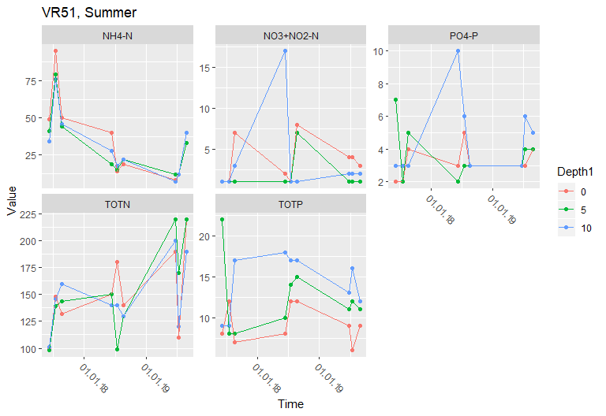<!-- -->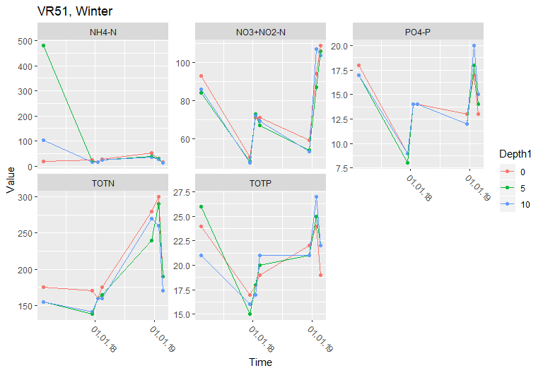<!-- -->

### Plot weighted surface values over time   
- 4 plots, one per station and season
- Note extremely high ammonium value in VR51 winter (see section "Seasonal mean values)  

```r
# Delete two extremely high ammonium values 
nrow(dat2)
```

```
## [1] 44293
```

```r
sel <- with(dat2,
            StationCode == "VR51" & 
              Variable %in% "NH4-N" &
              month(Time) == 2 &
              Value > 80)
sum(sel)
```

```
## [1] 2
```

```r
plotdata <- dat2[!sel,]
nrow(plotdata)
```

```
## [1] 44291
```

```r
# order_as_excel <- c("VT71", "VR51")

months <- list(c(6,7,8), c(1,2,12))
names(months) <- c("Summer", "Winter")

for (i in seq_along(months)){
  df <- NIVAklass_get_mean_overdepth(
    years = 2017:2019,
    data = plotdata,
    vars = c("TOTP", "PO4-P", "TOTN", "NO3+NO2-N", "NH4-N"),
    months = months[[i]])
  gg <- ggplot(df, aes(Time, Value, color = StationCode)) +
    geom_point() +
    geom_line() +
    facet_wrap(vars(Variable), scales = "free_y") + 
    labs(title = names(months)[[i]]) +
    scale_x_datetime(breaks = "1 year", date_labels = "%d.%m.%y") +
    theme(axis.text.x = element_text(hjust = 0, angle = -45))
  print(gg)
}
```

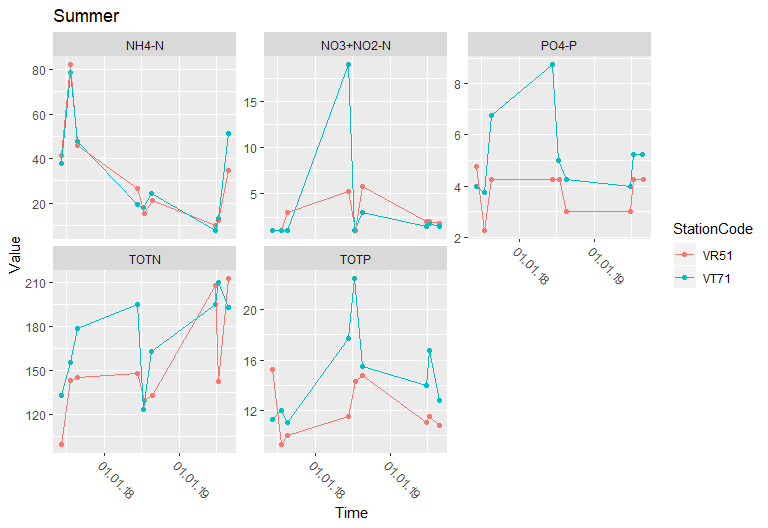<!-- -->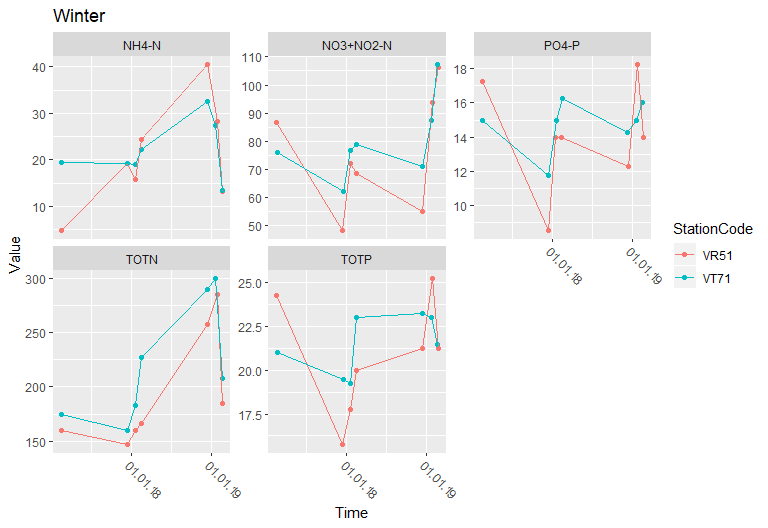<!-- -->

### Seasonal mean values  
- Compare with vallues used in NIVAclass excel sheets here:  
`K:\Prosjekter\Sjøvann\KYSTOVERVÅKING ØKOKYST\KYSTOVERVÅKING ØKOKYST 2017-2020\ØKOKYST DP Norskehavet Sør I O-17091_18091_19091_200091\Rapport 2019-data\klassification`    
- VT71: Results not equal to the numbers used for VT71, but so close that none of them change class  
- VR51: Very samll difference between weighted and unweighted means. Got exactly same numbers as those used if we used equal weights for 0,5 and 10 meters.   
- VR51, ammonium in winter: before deleting 2 very high February values, we have unweighted mean = 49.09, in Excel 23.63. After deleting, they are quite close.  

```r
#
# Weights = 0.25,0.5,0.25 for 0,5 and 10 meters
#
df_mean_nutrients <- NIVAklass_nutrientvalues(2017:2019, plotdata)

df_mean_nutrients %>%
  arrange(StationCode, Season) %>%
  knitr::kable()
```


StationCode   Season   Variable          Value
------------  -------  ----------  -----------
VR51          Summer   TOTP          12.027778
VR51          Summer   PO4-P          3.805556
VR51          Summer   TOTN         151.027778
VR51          Summer   NO3+NO2-N      2.527778
VR51          Summer   NH4-N         32.138889
VR51          Winter   TOTP          20.785714
VR51          Winter   PO4-P         14.035714
VR51          Winter   TOTN         194.357143
VR51          Winter   NO3+NO2-N     75.821429
VR51          Winter   NH4-N         20.892857
VT71          Summer   TOTP          14.833333
VT71          Summer   PO4-P          5.222222
VT71          Summer   TOTN         171.694444
VT71          Summer   NO3+NO2-N      3.416667
VT71          Summer   NH4-N         33.138889
VT71          Winter   TOTP          21.500000
VT71          Winter   PO4-P         14.750000
VT71          Winter   TOTN         220.285714
VT71          Winter   NO3+NO2-N     79.964286
VT71          Winter   NH4-N         21.928571

```r
#
# Weights = same for 0,5 and 10 meters
#
df_mean_nutrients <- NIVAklass_nutrientvalues(2017:2019, plotdata, 
                                              depths_weights = c(1,1,1))

df_mean_nutrients %>%
  arrange(StationCode, Season) %>%
  knitr::kable()
```


StationCode   Season   Variable          Value
------------  -------  ----------  -----------
VR51          Summer   TOTP          11.925926
VR51          Summer   PO4-P          3.851852
VR51          Summer   TOTN         150.629630
VR51          Summer   NO3+NO2-N      2.814815
VR51          Summer   NH4-N         32.592593
VR51          Winter   TOTP          20.714286
VR51          Winter   PO4-P         14.095238
VR51          Winter   TOTN         195.428571
VR51          Winter   NO3+NO2-N     76.380952
VR51          Winter   NH4-N         21.380952
VT71          Summer   TOTP          15.148148
VT71          Summer   PO4-P          5.259259
VT71          Summer   TOTN         171.074074
VT71          Summer   NO3+NO2-N      3.666667
VT71          Summer   NH4-N         33.000000
VT71          Winter   TOTP          21.571429
VT71          Winter   PO4-P         14.809524
VT71          Winter   TOTN         219.190476
VT71          Winter   NO3+NO2-N     80.000000
VT71          Winter   NH4-N         22.238095

## 4. Chl a quantiles    
- VR51: Fairly big difference - 3.01 used in Excel, got 3.64 here   
- VT71: Small difference - 1.78 used in Excel, got 1.72 here    

```r
NIVAklass_get_chl_data <- function(years, data, months = 2:10, depths = c(0,5,10)){
  data %>%
    mutate(Depth1 = ifelse(Depth1 == 0.5, 0, Depth1)) %>%
    filter(Variable %in% "KlfA" & 
             Depth1 %in% depths &
             month(Time) %in% months & year(Time) %in% years) %>% 
    select(StationCode, Time, Depth1, Variable, Value) %>%
    pivot_wider(names_from = Depth1, values_from = Value, names_prefix = "Depth")  %>%
    mutate(Max = pmax(Depth0, Depth5, Depth10, na.rm = TRUE))
    }


NIVAklass_plot_chl <- function(chldata){
  chldata %>%
    pivot_longer(c(Depth0, Depth5, Depth10, Max), names_to = "Depth", values_to = "KlfA") %>%
    ggplot(aes(Time, KlfA, color = Depth)) +
    geom_line() +
    facet_wrap(vars(StationCode))
}

NIVAklass_get_chl_quantiles <- function(chldata){
  chldata %>%
    group_by(StationCode) %>%
    summarise_at(c("Depth0", "Depth5", "Depth10", "Max"), 
             quantile, probs = 0.9, na.rm = TRUE, type = 7)  # type = 7 correponds to PERCENTILE:INC in Excel
                                                             # See part 6 above
    }


df <- NIVAklass_get_chl_data(2017:2019, dat2)

# df
NIVAklass_plot_chl(df)
```

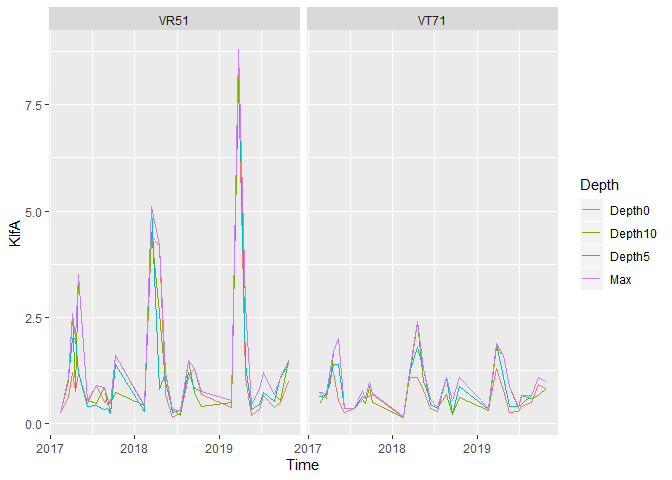<!-- -->

```r
NIVAklass_get_chl_quantiles(df)
```

```
## # A tibble: 2 x 5
##   StationCode Depth0 Depth5 Depth10   Max
##   <chr>        <dbl>  <dbl>   <dbl> <dbl>
## 1 VR51          2.12    2      2.94  3.64
## 2 VT71          1.12    1.4    1.72  1.74
```


## 5. Bottom O2    
- NOTE: Here we just check *CTD* values - the classification uses Winkler values from samples    
- Couldnæt find the lab values (at least not for 2019)  
  
Code from script 13 '13_QA_CTD_2019.Rmd'     
Remember that oxygen should be in ml/L! - See below   

```r
### Folders

basefolder <- "K:/Avdeling/214-Oseanografi/DATABASER/OKOKYST_2017/"

# Norskehavet Sør I
folder1 <- "OKOKYST_NH_Sor1_RMS/xlsbase/TilAquamonitor"

#
# Get data frame with one line per data file
#
# 1. Find sheet names here: (can be commented out afterwards)
# sheets_in_folder(folder1)                                 
# 2. Enter the sheet names here:  
fileinfo <- vars_in_folder(folder1, c("data","data","Data"))       

#
# Get data as list
#
datalist <- seq_len(nrow(fileinfo)) %>% map(read_data_fileno, df_fileinfo = fileinfo)

#
# Get data frame with one line per station
# NOTE: Not actally needed
#
fileinfo_stations <- seq_len(nrow(fileinfo)) %>% map_df(get_stations)
fileinfo_stations
```

```
##                                       Folder
## 1 OKOKYST_NH_Sor1_RMS/xlsbase/TilAquamonitor
## 2 OKOKYST_NH_Sor1_RMS/xlsbase/TilAquamonitor
## 3 OKOKYST_NH_Sor1_RMS/xlsbase/TilAquamonitor
## 4 OKOKYST_NH_Sor1_RMS/xlsbase/TilAquamonitor
## 5 OKOKYST_NH_Sor1_RMS/xlsbase/TilAquamonitor
## 6 OKOKYST_NH_Sor1_RMS/xlsbase/TilAquamonitor
##                                     File Sheet StationCode_var File_no
## 1 Økokyst_Norskehavet_Sør1_CTD_2017.xlsm  data     StationCode       1
## 2 Økokyst_Norskehavet_Sør1_CTD_2017.xlsm  data     StationCode       1
## 3 Økokyst_Norskehavet_Sør1_CTD_2018.xlsm  data     StationCode       2
## 4 Økokyst_Norskehavet_Sør1_CTD_2018.xlsm  data     StationCode       2
## 5 Økokyst_Norskehavet_Sør1_CTD_2019.xlsm  Data       StationId       3
## 6 Økokyst_Norskehavet_Sør1_CTD_2019.xlsm  Data       StationId       3
##   StationCode    n
## 1        VR51 3016
## 2        VT71  854
## 3        VR51 3168
## 4        VT71  917
## 5        VR51 2957
## 6        VT71  836
```

### Check and combine all data   
Remember that oxygen should be in ml/L!   

```r
# Check variable names of each dataset
map(datalist, names)
```

```
## [[1]]
##  [1] "ProjectName"    "StationCode"    "Date"           "Depth1"        
##  [5] "Depth2"         "Saltholdighet"  "Temperatur"     "Oksygen"       
##  [9] "Oksygenmetning" "Metode"        
## 
## [[2]]
##  [1] "ProjectName"    "StationCode"    "Date"           "Depth1"        
##  [5] "Depth2"         "Saltholdighet"  "Temperatur"     "Oksygen"       
##  [9] "Oksygenmetning" "Metode"        
## 
## [[3]]
##  [1] "ProjectId"      "StationId"      "Date"           "Depth1"        
##  [5] "Depth2"         "Saltholdighet"  "Temperatur"     "Oksygen"       
##  [9] "Oksygen__1"     "Oksygenmetning" "Methode"
```

```r
map(datalist, ~"StationCode" %in% names(.))   # note StationId instead of StationCode in 3rd file!
```

```
## [[1]]
## [1] TRUE
## 
## [[2]]
## [1] TRUE
## 
## [[3]]
## [1] FALSE
```

```r
# Check start of file of each dataset
map(datalist, head)  
```

```
## [[1]]
## # A tibble: 6 x 10
##   ProjectName StationCode Date                Depth1 Depth2 Saltholdighet
##   <chr>       <chr>       <dttm>               <dbl>  <dbl>         <dbl>
## 1 ØKOKYST No~ VR51        2017-02-15 00:00:00    0      0.5          33.5
## 2 ØKOKYST No~ VR51        2017-02-15 00:00:00    0.5    1.5          33.5
## 3 ØKOKYST No~ VR51        2017-02-15 00:00:00    1.5    2.5          33.6
## 4 ØKOKYST No~ VR51        2017-02-15 00:00:00    2.5    3.5          33.7
## 5 ØKOKYST No~ VR51        2017-02-15 00:00:00    3.5    4.5          33.8
## 6 ØKOKYST No~ VR51        2017-02-15 00:00:00    4.5    5.5          33.8
## # ... with 4 more variables: Temperatur <dbl>, Oksygen <dbl>,
## #   Oksygenmetning <dbl>, Metode <chr>
## 
## [[2]]
## # A tibble: 6 x 10
##   ProjectName StationCode Date                Depth1 Depth2 Saltholdighet
##   <chr>       <chr>       <dttm>               <dbl>  <dbl>         <dbl>
## 1 ØKOKYST No~ VR51        2017-12-14 13:39:27    0      0.5          31.2
## 2 ØKOKYST No~ VR51        2017-12-14 13:39:27    0.5    1.5          31.2
## 3 ØKOKYST No~ VR51        2017-12-14 13:39:27    1.5    2.5          31.1
## 4 ØKOKYST No~ VR51        2017-12-14 13:39:27    2.5    3.5          31.1
## 5 ØKOKYST No~ VR51        2017-12-14 13:39:27    3.5    4.5          31.2
## 6 ØKOKYST No~ VR51        2017-12-14 13:39:27    4.5    5.5          31.2
## # ... with 4 more variables: Temperatur <dbl>, Oksygen <dbl>,
## #   Oksygenmetning <dbl>, Metode <chr>
## 
## [[3]]
## # A tibble: 6 x 11
##   ProjectId StationId Date                Depth1 Depth2 Saltholdighet Temperatur
##   <chr>     <chr>     <dttm>               <dbl>  <dbl>         <dbl>      <dbl>
## 1 ØKOKYST ~ VR51      2018-12-14 14:09:37    0      0.5          31.5       5.37
## 2 ØKOKYST ~ VR51      2018-12-14 14:09:37    0.5    1.5          31.8       5.55
## 3 ØKOKYST ~ VR51      2018-12-14 14:09:37    1.5    2.5          32.0       6.04
## 4 ØKOKYST ~ VR51      2018-12-14 14:09:37    2.5    3.5          32.3       7.24
## 5 ØKOKYST ~ VR51      2018-12-14 14:09:37    3.5    4.5          32.6       8.51
## 6 ØKOKYST ~ VR51      2018-12-14 14:09:37    4.5    5.5          32.7       8.86
## # ... with 4 more variables: Oksygen <dbl>, Oksygen__1 <dbl>,
## #   Oksygenmetning <dbl>, Methode <chr>
```

```r
# For file no 3, we want Oxygen__1! (oxygen in ml/L)
#   (inspect 2nd row of Excel file)
# So we delete the original Oksygen and make a new one
datalist[[3]] <- datalist[[3]] %>%
  select(-Oksygen) %>%
  rename(Oksygen = Oksygen__1) %>%
  rename(StationCode = StationId)    # Also remember this!

# datalist[[3]] %>% filter(Depth1 == 200.5) %>% View("Data no 3")

# Combine
data_all <- bind_rows(datalist)

data_all <- data_all %>%
  filter(Oksygen > 0)

# Check
# data_all %>% filter(Depth1 == 200.5) %>% View("Data_all")
```


#### Data availability and max depth  

```r
for (station in c("VR51", "VT71")){
  
  dat <- data_all %>%
    filter(StationCode %in% station)
  
  # Plot data availablity 1 - number of data with/without Oxygen
  gg <- dat %>%
    count(Date, Has_data = !is.na(Oksygen)) %>%
    ggplot(aes(Date, n, color = Has_data)) + 
    geom_vline(aes(xintercept = Date), color = "grey60") +
    geom_point() +
    labs(title = paste(station, "- number of data with/without oxygen"))
  print(gg)
  
  # Plot data availablity 2 - max depth
  gg <- dat %>%
    filter(!is.na(Oksygen)) %>%
    group_by(Date) %>%
    summarise(Max_depth = max(Depth1)) %>%
    ggplot(aes(Date, Max_depth)) + 
    geom_vline(aes(xintercept = Date), color = "grey60")+
    geom_point() +
    labs(title = paste(station, "- max depth of oxygen data"))
  print(gg)
  
}
```

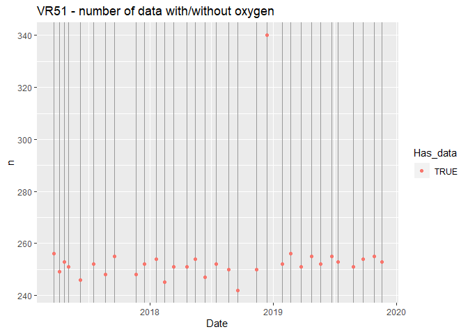<!-- --><!-- -->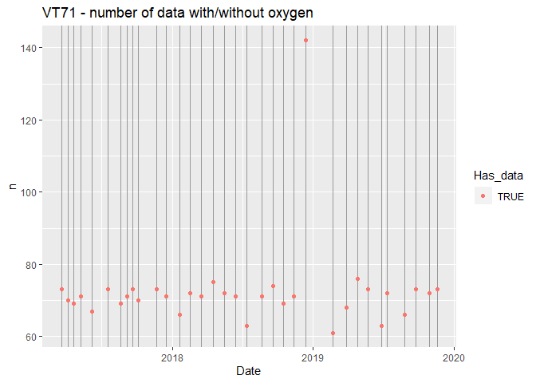<!-- -->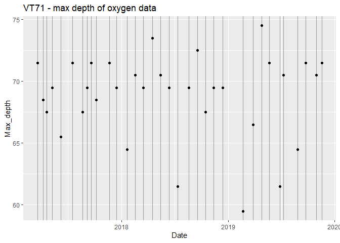<!-- -->

#### Get oxygen at max depth    
Also calculates 'Max_depth_perc' = Max depth that date as percent of max depth of that station

```r
# Get data from largest depth
# 'Max_depth_perc'
dat_bottom <- data_all %>%
  filter(!is.na(Oksygen)) %>%
  group_by(StationCode) %>%
  mutate(Max_depth_station = max(Depth1)) %>%
  group_by(StationCode, Date) %>%
  mutate(Max_depth = max(Depth1),
         Max_depth_perc = Max_depth/Max_depth_station*100) %>%
  filter(Depth1 == Max_depth) # 230 is from plot above

# Check 
dat_bottom %>%
  select(StationCode, Date, Oksygen, Max_depth, Max_depth_station, Max_depth_perc)
```

```
## # A tibble: 68 x 6
## # Groups:   StationCode, Date [66]
##    StationCode Date                Oksygen Max_depth Max_depth_stati~
##    <chr>       <dttm>                <dbl>     <dbl>            <dbl>
##  1 VR51        2017-03-21 00:00:00   3.55      254.             254. 
##  2 VR51        2017-04-07 00:00:00   3.35      248.             254. 
##  3 VR51        2017-04-21 00:00:00   0.115     252.             254. 
##  4 VR51        2017-05-04 00:00:00   3.37      250.             254. 
##  5 VR51        2017-06-08 00:00:00   4.33      244.             254. 
##  6 VR51        2017-07-18 00:00:00   4.29      250.             254. 
##  7 VR51        2017-08-21 00:00:00   4.12      246.             254. 
##  8 VR51        2017-09-18 00:00:00   3.44      254.             254. 
##  9 VR51        2017-11-20 00:00:00   3.89      246.             254. 
## 10 VT71        2017-03-20 00:00:00   6.19       71.5             74.5
## # ... with 58 more rows, and 1 more variable: Max_depth_perc <dbl>
```

```r
# Keep only those where max depth is 85% of depth at station
dat_bottom <- dat_bottom %>%
  filter(Max_depth_perc > 85)
```

#### Get oxygen at oxygen minimum

```r
dat_o2min <- data_all %>%
  filter(!is.na(Oksygen)) %>%
  group_by(StationCode, Date) %>%
  mutate(Min_O2 = min(Oksygen)) %>%
  filter(Oksygen == Min_O2) %>% # select(Date, Oksygen, Depth1)
  summarise(Oksygen = mean(Oksygen), 
            Oksygenmetning = mean(Oksygenmetning), 
            Depth1_min = min(Depth1),
            Depth1_max = max(Depth1),
            Depth1 = max(Depth1)
            ) %>%
  mutate(Depth_diff = Depth1_max - Depth1_min)

# Check those where mn oxygen occurs over > 2 meter depth
dat_o2min %>% 
  filter(Depth_diff > 2) %>%
  select(StationCode, Date, Oksygen, Depth1_min, Depth1_max)
```

```
## # A tibble: 4 x 5
## # Groups:   StationCode [2]
##   StationCode Date                Oksygen Depth1_min Depth1_max
##   <chr>       <dttm>                <dbl>      <dbl>      <dbl>
## 1 VR51        2018-04-19 11:20:41    4.91      244.       250. 
## 2 VT71        2017-03-20 00:00:00    6.19       58.5       67.5
## 3 VT71        2017-05-09 00:00:00    5.95       40.5       44.5
## 4 VT71        2017-07-18 00:00:00    4.06       59.5       64.5
```

#### Combine oxygen data  

```r
dat_oxygen <- bind_rows(
  dat_bottom %>% 
    select(StationCode, Date, Oksygen, Oksygenmetning, Depth1) %>% 
    mutate(Position = "Bottom"),
  dat_o2min %>% 
    select(StationCode, Date, Oksygen, Oksygenmetning, Depth1) %>% 
    mutate(Position = "O2-minimum")
  ) %>%
  ungroup()

dat_oxygen
```

```
## # A tibble: 129 x 6
##    StationCode Date                Oksygen Oksygenmetning Depth1 Position
##    <chr>       <dttm>                <dbl>          <dbl>  <dbl> <chr>   
##  1 VR51        2017-03-21 00:00:00   3.55           53.8   254.  Bottom  
##  2 VR51        2017-04-07 00:00:00   3.35           50.8   248.  Bottom  
##  3 VR51        2017-04-21 00:00:00   0.115           1.76  252.  Bottom  
##  4 VR51        2017-05-04 00:00:00   3.37           51.1   250.  Bottom  
##  5 VR51        2017-06-08 00:00:00   4.33           65.8   244.  Bottom  
##  6 VR51        2017-07-18 00:00:00   4.29           65.2   250.  Bottom  
##  7 VR51        2017-08-21 00:00:00   4.12           62.7   246.  Bottom  
##  8 VR51        2017-09-18 00:00:00   3.44           52.3   254.  Bottom  
##  9 VR51        2017-11-20 00:00:00   3.89           59.2   246.  Bottom  
## 10 VT71        2017-03-20 00:00:00   6.19           89.8    71.5 Bottom  
## # ... with 119 more rows
```

#### Plot time series   
Shading for winter season (October - April)

```r
for (station in c("VR51", "VT71")){
  gg1 <- plot_ts(
    data = dat_oxygen %>% filter(StationCode %in% station), 
    years = 2017:2019, 
    y_variable = "Oksygen", category_variable = "Position", 
    quality_type = "Concentration",
    title = paste(station, "- oxygen concentration"))
  gg2 <- plot_ts(
    data = dat_oxygen %>% filter(StationCode %in% station), 
    years = 2017:2019, 
    category_variable = "Position",
    y_variable = "Oksygenmetning", 
    quality_type = "Saturation",
    title = paste(station, "- oxygen saturation"))
  print(gg1)
  print(gg2)
}
```

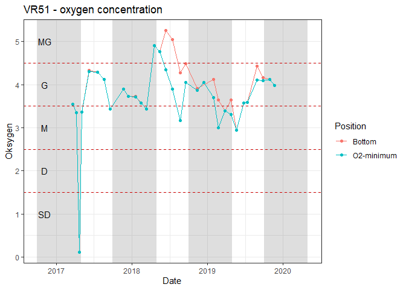<!-- -->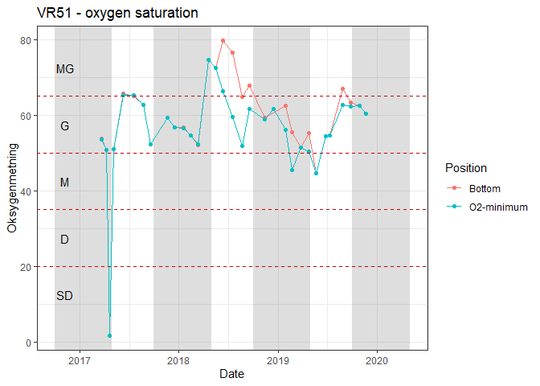<!-- -->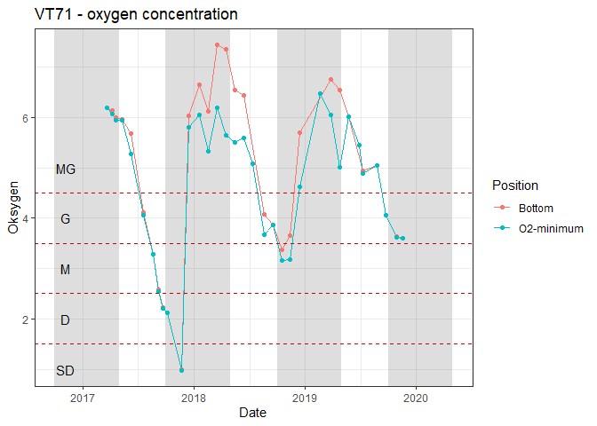<!-- -->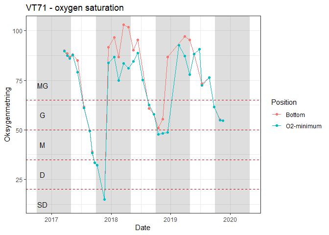<!-- -->

#### Make means  
Mean for last 3 years = 3.844558    
Mean for last 3 years, winer only = 3.641219   


```r
# Mean oxygen for all months
dat_oxygen %>%
  group_by(StationCode, Position) %>%
  summarise(Oksygen = mean(Oksygen), 
            Oksygenmetning = mean(Oksygenmetning)) %>%
  knitr::kable(caption = "Mean oxygen for all months", digits = 2)
```


Table: Mean oxygen for all months

StationCode   Position      Oksygen   Oksygenmetning
------------  -----------  --------  ---------------
VR51          Bottom           3.84            58.41
VR51          O2-minimum       3.68            56.11
VT71          Bottom           4.97            72.96
VT71          O2-minimum       4.66            68.78

```r
# Mean oxygen for winter (Sept - April)
dat_oxygen %>%
  filter(month(Date) <= 4 | month(Date) >= 9) %>%
  group_by(StationCode, Position) %>%
  summarise(Oksygen = mean(Oksygen),
            Oksygenmetning = mean(Oksygenmetning)) %>%
  knitr::kable(caption = "Mean oxygen for winter (Sept - April)", digits = 2)
```


Table: Mean oxygen for winter (Sept - April)

StationCode   Position      Oksygen   Oksygenmetning
------------  -----------  --------  ---------------
VR51          Bottom           3.64            55.34
VR51          O2-minimum       3.56            54.20
VT71          Bottom           4.85            71.19
VT71          O2-minimum       4.49            64.68

