**QC of Norskehavet Sør I (Caroline + Lars)**      
- Checked input to these files:  
`K:\Prosjekter\Sjøvann\KYSTOVERVÅKING ØKOKYST\KYSTOVERVÅKING ØKOKYST 2017-2020\ØKOKYST DP Norskehavet Sør I O-17091_18091_19091_200091\Rapport 2019-data\klassification`
- Stations:
    + VT71 Skinnbrokleia
    + VR51 Korsen
  
- **Note: Here we download data from Aquamonitor insted of reading excel files (as last year)**  

**Veileder:**  
- `Documents\artikler\veiledere etc\02_2013_klassifiserings-veileder_.pdf`  
- Chlorophyll: page 91.   
"I SørNorge (til Stadt) anbefales det at innsamlingen starter i februar og avsluttes ved utgangen av oktober."   
"Nord for Stadt anbefales det at innsamlingsperioden strekker seg fra mars til og med september."   
90% percentiles should be used   
  
- Also see calculation example on on page 187-189, and the comment on page 189:  
"Det gjøres oppmerksom på at dataprogrammene som beregner 90-persentil, gjerne benytter ulike metoder". We use the Excel method PERCENTILE.EXC, corresponding to type 6 quantiles in R  
  
- Nutrients: page 102 in veileder  
Vinter er november til og med februar   
Sommer er juni til og med august  

  


## 1. Read Norskehavet Nord I nutrients     


### Get data  

```
## 3983 rows of data downloaded 
## Stations: VR51, VT71 
## Parameters: NO3+NO2-N, NH4-N, TOTP, PO4-P, SiO2, KlfA, TSM, TOTN (old EF), TOTN, TOTN (est.)
```


### Measurements by parameter, site and year    

```
## , , STATION_CODE = VR51
## 
##       PARAM_NAME
## Year   KlfA NH4-N NO3+NO2-N PO4-P SiO2 TOTN TOTN (old EF) TOTP TSM
##   2017   65    65        65    65   65   55            10   65  65
##   2018   60    60        60    60   60   20            40   60  59
##   2019   60    60        60    60   60    0            60   60  60
##   2020   55    60        60    60   60   15            60   60  60
## 
## , , STATION_CODE = VT71
## 
##       PARAM_NAME
## Year   KlfA NH4-N NO3+NO2-N PO4-P SiO2 TOTN TOTN (old EF) TOTP TSM
##   2017   65    65        65    65   65   55            10   65  65
##   2018   60    60        60    60   60   20            40   60  59
##   2019   60    60        60    60   60    0            60   60  60
##   2020   60    70        70    70   70   15            60   60  60
```
### Measurements by depth, site and year    

```
## , , STATION_CODE = VR51
## 
##       Year
## DEPTH1 2017 2018 2019 2020
##     0    13   12   12   13
##     5    13   12   12   13
##     10   13   12   12   13
##     20   13   12   12   13
##     30   13   12   12   13
##     65    0    0    0    0
##     71    0    0    0    0
##     74    0    0    0    0
##     75    0    0    0    0
##     76    0    0    0    0
## 
## , , STATION_CODE = VT71
## 
##       Year
## DEPTH1 2017 2018 2019 2020
##     0    13   12   12   12
##     5    13   12   12   12
##     10   13   12   12   12
##     20   13   12   12   12
##     30   13   12   12   12
##     65    0    0    0    2
##     71    0    0    0    1
##     74    0    0    0    1
##     75    0    0    0    2
##     76    0    0    0    4
```
### Parameters  

```
## # A tibble: 10 x 3
##    PARAM_NAME    NAME                 n
##    <chr>         <chr>            <int>
##  1 KlfA          Klorofyll A        485
##  2 NH4-N         Ammonium           500
##  3 NO3+NO2-N     Nitritt + nitrat   500
##  4 PO4-P         Fosfat             500
##  5 SiO2          Silikat            500
##  6 TOTN          Total nitrogen     180
##  7 TOTN (old EF) Total nitrogen     340
##  8 TOTP          Total fosfor       490
##  9 TSM           TSM                351
## 10 TSM           TSM-F              137
```

### Reformat data    
Formatting the data in 'wide' format (one column per paremeter) as shown below  

```
## # A tibble: 4 x 15
##   StationCode Date                Depth1 `NH4-N`   TSM  SiO2 `NO3+NO2-N`  TOTP
##   <chr>       <dttm>               <dbl>   <dbl> <dbl> <dbl>       <dbl> <dbl>
## 1 VT71        2017-02-16 00:00:00      0      20  0.19   330          75    21
## 2 VT71        2017-02-16 00:00:00      5      19  0.51   320          75    21
## 3 VT71        2017-02-16 00:00:00     10      20  0.37   340          79    21
## 4 VT71        2017-02-16 00:00:00     20      20  0.21   350          81    21
## # ... with 7 more variables: TOTN <dbl>, `PO4-P` <dbl>, KlfA <dbl>, `TOTN (old
## #   EF)` <dbl>, Year <dbl>, Month <dbl>, `Nitrate + ammonium` <dbl>
```
  
## Chl a   
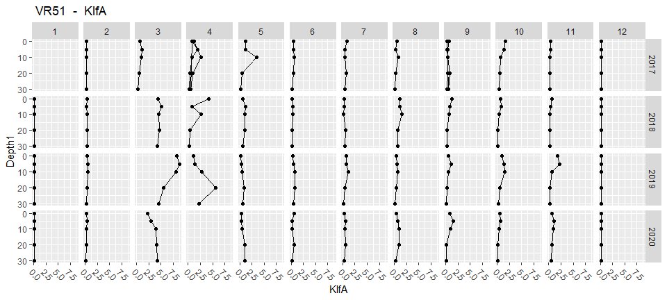<!-- -->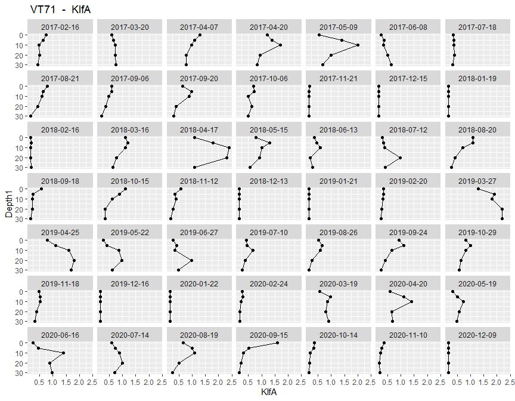<!-- -->

## Nutrients  {.tabset}


### NH4-N
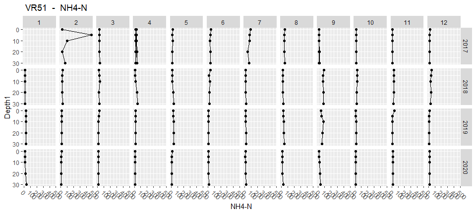<!-- -->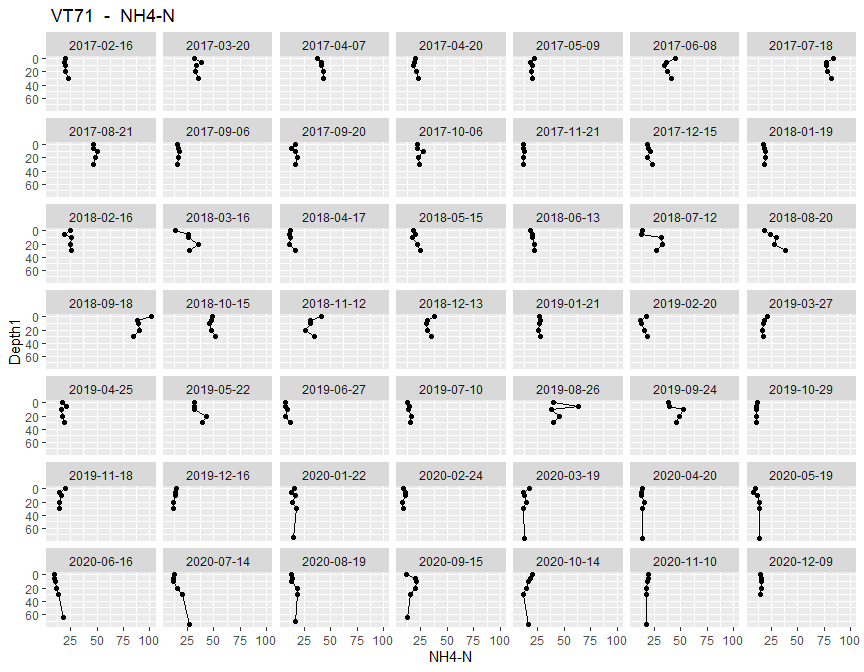<!-- -->


### NO3+NO2-N
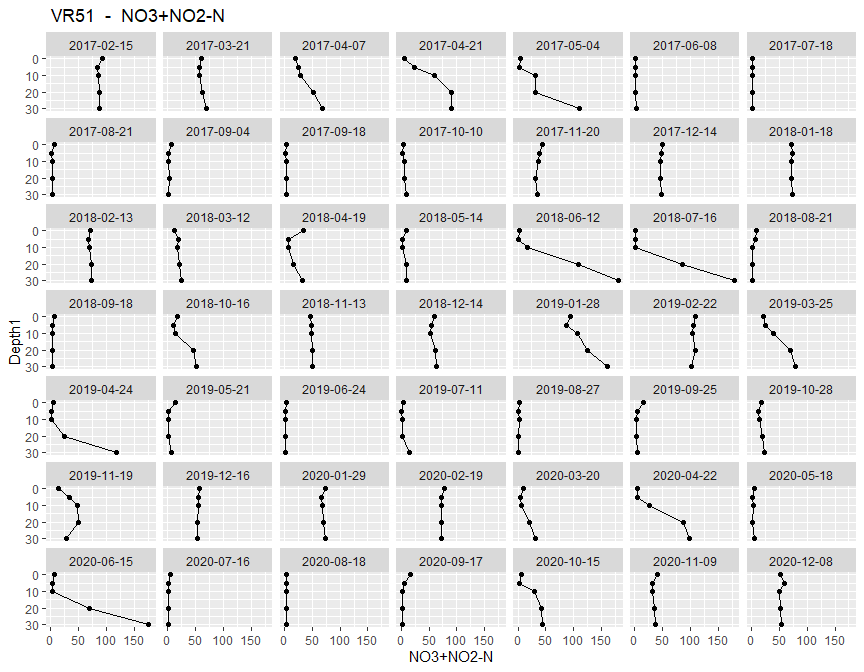<!-- -->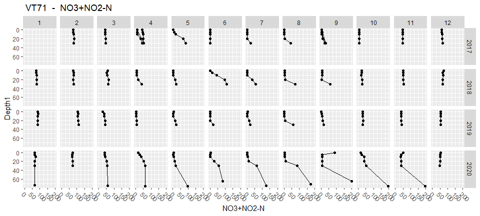<!-- -->


### TOTN
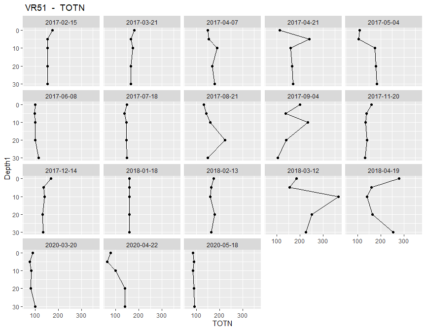<!-- -->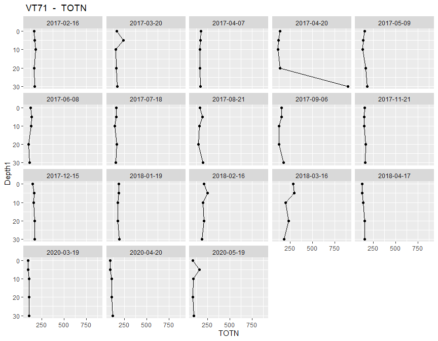<!-- -->


### TOTN (old EF) 
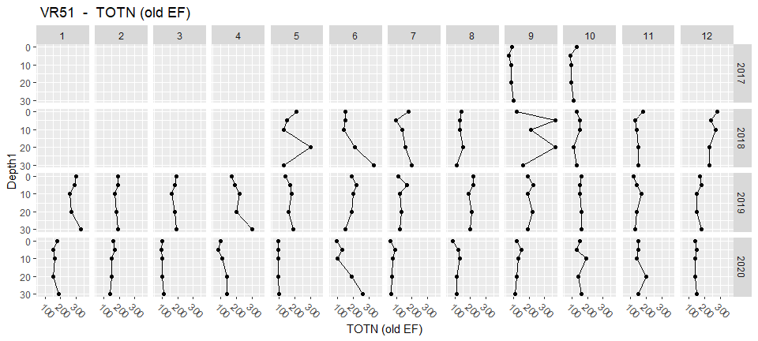<!-- -->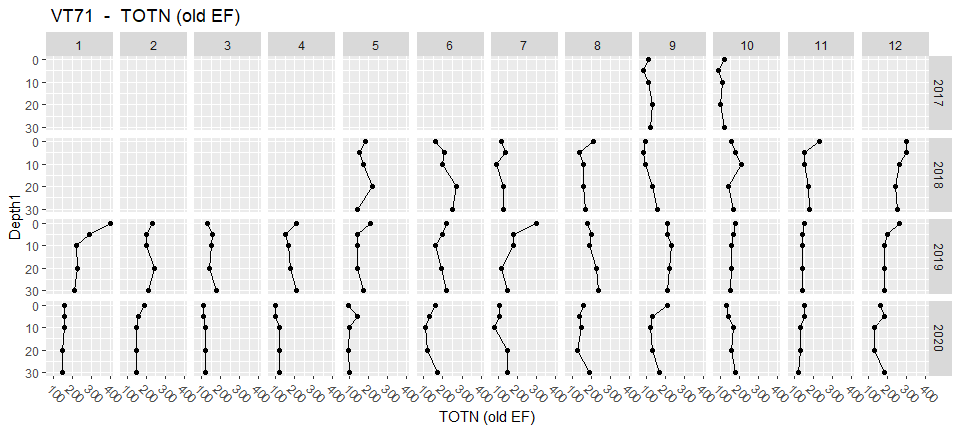<!-- -->


### PO4-P
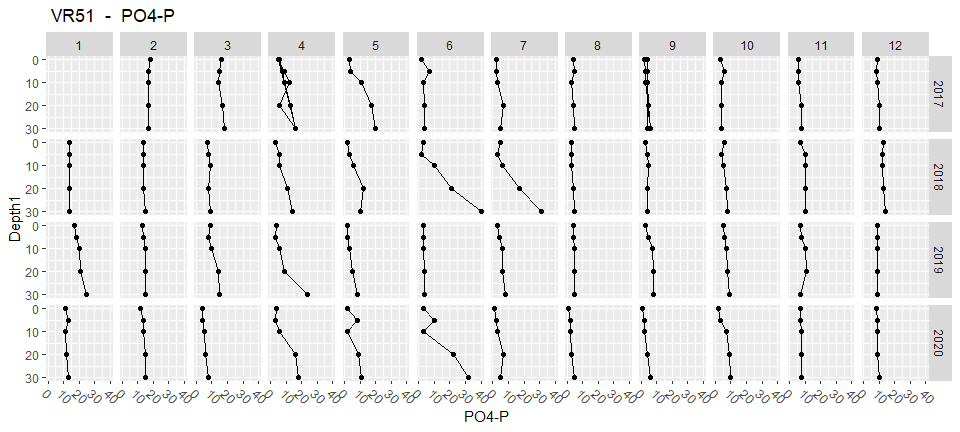<!-- --><!-- -->

### TOTP
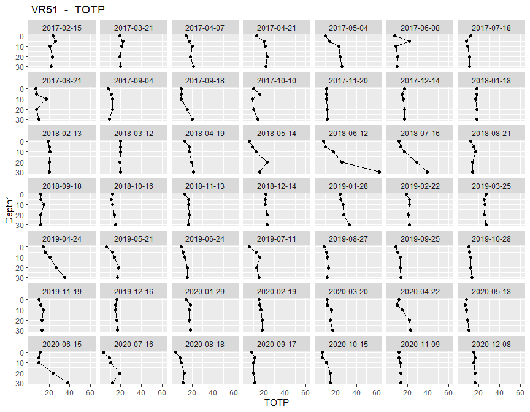<!-- -->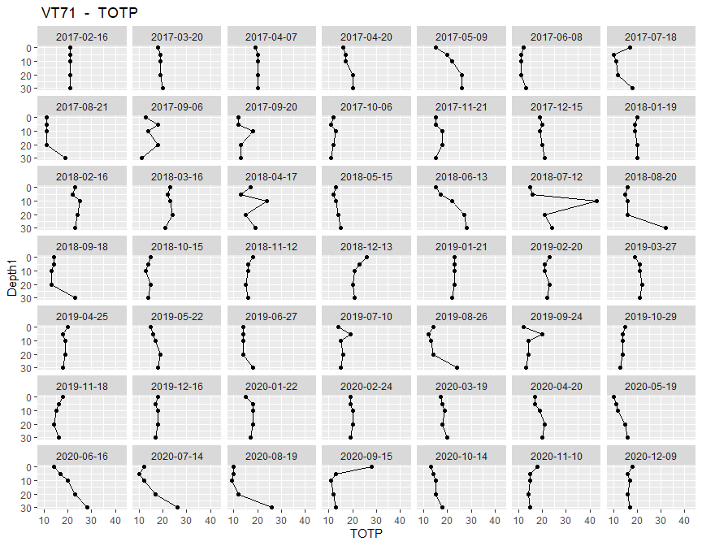<!-- -->

### SiO2
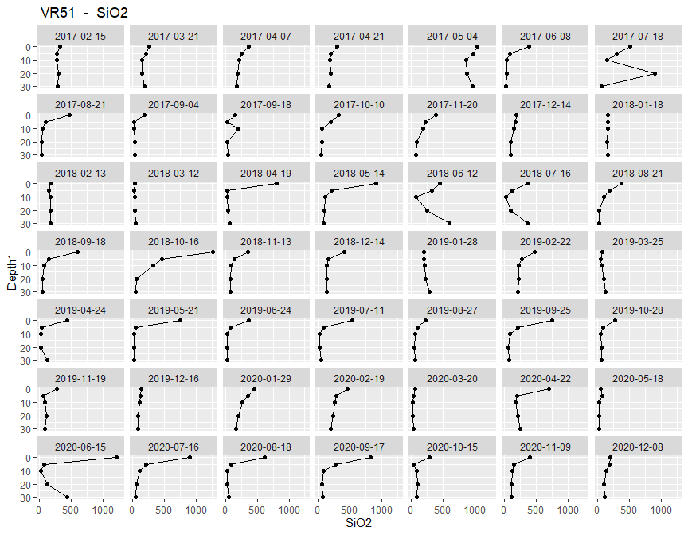<!-- -->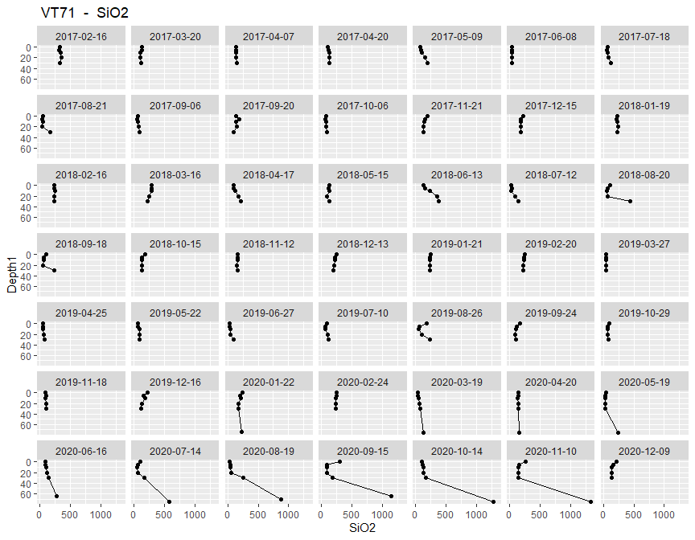<!-- -->

### TSM
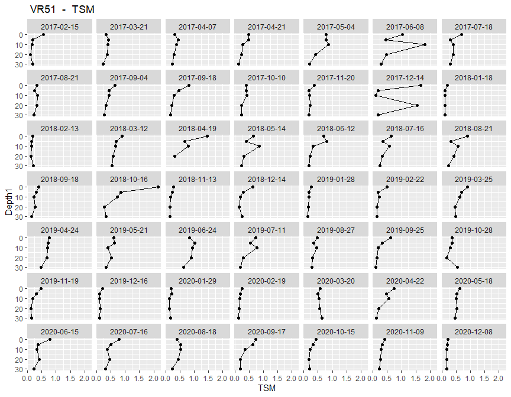<!-- -->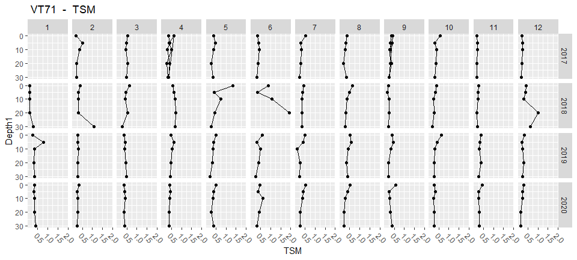<!-- -->

## TotN versus the sum of nitrate + ammonium    
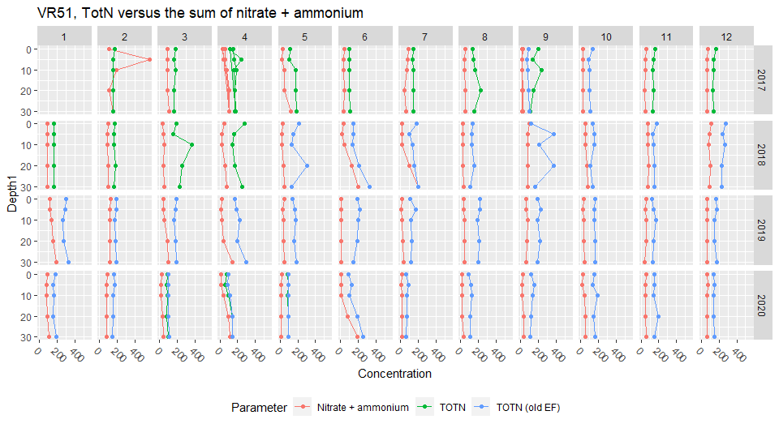<!-- -->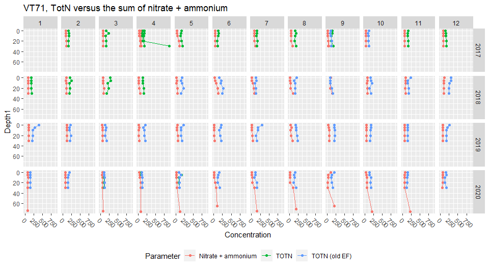<!-- -->


