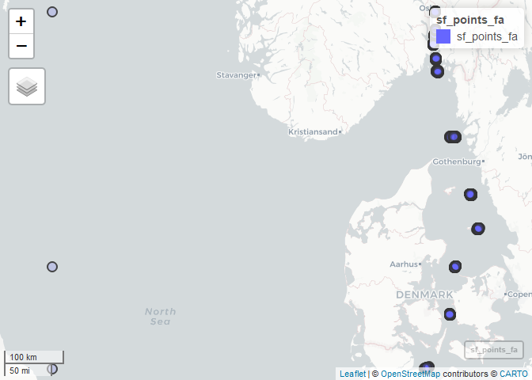
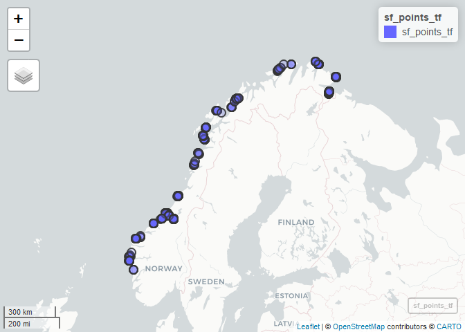
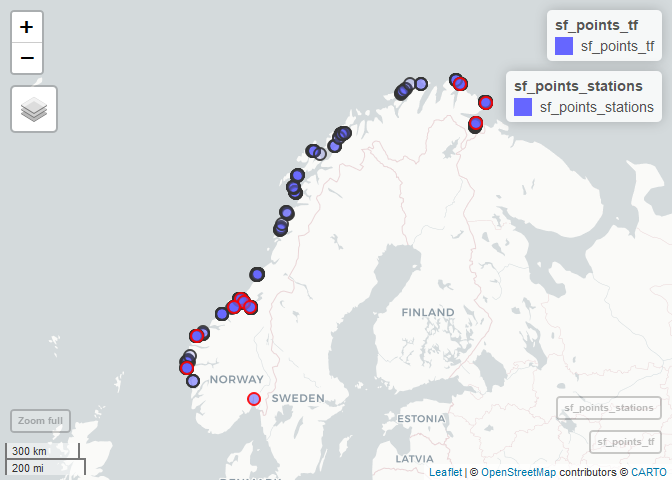

Match ferrybox sample numbers to stations
================
Helene
7 februar 2020

  - [1. Libraries](#libraries)
  - [2. Read AqM station data](#read-aqm-station-data)
  - [3. Ferrybox log data 2019](#ferrybox-log-data-2019)
      - [a. Ferrybox log data 2019](#a.-ferrybox-log-data-2019)
      - [b. Ferrybox log data 2018](#b.-ferrybox-log-data-2018)
      - [c. Combine data for both years for each
        ferry](#c.-combine-data-for-both-years-for-each-ferry)
      - [d. Save sample files](#d.-save-sample-files)
      - [e. Sample numbers used in
        files](#e.-sample-numbers-used-in-files)
  - [4. Match automatic samples](#match-automatic-samples)
      - [Check samples in map - prepare
        data](#check-samples-in-map---prepare-data)
      - [Check Fantasy samples in map](#check-fantasy-samples-in-map)
      - [Check Trollfjord samples in
        map](#check-trollfjord-samples-in-map)
      - [Check stations in map](#check-stations-in-map)
      - [Stations vs Fantasy sample
        positions](#stations-vs-fantasy-sample-positions)
      - [Stations vs Trollfjord sample
        positions](#stations-vs-trollfjord-sample-positions)
  - [5. Check positions of manual
    samples](#check-positions-of-manual-samples)
      - [Check samples in map - prepare
        data](#check-samples-in-map---prepare-data-1)
      - [Check Fantasy samples in map](#check-fantasy-samples-in-map-1)
      - [Check Trollfjord samples in
        map](#check-trollfjord-samples-in-map-1)

Find which sample numbers (in Ferrybox files) belongs to which stations

Corresponding numbers in Fantasy:  
\- VT4 = sample no 21-22

Corresponding numbers in Trollfjord:  
\- VT4 = sample no 23-24  
\- VT72 = sample no 21-22  
\- VT23 = sample no 17-18  
\- VT80 = sample no 11-12  
\- VT45 = sample no 13-14  
\- VT22 = sample no 15-16  
\- VR25 = sample no 6-7  
\- VR23 = sample no 4-5  
\- VR76 = sample no 2-3

For a version with interactive maps, see `21_FBstations.html`.  
(Was created using `output: html_document` with `toc: true, toc_float:
true` to create html
file.)

## 1\. Libraries

``` r
library(plyr)      # used by functions in "Get_files_NIVA_ftp_server_functions.R" 
library(dplyr)     # load AFTER plyr, so e,g, we use count() from dplyr
```

    ## 
    ## Attaching package: 'dplyr'

    ## The following objects are masked from 'package:plyr':
    ## 
    ##     arrange, count, desc, failwith, id, mutate, rename, summarise,
    ##     summarize

    ## The following objects are masked from 'package:stats':
    ## 
    ##     filter, lag

    ## The following objects are masked from 'package:base':
    ## 
    ##     intersect, setdiff, setequal, union

``` r
library(purrr)
```

    ## 
    ## Attaching package: 'purrr'

    ## The following object is masked from 'package:plyr':
    ## 
    ##     compact

``` r
library(ggplot2)
library(lubridate)
```

    ## 
    ## Attaching package: 'lubridate'

    ## The following object is masked from 'package:plyr':
    ## 
    ##     here

    ## The following object is masked from 'package:base':
    ## 
    ##     date

``` r
library(readxl)
library(tidyr)
library(RColorBrewer)

source("Get_files_NIVA_ftp_server_functions.R")
```

    ## Loading required package: bitops

    ## 
    ## Attaching package: 'RCurl'

    ## The following object is masked from 'package:tidyr':
    ## 
    ##     complete

``` r
# library(niRvana)
#source("12_QA_2019_from_excel_functions.R")
# RColorBrewer::display.brewer.all()
```

## 2\. Read AqM station data

``` r
df_aqm_stations <- read_excel("Datasett/AqM_2017_2019_ØKOKYST_Ferrybox_ToR.xlsx", 
                              sheet = "StationPoint")
```

## 3\. Ferrybox log data 2019

### a. Ferrybox log data 2019

We do this before 2018 in order to get the headers (column names), which
we will use for 2018 data  
\- Data downloaded from Pierre’s OneDrive 12.02.2020  
\- [Link to Pierre’s
OneDrive](https://niva365-my.sharepoint.com/:f:/g/personal/pierre_jaccard_niva_no/Et9g2CZL2_tEg3vOt7ACQh0BHCjrOcKzPz-iAgdYst2ddQ?e=hpkNeW)

``` r
df_ferrybox_sampledata_2019_fa <- readxl::read_excel(
  "Datasett/Ferrybox_samples_OneDrive/FA_2019_automatic_samples.xlsx")

df_ferrybox_sampledata_2019_tf <- readxl::read_excel(
  "Datasett/Ferrybox_samples_OneDrive/TF_2019_automatic_samples.xlsx")

# names(df_ferrybox_sampledata_2019_fa)
# names(df_ferrybox_sampledata_2019_tf)

X <- df_ferrybox_sampledata_2019_fa$SYSTEM_DATE_DMY - ymd_hms("1899-12-31 00:00:00")

df_ferrybox_sampledata_2019_fa <- df_ferrybox_sampledata_2019_fa %>%
  mutate(TIME = SYSTEM_TIME + X)

# Check
# df_samples_fa$SYSTEM_DATE_DMY %>% head()
# df_samples_fa$SYSTEM_TIME %>% head()
# df_samples_fa$TIME %>% head()

unique(df_ferrybox_sampledata_2019_fa$SYSTEM_DATE_DMY)
```

    ##  [1] "2018-12-31 UTC" "2019-01-03 UTC" "2019-01-04 UTC" "2019-02-18 UTC"
    ##  [5] "2019-02-19 UTC" "2019-02-26 UTC" "2019-02-27 UTC" "2019-03-06 UTC"
    ##  [9] "2019-03-07 UTC" "2019-03-20 UTC" "2019-03-21 UTC" "2019-04-09 UTC"
    ## [13] "2019-04-10 UTC" "2019-04-12 UTC" "2019-04-23 UTC" "2019-04-24 UTC"
    ## [17] "2019-05-13 UTC" "2019-05-14 UTC" "2019-05-29 UTC" "2019-05-30 UTC"
    ## [21] "2019-06-08 UTC" "2019-06-09 UTC" "2019-06-26 UTC" "2019-06-27 UTC"
    ## [25] "2019-07-01 UTC" "2019-07-14 UTC" "2019-07-15 UTC" "2019-07-30 UTC"
    ## [29] "2019-07-31 UTC" "2019-08-15 UTC" "2019-08-16 UTC" "2019-09-02 UTC"
    ## [33] "2019-09-03 UTC" "2019-09-08 UTC" "2019-09-09 UTC" "2019-09-22 UTC"
    ## [37] "2019-09-23 UTC" "2019-10-02 UTC" "2019-10-03 UTC" "2019-10-16 UTC"
    ## [41] "2019-10-17 UTC" "2019-10-28 UTC" "2019-10-29 UTC" "2019-11-17 UTC"
    ## [45] "2019-11-18 UTC" "2019-11-27 UTC" "2019-11-28 UTC" "2019-12-09 UTC"
    ## [49] "2019-12-10 UTC" "2019-12-17 UTC" "2019-12-18 UTC"

### b. Ferrybox log data 2018

``` r
# 4. Download all Ferrybox log data    
# Or just use saved log data

redownload_data <- FALSE  # if FALSE, we just read the saved data


if (redownload_data){  # takes just a couple of minutes
  
  #
  # a. Get dates and filenames ('df_samplefilenames_fa_2018')  
  #
  # get_folders()
  
  #
  # Fantasy
  #
  
  # Get the url for the vessel we want
  url.folder <- get_url_foldername("fantasy")
  
  # Get file names of all log files for that vessel
  samplefiles_fn <- get_filenames_samplefiles("fantasy")
  
  head(samplefiles_fn)
  # Check
  # tail(logfiles_fn)
  
  # Combine with dates 
  df_samplefilenames_fa_2018 <- data.frame(
    filename = samplefiles_fn,
    Date = ymd(substr(samplefiles_fn, 9, 16)),   # note that 9,16 is specifically for 'samples'
    stringsAsFactors = FALSE) %>%
    filter(year(Date) == 2018)
  
  
  #
  # Trollfjord
  #
  
  # Get the url for the vessel we want
  url.folder <- get_url_foldername("trollfjord")
  
  # Get file names of all log files for that vessel
  samplefiles_fn <- get_filenames_samplefiles("trollfjord")
  
  # Check
  # tail(logfiles_fn)
  
  # Combine with dates 
  df_samplefilenames_tf_2018 <- data.frame(
    filename = samplefiles_fn,
    Date = ymd(substr(samplefiles_fn, 9, 16)), # note that 9,16 is specifically for 'samples'
    stringsAsFactors = FALSE) %>%
    filter(year(Date) == 2018)
  
  #
  # b. Combine filenames  
  #
  
  df_samplefilenames_2018 <- 
    bind_rows(
      df_samplefilenames_fa_2018 %>% mutate(Ferrybox = "fantasy"),
      df_samplefilenames_tf_2018 %>% mutate(Ferrybox = "trollfjord")
    )
  
  #
  # c. Download sample file data
  #
  df_ferrybox_sampledata_2018_fa <- get_several_logfiles(
    df_samplefilenames_fa_2018$filename, 
    vessel = "fantasy",
    trace = FALSE)
  
  df_ferrybox_sampledata_2018_tf <- get_several_logfiles(
    df_samplefilenames_tf_2018$filename, 
    vessel = "trollfjord",
    trace = FALSE)
  
  names(df_ferrybox_sampledata_2018_fa) <- names(df_ferrybox_sampledata_2019_fa)
  names(df_ferrybox_sampledata_2018_tf) <- names(df_ferrybox_sampledata_2019_tf)

  #
  # d. Save
  #
  saveRDS(df_ferrybox_sampledata_2018_fa,
          "Datasett/18_df_ferrybox_sampledata_2018_fa.rds")
  saveRDS(df_ferrybox_sampledata_2018_tf,
          "Datasett/18_df_ferrybox_sampledata_2018_tf.rds")
  
  
} else {
  
  df_ferrybox_sampledata_2018_fa <-
    readRDS("Datasett/18_df_ferrybox_sampledata_2018_fa.rds")
  df_ferrybox_sampledata_2018_tf <-
    readRDS("Datasett/18_df_ferrybox_sampledata_2018_tf.rds")
  
}
```

### c. Combine data for both years for each ferry

  - 2018 + 2019  
  - The file columns differ betrween ferries, so we donæt combine them

<!-- end list -->

``` r
#
# Fantasy
#

df_ferrybox_sampledata_2018_fa[1:7] %>% str()
```

    ## 'data.frame':    571 obs. of  7 variables:
    ##  $ SHIP_CODE      : chr  "FA" "FA" "FA" "FA" ...
    ##  $ SYSTEM_DATE_DMY: chr  "27.02.2018" "27.02.2018" "27.02.2018" "27.02.2018" ...
    ##  $ SYSTEM_TIME    : chr  "14:00:40" "14:09:41" "17:18:00" "17:22:01" ...
    ##  $ GPS_LATITUDE   : num  54.5 54.5 55.4 55.4 56.1 ...
    ##  $ GPS_LONGITUDE  : num  10.4 10.4 11 11 11.2 ...
    ##  $ GPS_TIME       : int  140037 140938 171757 172158 195914 200414 221327 221728 235438 235838 ...
    ##  $ PUMP           : int  1 1 1 1 1 1 1 1 1 1 ...

``` r
df_ferrybox_sampledata_2019_fa[1:7] %>% str()
```

    ## Classes 'tbl_df', 'tbl' and 'data.frame':    600 obs. of  7 variables:
    ##  $ SHIP_CODE      : chr  "FA" "FA" "FA" "FA" ...
    ##  $ SYSTEM_DATE_DMY: POSIXct, format: "2018-12-31" "2019-01-03" ...
    ##  $ SYSTEM_TIME    : POSIXct, format: "1899-12-31 08:30:14" "1899-12-31 14:05:20" ...
    ##  $ GPS_LATITUDE   : num  54.3 54.5 54.5 55.4 55.4 ...
    ##  $ GPS_LONGITUDE  : num  10.2 10.4 10.4 11 11 ...
    ##  $ GPS_TIME       : num  83013 140519 141520 172040 172440 ...
    ##  $ PUMP           : num  0 0 0 0 0 1 0 0 1 1 ...

``` r
df_ferrybox_sampledata_2018_fa <- df_ferrybox_sampledata_2018_fa %>%
  mutate(SYSTEM_DATE_DMY = dmy_hms(paste(SYSTEM_DATE_DMY, "00:00:00")),
         SYSTEM_TIME = ymd_hms(paste("1899-12-31", SYSTEM_TIME)))

df_ferrybox_sampledata_fa <- bind_rows(
  df_ferrybox_sampledata_2018_fa,
  df_ferrybox_sampledata_2019_fa)

#
# Trollfjord
#
df_ferrybox_sampledata_2018_tf[1:7] %>% str()
```

    ## 'data.frame':    680 obs. of  7 variables:
    ##  $ SHIP_CODE  : chr  "TF" "TF" "TF" "TF" ...
    ##  $ SYSTEM_DATE: chr  "26.03.2018" "26.03.2018" "26.03.2018" "26.03.2018" ...
    ##  $ SYSTEM_TIME: chr  "08:49:43" "08:51:43" "08:57:44" "08:59:44" ...
    ##  $ GPS_LAT    : num  70.7 70.7 70.7 70.7 70.7 ...
    ##  $ GPS_LON    : num  23.7 23.7 23.7 23.7 23.7 ...
    ##  $ GPS_TIME   : int  84938 85138 85739 85939 90240 90340 90540 90741 90941 91141 ...
    ##  $ PUMP_FLAG  : int  0 0 0 0 0 0 0 0 0 0 ...

``` r
df_ferrybox_sampledata_2019_tf[1:7] %>% str()
```

    ## Classes 'tbl_df', 'tbl' and 'data.frame':    260 obs. of  7 variables:
    ##  $ SHIP_CODE  : chr  "TF" "TF" "TF" "TF" ...
    ##  $ SYSTEM_DATE: POSIXct, format: "2018-12-20" "2019-01-16" ...
    ##  $ SYSTEM_TIME: POSIXct, format: "1899-12-31 19:53:26" "1899-12-31 11:58:09" ...
    ##  $ GPS_LAT    : num  63 69.8 69.8 69.8 70.5 ...
    ##  $ GPS_LON    : num  7.26 30.1 30.11 30.11 30.99 ...
    ##  $ GPS_TIME   : num  195322 115806 120707 121108 161343 ...
    ##  $ PUMP_FLAG  : num  1 1 1 1 1 1 1 1 1 1 ...

``` r
df_ferrybox_sampledata_2018_tf <- df_ferrybox_sampledata_2018_tf %>%
  mutate(SYSTEM_DATE = dmy_hms(paste(SYSTEM_DATE, "00:00:00")),
         SYSTEM_TIME = ymd_hms(paste("1899-12-31", SYSTEM_TIME)))

df_ferrybox_sampledata_tf <- bind_rows(
  df_ferrybox_sampledata_2018_tf,
  df_ferrybox_sampledata_2019_tf)

names(df_ferrybox_sampledata_fa)
```

    ##  [1] "SHIP_CODE"                  "SYSTEM_DATE_DMY"           
    ##  [3] "SYSTEM_TIME"                "GPS_LATITUDE"              
    ##  [5] "GPS_LONGITUDE"              "GPS_TIME"                  
    ##  [7] "PUMP"                       "OBSTRUCTION"               
    ##  [9] "MANUAL_SAMPLE_COUNTER"      "AUTOMATIC_SAMPLE_COUNTER"  
    ## [11] "DATA_FLAG_UNDERWAY"         "DATA_QUALITY_UNDERWAY"     
    ## [13] "TRIP_NUMBER"                "TURBIDITY"                 
    ## [15] "NOT_AVAILABLE"              "RAW_CHLA_FLUORESCENCE"     
    ## [17] "CHLA_FLUORESCENCE"          "INLET_TEMPERATURE"         
    ## [19] "CTD_TEMPERATURE"            "CTD_SALINITY"              
    ## [21] "OXYGEN_CONCENTRATION"       "OXYGEN_SATURATION"         
    ## [23] "OXYGEN_TEMPERATURE"         "NOT_AVAILABLE__1"          
    ## [25] "RAW_CDOM_FLUORESCENCE"      "CDOM_FLUORESCENCE"         
    ## [27] "RAW_CYANO_FLUORESCENCE"     "CYANO_FLUORESCENCE"        
    ## [29] "INLET_OXYGEN_SATURATION"    "INLET_OXYGEN_CONCENTRATION"
    ## [31] "INLET_OXYGEN_TEMPERATURE"   "RAW_PAH_FLUORESCENCE"      
    ## [33] "PAH_FLUORESCENCE"           "TIME"

``` r
names(df_ferrybox_sampledata_tf)
```

    ##  [1] "SHIP_CODE"       "SYSTEM_DATE"     "SYSTEM_TIME"     "GPS_LAT"        
    ##  [5] "GPS_LON"         "GPS_TIME"        "PUMP_FLAG"       "OBS_FLAG"       
    ##  [9] "SAMPLE_MAN_NUM"  "SAMPLE_AUTO_NUM" "DATA_VALID_FLAG" "DATA_QA_FLAG"   
    ## [13] "TRIP"            "TURB"            "NOT_AVAILABLE"   "RAW_CHLA_FLU"   
    ## [17] "CHLA_FLU"        "TEMP_INLET"      "TEMP_CTD"        "SAL_CTD"        
    ## [21] "CONC_O2"         "SAT_O2"          "TEMP_O2"         "PRESS"          
    ## [25] "RAW_YEL_FLU"     "YEL_FLU"         "RAW_BG_FLU"      "BG_FLU"

``` r
# df_ferrybox_sampledata <- 
#   bind_rows()
```

### d. Save sample files

``` r
saveRDS(df_ferrybox_sampledata_fa,
        "Datasett/18_df_ferrybox_sampledata_fa.rds")
saveRDS(df_ferrybox_sampledata_tf,
        "Datasett/18_df_ferrybox_sampledata_tf.rds")

openxlsx::write.xlsx(df_ferrybox_sampledata_fa,
                     "Datasett/Ferrybox_samples_OneDrive/FA_2018-19_automatic_samples.xlsx")
```

    ## Note: zip::zip() is deprecated, please use zip::zipr() instead

``` r
openxlsx::write.xlsx(df_ferrybox_sampledata_tf,
                     "Datasett/Ferrybox_samples_OneDrive/TF_2018-19_automatic_samples.xlsx")
```

### e. Sample numbers used in files

Fantasy:  
\- Mostly MANUAL\_SAMPLE\_COUNTER = 0 and AUTOMATIC\_SAMPLE\_COUNTER =
1-24  
\- For a few lines MANUAL\_SAMPLE\_COUNTER = 1-24 and
AUTOMATIC\_SAMPLE\_COUNTER = 0  
Trollfjord:  
\- Same but variables are called SAMPLE\_MAN\_NUM and SAMPLE\_AUTO\_NUM

``` r
cat("================================================\n")
cat("     FANTASY\n")
#
# Fantasy
#
cat("----------------------------\n")
cat("MANUAL_SAMPLE_COUNTER == 0\n")
df_ferrybox_sampledata_fa %>% 
  filter(MANUAL_SAMPLE_COUNTER == 0) %>% 
  xtabs(~AUTOMATIC_SAMPLE_COUNTER, .)

cat("----------------------------\n")
cat("AUTOMATIC_SAMPLE_COUNTER == 0\n")
df_ferrybox_sampledata_fa %>% 
  filter(AUTOMATIC_SAMPLE_COUNTER == 0) %>% 
  xtabs(~MANUAL_SAMPLE_COUNTER, .)

cat("----------------------------\n")
cat("Both == 0\n")
df_ferrybox_sampledata_fa %>% 
  filter(MANUAL_SAMPLE_COUNTER == 0 & AUTOMATIC_SAMPLE_COUNTER == 0) %>% nrow()

cat("================================================\n")
cat("     TROLLFJORD\n")
#
# Trollfjord
#

cat("----------------------------\n")
cat("SAMPLE_MAN_NUM == 0\n")
df_ferrybox_sampledata_tf %>% 
  filter(SAMPLE_MAN_NUM == 0) %>%
  xtabs(~SAMPLE_AUTO_NUM, .)

cat("----------------------------\n")
cat("SAMPLE_AUTO_NUM == 0\n")
df_ferrybox_sampledata_tf %>% 
  filter(SAMPLE_AUTO_NUM == 0) %>%
  xtabs(~SAMPLE_MAN_NUM, .)
```

    ## ================================================
    ##      FANTASY
    ## ----------------------------
    ## MANUAL_SAMPLE_COUNTER == 0
    ## AUTOMATIC_SAMPLE_COUNTER
    ##  0  1  2  3  4  5  6  7  8  9 10 11 12 13 14 15 16 17 18 19 20 21 22 23 24 
    ## 53 44 45 45 45 45 45 45 45 45 45 45 45 45 45 45 45 45 45 45 45 45 45 45 45 
    ## ----------------------------
    ## AUTOMATIC_SAMPLE_COUNTER == 0
    ## MANUAL_SAMPLE_COUNTER
    ##  0  1  2  3  4  5  6  7 10 11 13 14 15 16 17 19 20 22 23 24 
    ## 53  6  6  4  3  4  3  1  1  1  1  1  1  1  1  1  1  1  1  1 
    ## ----------------------------
    ## Both == 0
    ## [1] 53
    ## ================================================
    ##      TROLLFJORD
    ## ----------------------------
    ## SAMPLE_MAN_NUM == 0
    ## SAMPLE_AUTO_NUM
    ##   0   1   2   3   4   5   6   7   8   9  10  11  12  13  14  15  16  17  18  19 
    ## 184  24  25  25  23  25  24  27  50  23  26  26  26  26  26  25  47  25  28  27 
    ##  20  21  22  23  24 
    ##  26  28  37  28  56 
    ## ----------------------------
    ## SAMPLE_AUTO_NUM == 0
    ## SAMPLE_MAN_NUM
    ##   0   1   2   3   4   5   6   7   8   9  10  11  12  13  14  15  16  17  18  19 
    ## 184   1   5   4   4   2   1   2   2   1   2   3   1   3   2   1   1   1   1   1 
    ##  20  21  22  23  24  25  26  28  31 
    ##   1   1   2   1   1   1   2   1   1

## 4\. Match automatic samples

Find which sample numbers (in Ferrybox files) belongs to which stations

### Check samples in map - prepare data

``` r
library(mapview)
library(sf)
```

    ## Linking to GEOS 3.6.1, GDAL 2.2.3, PROJ 4.9.3

``` r
#
# Fantasy (sf_points_fa)
#

# Set rownames to "FullStationName" - these will show up when you hover over points with the mouse
df_points <- df_ferrybox_sampledata_fa %>%
  filter(AUTOMATIC_SAMPLE_COUNTER > 0) %>%
  # "copy" coordinates so the show up in popup
  mutate(Lon = GPS_LONGITUDE, Lat = GPS_LATITUDE) %>%  
  as.data.frame()   # read_excel makes a tibble, but you can't set row names for tibbles 

# Set rownames (shown at mouse hover) - must be unique
rownames(df_points) <- with(df_points,
                            paste(SHIP_CODE, AUTOMATIC_SAMPLE_COUNTER, 
                                  SYSTEM_DATE_DMY))

sf_points_fa <- st_as_sf(df_points,
                          coords = c("GPS_LONGITUDE", "GPS_LATITUDE"),
                          crs = "+proj=longlat +ellps=WGS84")

#
# Trollfjord (sf_points_tf)
#

# Set rownames to "FullStationName" - these will show up when you hover over points with the mouse
df_points <- df_ferrybox_sampledata_tf %>%
  filter(SAMPLE_AUTO_NUM > 0) %>%
  # "copy" coordinates so the show up in popup
  mutate(Lon = GPS_LON, Lat = GPS_LAT) %>%  
  as.data.frame()   # read_excel makes a tibble, but you can't set row names for tibbles 

# Set rownames (shown at mouse hover) - must be unique
rownames(df_points) <- with(df_points,
                            paste(SHIP_CODE, SAMPLE_AUTO_NUM, 
                                  SYSTEM_DATE, SYSTEM_TIME))

sf_points_tf <- st_as_sf(df_points,
                          coords = c("GPS_LON", "GPS_LAT"),
                          crs = "+proj=longlat +ellps=WGS84")
```

### Check Fantasy samples in map

``` r
m_fa <- mapview(sf_points_fa, alpha.regions = 0.2)
m_fa
```

<!-- -->

### Check Trollfjord samples in map

``` r
m_tf <- mapview(sf_points_tf, alpha.regions = 0.2)
m_tf
```

<!-- -->

### Check stations in map

``` r
df_aqm_stations <- as.data.frame(df_aqm_stations)

rownames(df_aqm_stations) <- df_aqm_stations$StationCode  

sf_points_stations <- st_as_sf(df_aqm_stations,
                       coords = c("Longitude", "Latitude"),
                       crs = "+proj=longlat +ellps=WGS84")

mapview(sf_points_stations)
```

<!-- -->

### Stations vs Fantasy sample positions

Correspondence:  
\- VT4 = sample no 21-22

``` r
m_fa +mapview(sf_points_stations, color = "red") 
```

<!-- -->

### Stations vs Trollfjord sample positions

Correspondence:  
\- VT4 = sample no 23-24  
\- VT72 = sample no 21-22  
\- VT23 = sample no 17-18  
\- VT80 = sample no 11-12  
\- VT45 = sample no 13-14  
\- VT22 = sample no 15-16  
\- VR25 = sample no 6-7  
\- VR23 = sample no 4-5  
\- VR76 = sample no 2-3

``` r
m_tf + mapview(sf_points_stations, color = "red") 
```

<!-- -->

## 5\. Check positions of manual samples

### Check samples in map - prepare data

``` r
library(mapview)
library(sf)

#
# Fantasy (sf_points_fa)
#

# Set rownames to "FullStationName" - these will show up when you hover over points with the mouse
df_points <- df_ferrybox_sampledata_fa %>%
  filter(MANUAL_SAMPLE_COUNTER > 0) %>%
  # "copy" coordinates so the show up in popup
  mutate(Lon = GPS_LONGITUDE, Lat = GPS_LATITUDE) %>%  
  as.data.frame()   # read_excel makes a tibble, but you can't set row names for tibbles 

# Set rownames (shown at mouse hover) - must be unique
rownames(df_points) <- with(df_points,
                            paste(SHIP_CODE, MANUAL_SAMPLE_COUNTER, 
                                  SYSTEM_DATE_DMY, SYSTEM_TIME))

sf_points_fa <- st_as_sf(df_points,
                          coords = c("GPS_LONGITUDE", "GPS_LATITUDE"),
                          crs = "+proj=longlat +ellps=WGS84")

#
# Trollfjord (sf_points_tf)
#

# Set rownames to "FullStationName" - these will show up when you hover over points with the mouse
df_points <- df_ferrybox_sampledata_tf %>%
  filter(SAMPLE_MAN_NUM > 0) %>%
  # "copy" coordinates so the show up in popup
  mutate(Lon = GPS_LON, Lat = GPS_LAT) %>%  
  as.data.frame()   # read_excel makes a tibble, but you can't set row names for tibbles 

# Set rownames (shown at mouse hover) - must be unique
rownames(df_points) <- with(df_points,
                            paste(SHIP_CODE, SAMPLE_MAN_NUM, 
                                  SYSTEM_DATE, SYSTEM_TIME))

sf_points_tf <- st_as_sf(df_points,
                          coords = c("GPS_LON", "GPS_LAT"),
                          crs = "+proj=longlat +ellps=WGS84")
```

### Check Fantasy samples in map

``` r
m_fa <- mapview(sf_points_fa, alpha.regions = 0.2)
m_fa
```

<!-- -->

### Check Trollfjord samples in map

``` r
m_fa <- mapview(sf_points_tf, alpha.regions = 0.2)
m_fa
```

<!-- -->


