22\. Match FBdata to AqM stations
================
DHJ
17 February 2020

  - [1. Libraries](#libraries)
  - [2. Data](#data)
      - [Stations](#stations)
      - [Ferrybox sample data](#ferrybox-sample-data)
      - [Ferrybox: Add Date + Time](#ferrybox-add-date-time)
      - [Ferrybox: add StationCode](#ferrybox-add-stationcode)
      - [Aquamonitor bottle data](#aquamonitor-bottle-data)
      - [Converting DOC from mg C /l (NIVAlab) to umol C
        /Kg](#converting-doc-from-mg-c-l-nivalab-to-umol-c-kg)
  - [3. Ferrybox data - set
    StationCode](#ferrybox-data---set-stationcode)
      - [Ferrybox: check StationCode](#ferrybox-check-stationcode)
      - [Fix TRIP for Trollfjord](#fix-trip-for-trollfjord)
      - [Set StationCode for
        Trollfjord](#set-stationcode-for-trollfjord)
      - [Time range](#time-range)
      - [Check StationCode for
        Trollfjord](#check-stationcode-for-trollfjord)
  - [4. Aggregate ferrybox data to samples and add
    StationCode](#aggregate-ferrybox-data-to-samples-and-add-stationcode)
      - [Aggregation](#aggregation)
      - [Check Date\_range](#check-date_range)
      - [Check position range](#check-position-range)
  - [5. Station positions and dates](#station-positions-and-dates)
      - [Check samples for example months,
        Trollfjord](#check-samples-for-example-months-trollfjord)
      - [Check samples for example months,
        Fantasy](#check-samples-for-example-months-fantasy)
  - [6. Add ferrybox data to Aquamonitor bottle
    data](#add-ferrybox-data-to-aquamonitor-bottle-data)
      - [Function for getting Ferrybox time closest to the given
        ‘time’](#function-for-getting-ferrybox-time-closest-to-the-given-time)
      - [Get ferrybox data for each of the stations/dates in bottle
        data](#get-ferrybox-data-for-each-of-the-stationsdates-in-bottle-data)
      - [Check difference in days between bottle and ferrybox
        sample](#check-difference-in-days-between-bottle-and-ferrybox-sample)
      - [Add to bottle data](#add-to-bottle-data)
      - [Check](#check)
  - [Check ferrybox *log* data](#check-ferrybox-log-data)

Add Ferrybox data (Temp,Salt) to Aquamonitor sample
data

## 1\. Libraries

``` r
library(plyr)      # used by functions in "Get_files_NIVA_ftp_server_functions.R" 
library(dplyr)     # load AFTER plyr, so e,g, we use count() from dplyr
library(purrr)
library(ggplot2)
library(lubridate)
library(readxl)
library(tidyr)
library(RColorBrewer)

source("Get_files_NIVA_ftp_server_functions.R")

# library(niRvana)
#source("12_QA_2019_from_excel_functions.R")
# RColorBrewer::display.brewer.all()
```

## 2\. Data

### Stations

``` r
df_aqm_stations <- read_excel("Datasett/AqM_2017_2019_ØKOKYST_Ferrybox_ToR.xlsx", 
                              sheet = "StationPoint")
```

### Ferrybox sample data

``` r
df_fa <- readRDS("Datasett/21_df_ferrybox_sampledata_fa.rds")    
df_tf <- readRDS("Datasett/21_df_ferrybox_sampledata_tf_stations.rds")  # has StationCode_closest
```

### Ferrybox: Add Date + Time

Already did this for Trollfjord (script 21)

``` r
df_fa <- df_fa %>% 
  mutate(
    x1 = as.character(SYSTEM_DATE_DMY),
    x2 = as.character(SYSTEM_TIME) %>% substr(12,19),
    Date = ymd(x1),
    Time = ymd_hms(paste(x1, x2))) %>%   # select(x1, x2, Date, Time)
  select(-x1, -x2, -SYSTEM_TIME, -SYSTEM_DATE_DMY) %>%
  select(SHIP_CODE, Date, Time, everything())

df_tf <- df_tf %>%
  select(SHIP_CODE, Date, Time, everything())
```

### Ferrybox: add StationCode

Corresponding numbers in Fantasy (AUTOMATIC\_SAMPLE\_COUNTER):  
\- VT4 = sample no 21-22  
In Trollfjord, these are OFTEN but not always Corresponding numbers
(SAMPLE\_AUTO\_NUM):  
\- VT4 = sample no 23-24  
\- VT72 = sample no 21-22  
\- VT23 = sample no 17-18  
\- VT80 = sample no 11-12  
\- VT45 = sample no 13-14  
\- VT22 = sample no 15-16  
\- VR25 = sample no 6-7  
\- VR23 = sample no 4-5  
\- VT76 = sample no 2-3

``` r
df_fa <- df_fa %>%
  mutate(
    StationCode = 
      case_when(
        AUTOMATIC_SAMPLE_COUNTER %in% 21:22 ~ "VT4"
      ))

# Just for interactive use (so one gets a blue little arrow in the envir. window) 
# df_fa <- df_fa %>% filter(TRUE)      
# df_tf <- df_tf %>% filter(TRUE)      
```

### Aquamonitor bottle data

``` r
# DOC     Fluo    KlfA  NH4-N   NO3     PO4-P     Salt  SiO2    Temperatur  TOC TOTN    TOTP    TSM Turbiditet
# mg/L C    ?g/l    ?g/l    ?g/l    ?g/l    ?g/l              mg/l  C             mg/l ?g/l ?g/l    mg/l    FNU

# sjekke filer i folder "Datasett"
#dir("Datasett")

df_aqm <- read_excel("Datasett/AqM_2017_2019_ØKOKYST_Ferrybox_ToR.xlsx", sheet = "WaterChemistry")

#lage datoobjekt
df_aqm$Date <- as.Date (paste (df_aqm$Year, df_aqm$Month, df_aqm$Day, sep ="-"))

str(df_aqm)
```

    ## Classes 'tbl_df', 'tbl' and 'data.frame':    431 obs. of  23 variables:
    ##  $ ProjectId  : num  11046 11046 11046 11046 11046 ...
    ##  $ ProjectName: chr  "ØKOKYST Ferrybox" "ØKOKYST Ferrybox" "ØKOKYST Ferrybox" "ØKOKYST Ferrybox" ...
    ##  $ StationId  : num  69142 69142 69142 69142 69142 ...
    ##  $ StationCode: chr  "VT4" "VT4" "VT4" "VT4" ...
    ##  $ StationName: chr  "Hvitsten" "Hvitsten" "Hvitsten" "Hvitsten" ...
    ##  $ Day        : chr  "26" "07" "20" "08" ...
    ##  $ Month      : chr  "01" "03" "04" "05" ...
    ##  $ Year       : chr  "2017" "2017" "2017" "2017" ...
    ##  $ Time       : chr  "00:00:00" "00:00:00" "00:00:00" "00:00:00" ...
    ##  $ Depth1     : num  4 4 4 4 4 4 4 4 4 4 ...
    ##  $ Depth2     : num  4 4 4 4 4 4 4 4 4 4 ...
    ##  $ DOC        : num  1.6 NA 2.2 1.8 2.9 2.1 3.1 3 1.6 1.5 ...
    ##  $ Fluorescens: num  NA NA NA NA NA NA NA NA NA NA ...
    ##  $ KlfA       : chr  "NA" "3.8" "1.1000000000000001" "2.7" ...
    ##  $ NH4        : chr  NA NA "30" "8" ...
    ##  $ NO3_NO2    : chr  "155" "103" "60" "3" ...
    ##  $ PO4        : chr  "15" "13" "3" "5" ...
    ##  $ Salt       : num  NA 26.4 NA NA NA NA NA NA NA NA ...
    ##  $ SiO2       : num  1.01 0.66 0.58 0.028 1.33 0.046 0.47 0.87 0.58 0.86 ...
    ##  $ Temp       : num  NA NA NA NA NA NA NA NA NA NA ...
    ##  $ TOTN       : num  270 270 220 200 230 205 175 210 200 290 ...
    ##  $ TOTP       : num  21 27 11 8 15 9 12 11 11 29 ...
    ##  $ Date       : Date, format: "2017-01-26" "2017-03-07" ...

``` r
summary(df_aqm)
```

    ##    ProjectId     ProjectName          StationId     StationCode       
    ##  Min.   :11046   Length:431         Min.   :69142   Length:431        
    ##  1st Qu.:11046   Class :character   1st Qu.:69395   Class :character  
    ##  Median :11046   Mode  :character   Median :69399   Mode  :character  
    ##  Mean   :11046                      Mean   :69379                     
    ##  3rd Qu.:11046                      3rd Qu.:69402                     
    ##  Max.   :11046                      Max.   :69404                     
    ##                                                                       
    ##  StationName            Day               Month               Year          
    ##  Length:431         Length:431         Length:431         Length:431        
    ##  Class :character   Class :character   Class :character   Class :character  
    ##  Mode  :character   Mode  :character   Mode  :character   Mode  :character  
    ##                                                                             
    ##                                                                             
    ##                                                                             
    ##                                                                             
    ##      Time               Depth1      Depth2       DOC         Fluorescens    
    ##  Length:431         Min.   :4   Min.   :4   Min.   :0.850   Min.   :0.1348  
    ##  Class :character   1st Qu.:4   1st Qu.:4   1st Qu.:1.208   1st Qu.:0.5971  
    ##  Mode  :character   Median :4   Median :4   Median :1.400   Median :1.0113  
    ##                     Mean   :4   Mean   :4   Mean   :1.523   Mean   :1.4506  
    ##                     3rd Qu.:4   3rd Qu.:4   3rd Qu.:1.700   3rd Qu.:1.7943  
    ##                     Max.   :4   Max.   :4   Max.   :3.500   Max.   :5.6344  
    ##                                             NA's   :107     NA's   :337     
    ##      KlfA               NH4              NO3_NO2              PO4           
    ##  Length:431         Length:431         Length:431         Length:431        
    ##  Class :character   Class :character   Class :character   Class :character  
    ##  Mode  :character   Mode  :character   Mode  :character   Mode  :character  
    ##                                                                             
    ##                                                                             
    ##                                                                             
    ##                                                                             
    ##       Salt            SiO2             Temp             TOTN      
    ##  Min.   :11.64   Min.   :0.0280   Min.   : 1.611   Min.   : 82.0  
    ##  1st Qu.:30.16   1st Qu.:0.1400   1st Qu.: 6.242   1st Qu.:149.0  
    ##  Median :31.82   Median :0.2200   Median : 8.147   Median :175.0  
    ##  Mean   :30.68   Mean   :0.4016   Mean   : 8.661   Mean   :179.1  
    ##  3rd Qu.:33.22   3rd Qu.:0.3800   3rd Qu.:12.087   3rd Qu.:200.0  
    ##  Max.   :34.23   Max.   :4.0500   Max.   :15.227   Max.   :740.0  
    ##  NA's   :332     NA's   :98       NA's   :334      NA's   :98     
    ##       TOTP            Date           
    ##  Min.   : 6.00   Min.   :2017-01-26  
    ##  1st Qu.:16.00   1st Qu.:2017-07-26  
    ##  Median :19.00   Median :2018-01-23  
    ##  Mean   :20.05   Mean   :2018-04-11  
    ##  3rd Qu.:24.00   3rd Qu.:2018-12-21  
    ##  Max.   :43.00   Max.   :2019-11-18  
    ##  NA's   :98

``` r
# no duplicates
str (test <- distinct (df_aqm))
```

    ## Classes 'tbl_df', 'tbl' and 'data.frame':    431 obs. of  23 variables:
    ##  $ ProjectId  : num  11046 11046 11046 11046 11046 ...
    ##  $ ProjectName: chr  "ØKOKYST Ferrybox" "ØKOKYST Ferrybox" "ØKOKYST Ferrybox" "ØKOKYST Ferrybox" ...
    ##  $ StationId  : num  69142 69142 69142 69142 69142 ...
    ##  $ StationCode: chr  "VT4" "VT4" "VT4" "VT4" ...
    ##  $ StationName: chr  "Hvitsten" "Hvitsten" "Hvitsten" "Hvitsten" ...
    ##  $ Day        : chr  "26" "07" "20" "08" ...
    ##  $ Month      : chr  "01" "03" "04" "05" ...
    ##  $ Year       : chr  "2017" "2017" "2017" "2017" ...
    ##  $ Time       : chr  "00:00:00" "00:00:00" "00:00:00" "00:00:00" ...
    ##  $ Depth1     : num  4 4 4 4 4 4 4 4 4 4 ...
    ##  $ Depth2     : num  4 4 4 4 4 4 4 4 4 4 ...
    ##  $ DOC        : num  1.6 NA 2.2 1.8 2.9 2.1 3.1 3 1.6 1.5 ...
    ##  $ Fluorescens: num  NA NA NA NA NA NA NA NA NA NA ...
    ##  $ KlfA       : chr  "NA" "3.8" "1.1000000000000001" "2.7" ...
    ##  $ NH4        : chr  NA NA "30" "8" ...
    ##  $ NO3_NO2    : chr  "155" "103" "60" "3" ...
    ##  $ PO4        : chr  "15" "13" "3" "5" ...
    ##  $ Salt       : num  NA 26.4 NA NA NA NA NA NA NA NA ...
    ##  $ SiO2       : num  1.01 0.66 0.58 0.028 1.33 0.046 0.47 0.87 0.58 0.86 ...
    ##  $ Temp       : num  NA NA NA NA NA NA NA NA NA NA ...
    ##  $ TOTN       : num  270 270 220 200 230 205 175 210 200 290 ...
    ##  $ TOTP       : num  21 27 11 8 15 9 12 11 11 29 ...
    ##  $ Date       : Date, format: "2017-01-26" "2017-03-07" ...

``` r
#include only 2018 and 2019 data
df_aqm <- subset(df_aqm, Date >= "2018-01-01" &  Date <= "2019-12-31")

# StationCode seems to be correct for all rows
#levels(as.factor (df_aqm$StationName))
#levels(as.factor (df_aqm$StationCode))
df_aqm$StationCode <- as.factor (df_aqm$StationCode)
df_aqm$StationName <- as.factor (df_aqm$StationName)
levels(df_aqm$StationCode)
```

    ##  [1] "VR23" "VR25" "VT12" "VT22" "VT23" "VT4"  "VT45" "VT72" "VT76" "VT80"

``` r
#order stations from south to north
df_aqm$StationCode <- factor(df_aqm$StationCode, levels = c("VT4", "VT12", "VT72", "VT80", "VT45", "VT22", "VT23", "VT76", "VR23", "VR25"))

# convert some columns read as chr to numeric
df_aqm<- df_aqm %>% mutate(
    KlfA = as.numeric(KlfA), NH4 = as.numeric(NH4), NO3_NO2 = as.numeric(NO3_NO2),  PO4 = as.numeric(PO4) 
)
```

    ## Warning: NAs introduced by coercion
    
    ## Warning: NAs introduced by coercion
    
    ## Warning: NAs introduced by coercion

``` r
# rounding
# df_aqm <- df_aqm %>% 
#   mutate_if(is.numeric, round, digits = 2)

# look at missing values
tb <- df_aqm %>% 
  gather("Variable", Value, DOC:TOTP) %>%
  filter(!is.na(Value)) %>%
  xtabs(~StationCode + Variable, .)
tb
```

    ##            Variable
    ## StationCode DOC KlfA NH4 NO3_NO2 PO4 SiO2 TOTN TOTP
    ##        VT4   19   22  21      22  23   23   23   23
    ##        VT12  22   22  22      22  23   23   23   23
    ##        VT72  23   22  23      22  23   23   23   23
    ##        VT80  22   19  22      22  22   22   22   22
    ##        VT45  22   17  20      22  22   22   22   22
    ##        VT22  20   17  22      22  22   22   22   22
    ##        VT23  22   19  22      22  22   22   22   22
    ##        VT76  22   19  22      22  22   22   22   22
    ##        VR23  22   19  22      22  22   22   22   22
    ##        VR25  22   18  21      22  22   22   22   22

### Converting DOC from mg C /l (NIVAlab) to umol C /Kg

``` r
# https://ocean.ices.dk/Tools/UnitConversion.aspx
#Conversions
#??g/l = ??mol/l ? MW
#g/l ??? g/kg ? 1.025

# converting mg/l to ug/L
DOC_ug <- df_aqm$DOC * 1000

# converting ug/l to umol/L
df_aqm$DOC_umolL <- DOC_ug / 12.01

# converting umol/l to umol/kg
df_aqm$DOC_umolKg <- df_aqm$DOC_umolL / 1.025
```

## 3\. Ferrybox data - set StationCode

### Ferrybox: check StationCode

Plot the selected Trollfjord samples (‘data’) in blue +  
the selected fixed stations (‘station’) in red

``` r
library(mapview)
library(sf)

#
# Plots the selected Trollfjord samples ('data') in blue +
# the selected fixed stations ('station') in red
#
check_positions_tf <- function(data, station){
  # FB points
  df_points <- data %>%
    # "copy" coordinates so the show up in popup
    mutate(Lon = GPS_LON, Lat = GPS_LAT) %>%  
    as.data.frame()   # read_excel makes a tibble, but you can't set row names for tibbles 
  # Set rownames (shown at mouse hover) - must be unique
  rownames(df_points) <- with(df_points, paste(SHIP_CODE, SAMPLE_AUTO_NUM, Time))
  sf_points_tf <- st_as_sf(df_points,
                           coords = c("GPS_LON", "GPS_LAT"),
                           crs = "+proj=longlat +ellps=WGS84")

  # Stations  
  df_aqm_stations <- df_aqm_stations %>%
    filter(StationCode == station) %>%
    as.data.frame()
  rownames(df_aqm_stations) <- df_aqm_stations$StationCode  
  sf_points_stations <- st_as_sf(df_aqm_stations,
                         coords = c("Longitude", "Latitude"),
                         crs = "+proj=longlat +ellps=WGS84")

  
  mapview(sf_points_tf, alpha.regions = 0.2) + 
    mapview(sf_points_stations, alpha.regions = 0.2, color = "red")

}

# Example
df_tf %>% filter(StationCode_closest %in% "VT76" & Distance_closest < 20) %>% check_positions_tf("VT76")
```

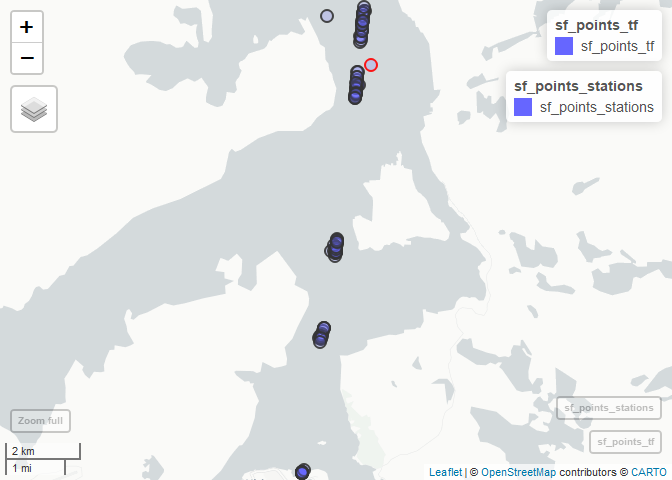<!-- -->

``` r
# Other examples
if (FALSE){
  df_tf %>% filter(StationCode_closest %in% "VT72" & Distance_closest < 10) %>% check_positions_tf("VT72")
  df_tf %>% filter(StationCode_closest %in% "VT23" & Distance_closest < 8) %>% check_positions_tf("VT23")
  df_tf %>% filter(StationCode_closest %in% "VT80" & Distance_closest < 20) %>% check_positions_tf("VT80")
  df_tf %>% filter(StationCode_closest %in% "VT45" & Distance_closest < 20) %>% check_positions_tf("VT45")
  df_tf %>% filter(StationCode_closest %in% "VT22" & Distance_closest < 20) %>% check_positions_tf("VT22")
  # df_tf %>% filter(StationCode_closest %in% "VT25" & Distance_closest < 20) %>% check_positions_tf("VT25")
}

# Other examples II
if (FALSE){
  df_tf %>% 
    filter(StationCode_closest %in% "VT76" & Distance_closest < 4) %>% 
    filter(TRIP == 8488 & year(Date) == 2018) %>% 
    check_positions_tf("VT76")
  
  df_tf %>% 
    filter(StationCode_closest %in% "VT22" & Distance_closest < 4) %>% 
    filter(TRIP == 8486 & year(Date) == 2018) %>% 
    check_positions_tf("VT22")
}
```

### Fix TRIP for Trollfjord

  - The trip number (TRIP) is unreliable, it restarts quite often  
  - We make TRIP2 which actiually identifies each trip

<!-- end list -->

``` r
# Fantasy - also looks bad
# But we don't care now, seems to work
# ggplot(df_fa, aes(x = Time, y = TRIP_NUMBER)) + geom_point()

ggplot(df_tf, aes(x = Time, y = TRIP)) + geom_point()
```

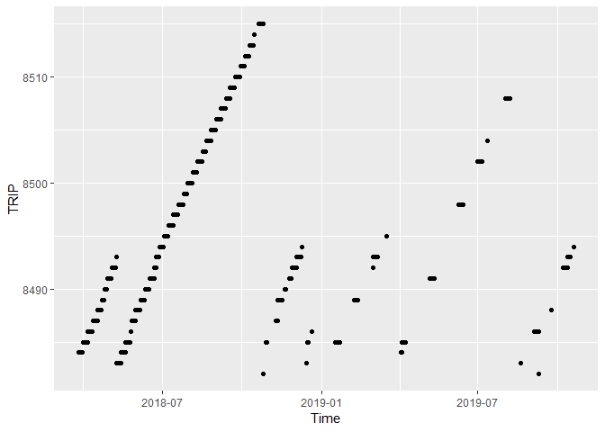<!-- -->

``` r
df_tf <- df_tf %>%
  arrange(Time) %>%
  ungroup() %>%
  mutate(Restart = ifelse(TRIP < lag(TRIP), 1, 0))
df_tf$Restart[1] <- 0
df_tf$Trip_batch = cumsum(df_tf$Restart)
df_tf <- df_tf %>%
  mutate(TRIP2 = Trip_batch*10000 + TRIP) %>%
  select(-Restart, -Trip_batch)
# df_tf %>% select(TRIP, Restart, Trip_batch)

ggplot(df_tf, aes(x = Time, y = TRIP2)) + geom_point()
```

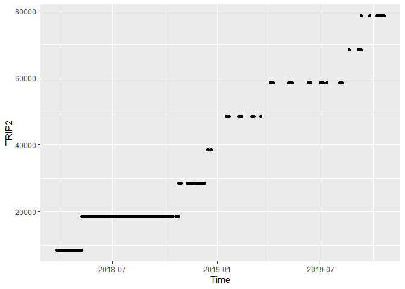<!-- -->

### Set StationCode for Trollfjord

``` r
df_tf <- df_tf %>%
  mutate(
    StationCode = 
      case_when(
        SAMPLE_AUTO_NUM == 0 ~ as.character(NA),
        StationCode_closest %in% "VT72" & Distance_closest < 10 ~ "VT72",
        StationCode_closest %in% "VT23" & Distance_closest <  8 ~ "VT23",
        StationCode_closest %in% "VT80" & Distance_closest < 20 ~ "VT80",
        StationCode_closest %in% "VT45" & Distance_closest < 20 ~ "VT45",
        StationCode_closest %in% "VT22" & Distance_closest < 4 ~ "VT22",
        StationCode_closest %in% "VT76" & Distance_closest < 4 ~ "VT76"
      )) %>%
  mutate(Year = year(Date)) %>%
  group_by(Year, StationCode, TRIP2) %>%
  mutate(Date_range = diff(range(Date)), 
         Time_range = diff(range(Time)),
         n = n()) %>%
  ungroup() %>%
  # Remove StationCode for a single øine of a single station (from plot in next chunk)
  # This had ~4 hours from measurement 2 to 3
  mutate(StationCode = 
           case_when(
             StationCode %in% "VT22" & TRIP2 %in% 8486 & Time_range > 5000 ~ as.character(NA),
             TRUE ~ StationCode))
```

### Time range

In days and in seconds

``` r
#
# Check Date_range - only zero *thumbs up*
# 
df_tf %>% filter(!is.na(StationCode)) %>% xtabs(~Date_range, .)
```

    ## Date_range
    ##   0 
    ## 254

``` r
# 
df_tf %>% 
  filter(!is.na(StationCode)) %>% 
  ggplot(aes(Date, Time_range)) + geom_point()
```

    ## Don't know how to automatically pick scale for object of type difftime. Defaulting to continuous.

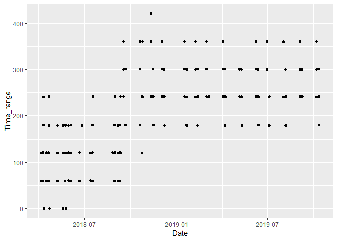<!-- -->

``` r
# Checked this one and removed one case - see "special case" in previous chunk
# df_tf %>%
#   filter(StationCode %in% "VT22" & TRIP2 ==   8486)
```

### Check StationCode for Trollfjord

``` r
if (FALSE){
  df_tf %>%
    xtabs(~paste(year(Date), TRIP) + addNA(StationCode), .)
}

if (FALSE){
  df_tf %>%
    filter(paste(year(Date), TRIP) == "2018 8488" & StationCode == "VT76")
  df_tf %>%
    filter(paste(year(Date), TRIP) == "2018 8486" & StationCode == "VT22")
}
```

## 4\. Aggregate ferrybox data to samples and add StationCode

### Aggregation

``` r
span <- function(x, na.rm = TRUE) diff(range(as.numeric(x), na.rm = na.rm))

df_tf_agg <- df_tf %>%
  rename(
    FB_Lon = GPS_LON,
    FB_Lat = GPS_LAT,
    FB_Temp = TEMP_INLET,
    FB_Salt = SAL_CTD,
    FB_Trip = TRIP2) %>%
  group_by(StationCode, FB_Trip) %>%
  summarise_at(vars(Date, Time, FB_Lon, FB_Lat, FB_Temp, FB_Salt), 
               list(mean=mean, range=span), 
               na.rm = TRUE) %>%
  filter(!is.na(StationCode))

df_fa_agg <- df_fa %>%
  mutate(Ferrybox = "fantasy") %>%
  rename(
    FB_Lon = GPS_LONGITUDE,
    FB_Lat = GPS_LATITUDE,
    FB_Temp = INLET_TEMPERATURE,
    FB_Salt = CTD_SALINITY,
    FB_Trip = TRIP_NUMBER) %>%
  group_by(StationCode, FB_Trip) %>%
  summarise_at(vars(Date, Time, FB_Lon, FB_Lat, FB_Temp, FB_Salt), 
               list(mean=mean, range=span), 
               na.rm = TRUE) %>%
  filter(!is.na(StationCode)) %>%
  mutate()

df_ferrybox <- bind_rows(
  df_tf_agg %>% mutate(Ferrybox = "trollfjord"),
  df_fa_agg %>% mutate(Ferrybox = "fantasy")
)
```

### Check Date\_range

If OK (it is), we replace the names Date\_mean, Time\_man with Date,
Time

``` r
# Date range
table(df_ferrybox$Date_range)
```

    ## 
    ##   0 
    ## 174

``` r
# ggplot(df_ferrybox, aes(Date_mean, Date_range, color = Ferrybox)) + geom_point()

# Time range
ggplot(df_ferrybox, aes(Date_mean, Time_range, color = Ferrybox)) + geom_point()
```

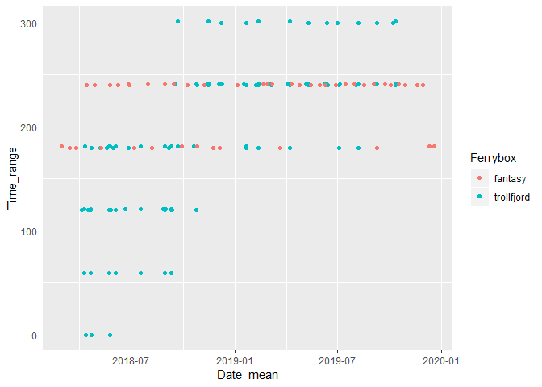<!-- -->

``` r
#
# Rename these columns
#
df_ferrybox <- df_ferrybox %>%
  rename(Date = Date_mean,
         Time = Time_mean)
```

### Check position range

Always
small

``` r
ggplot(df_ferrybox, aes(Date, FB_Lon_range, color = Ferrybox)) + geom_point()
```

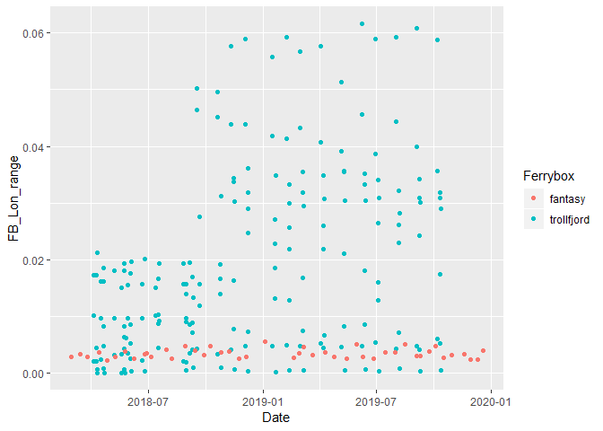<!-- -->

``` r
ggplot(df_ferrybox, aes(Date, FB_Lat_range, color = Ferrybox)) + geom_point()
```

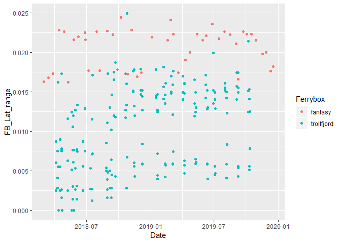<!-- -->

## 5\. Station positions and dates

Make
“df\_station\_date”

``` r
df_station_pos <- read_excel("Datasett/AqM_2017_2019_ØKOKYST_Ferrybox_ToR.xlsx", sheet = "StationPoint")

df_station_pos$StationCode <- factor(df_station_pos$StationCode, 
                                     levels = c("VT4", "VT12", "VT72", "VT80", "VT45", "VT22", 
                                                "VT23", "VT76", "VR23", "VR25"))

# table(addNA(df_station_pos$StationCode))

my_map <- map_data("world", "Norway")

ggplot(df_station_pos, aes(x = Longitude, y = Latitude)) +
  geom_text(aes(label = StationCode)) +
  annotation_map(my_map, fill = NA, color = "blue") + 
  labs(title = "Stations")
```

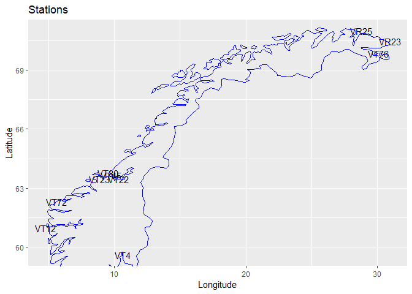<!-- -->

``` r
df_station_pos <- df_station_pos %>%
  mutate(Ferrybox = ifelse(StationCode %in% "VT4", "fantasy", "trollfjord"))

# One line per station/date combination in data
df_station_date <- df_aqm %>%
  count(StationCode, Date) %>%
  left_join(subset(df_station_pos, select = c(StationCode, Latitude, Longitude, Ferrybox)),
            by = "StationCode")

# df_station_date
# df_station_date %>% arrange(Date, StationCode)

ggplot(df_station_date, aes(Date, StationCode, color = Ferrybox)) +
  geom_point() +
  geom_vline(xintercept = seq(ymd("2018-01-01"), by = "month", length.out = 24), color = "grey60") +
  labs(title = "Stations/dates of bottle data")
```

<!-- -->

``` r
ggplot(df_tf %>% filter(SAMPLE_AUTO_NUM > 0), 
       aes(Date, SAMPLE_AUTO_NUM, color = SHIP_CODE)) +
  geom_point() +
  geom_vline(xintercept = seq(ymd("2018-01-01"), by = "month", length.out = 24), color = "grey60") +
  labs(title = "Stations/dates of all ferrybox 'sample' data")
```

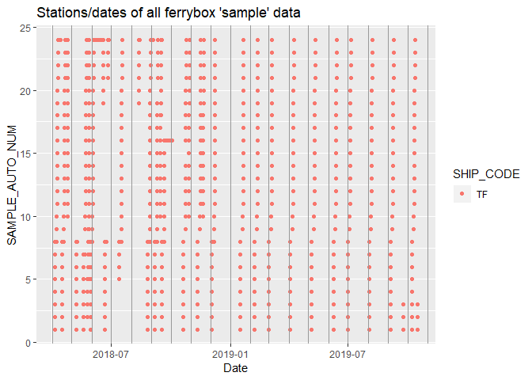<!-- -->

``` r
ggplot(df_tf_agg, aes(Date_mean, StationCode)) +
  geom_point() +
  geom_vline(xintercept = seq(ymd("2018-01-01"), by = "month", length.out = 24), color = "grey60") +
  labs(title = "Stations/dates of bottle data") +
  labs(title = "Stations/dates of Trollfjord ferrybox 'sample' data linked to stations")
```

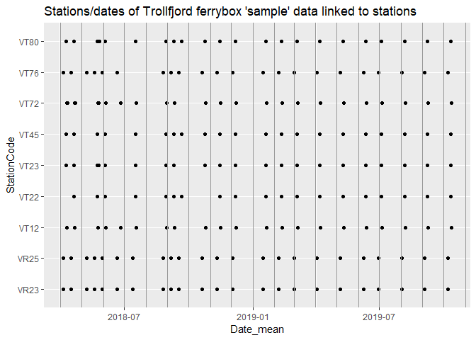<!-- -->

### Check samples for example months, Trollfjord

  - Bottle data = red points  
  - Ferrybox data = open circles

<!-- end list -->

``` r
year <- 2018

for (month in 4:8){
  gg <- ggplot(df_station_date %>% 
                 filter(year(Date) == 2018 & month(Date) == month & Ferrybox == "trollfjord"), 
               aes(Date, StationCode)) +
    # Bottle data = red points:
    geom_point(color = "red") +
    # Ferrybox data = open circles:
    geom_point(data = df_ferrybox %>% 
                 filter(year(Date) == 2018 & month(Date) == month & Ferrybox == "trollfjord"),
               shape = 1, size = 3) +
    # Show the entire month:
    scale_x_date(limits = ymd(c(paste0("2018-", month, "-01"),
                                paste0("2018-", month + 1, "-01")
                                ))
    )
  print(gg)
}
```

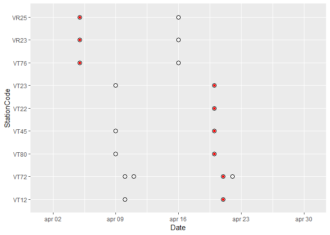<!-- -->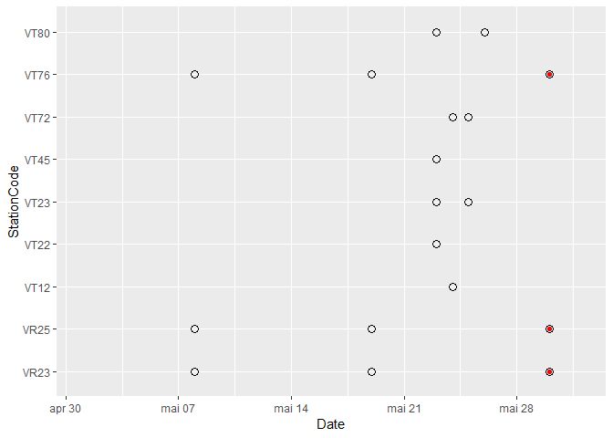<!-- -->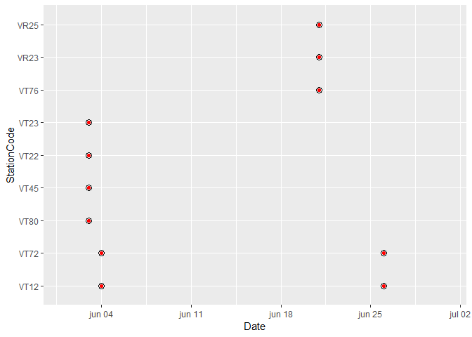<!-- -->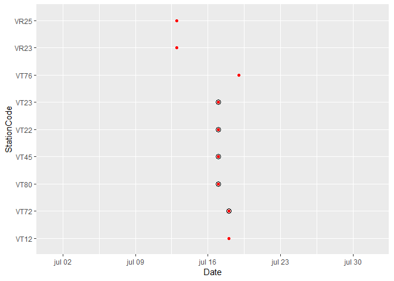<!-- -->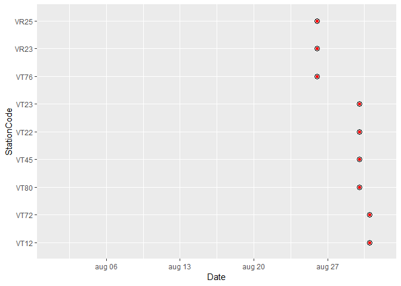<!-- -->

### Check samples for example months, Fantasy

  - Bottle data = red points  
  - Ferrybox data = open circles

<!-- end list -->

``` r
year <- 2018
month <- 1:12
gg <- ggplot(df_station_date %>% 
               filter(year(Date) == 2018 & month(Date) %in% month & Ferrybox == "fantasy"), 
             aes(Date, StationCode)) +
  # Bottle data = red points
  geom_point(color = "red") +
  # Ferrybox data = open circles
  geom_point(data = df_ferrybox %>% 
               filter(year(Date) == 2018 & month(Date) %in% month & Ferrybox == "fantasy"),
             shape = 1, size = 3)
```

## 6\. Add ferrybox data to Aquamonitor bottle data

### Function for getting Ferrybox time closest to the given ‘time’

``` r
# Returns a data frame
get_closest_day <- function(date, station, vessel, ferryboxdata){
  ferryboxdata %>%
    filter(StationCode %in% station & Ferrybox %in% vessel) %>%
    mutate(Days_diff = (Date - date)/ddays(1)) %>%                     # difference in number of days
    filter(abs(Days_diff) %in% min(abs(Days_diff), na.rm = TRUE)) %>%  # get the smallest difference
    rename(FB_Date = Date) %>%  # To avoid confusion
    mutate(Bottle_date = date)
    }

# Test
# get_closest_day(ymd("2018-08-28"), "VT22", "trollfjord", df_ferrybox)
# get_closest_day(ymd("2018-01-01"), "VT22", "trollfjord", df_ferrybox)
```

### Get ferrybox data for each of the stations/dates in bottle data

``` r
data_for_join <- df_station_date %>%
  count(Date, StationCode, Ferrybox) %>%
  select(-n) %>%
  as.list() %>% 
  purrr::pmap_dfr(~get_closest_day(..1, ..2, ..3, df_ferrybox))

head(data_for_join)
```

    ## # A tibble: 6 x 17
    ## # Groups:   StationCode [6]
    ##   StationCode FB_Trip FB_Date    Time                FB_Lon_mean FB_Lat_mean
    ##   <chr>         <dbl> <date>     <dttm>                    <dbl>       <dbl>
    ## 1 VT76           8486 2018-04-05 2018-04-05 12:40:03       30.1         69.8
    ## 2 VT80           8486 2018-04-09 2018-04-09 01:26:42        9.33        63.8
    ## 3 VT45           8486 2018-04-09 2018-04-09 02:38:23        9.77        63.6
    ## 4 VT22           8488 2018-04-20 2018-04-20 04:04:53       10.4         63.4
    ## 5 VT72           8486 2018-04-10 2018-04-10 01:03:40        5.58        62.3
    ## 6 VT23           8486 2018-04-09 2018-04-09 11:27:10        8.87        63.5
    ## # ... with 11 more variables: FB_Temp_mean <dbl>, FB_Salt_mean <dbl>,
    ## #   Date_range <dbl>, Time_range <dbl>, FB_Lon_range <dbl>, FB_Lat_range <dbl>,
    ## #   FB_Temp_range <dbl>, FB_Salt_range <dbl>, Ferrybox <chr>, Days_diff <dbl>,
    ## #   Bottle_date <date>

### Check difference in days between bottle and ferrybox sample

Either 0 days difference, or at least 14  
\- That means we can just keep the 0 day difference
data

``` r
ggplot(data_for_join, aes(Days_diff)) + geom_histogram(binwidth = 1)
```

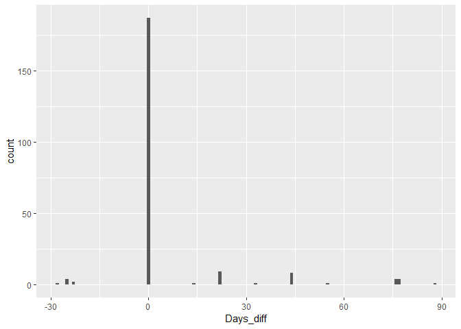<!-- -->

``` r
# xtabs(~Days_diff , data_for_join)
```

### Add to bottle data

``` r
# names(data_for_join)
# names(df_aqm)

# Prepare file for 
data_for_join2 <- data_for_join %>%
  filter(abs(Days_diff) <= 1) %>%    # we accpt one dday difference (all are zero in this case)
  rename(FB_Time = Time,
         FB_Lon = FB_Lon_mean,
         FB_Lat = FB_Lat_mean,
         FB_days_diff = Days_diff) %>%
  select(-FB_Trip, -Date_range, -Time_range, -FB_Lon_range, -FB_Lat_range)

if (!"FB_Temp_mean" %in% names(df_aqm)){
  df_aqm <- df_aqm %>%
    mutate(Ferrybox = ifelse(StationCode %in% "VT4", "fantasy", "trollfjord")) %>%
    # Add all ferrybox data
    left_join(data_for_join2, 
              by = c("Ferrybox", "StationCode", "Date" = "Bottle_date"))
}
```

    ## Warning: Column `StationCode` joining factor and character vector, coercing into
    ## character vector

``` r
# Station sequence (along the coast)
# table(addNA(df_aqm$StationCode))

sts <- c("VT4", "VT12", "VT72", "VT23", "VT80", "VT45", "VT22", "VR25", "VR23", "VT76")
# Check
# unique(df_aqm$StationCode) %in% sts

df_aqm <- df_aqm %>%
  mutate(StationCode = factor(StationCode, levels = sts))
```

### Check

``` r
df_aqm %>%
  mutate(`Has FB data` = ifelse(is.na(FB_Temp_mean), "No", "Yes")) %>%
  ggplot(aes(Date, StationCode, color = `Has FB data`)) +
  geom_point() +
  scale_color_brewer(palette = "Set1") +
  geom_vline(xintercept = seq(ymd("2018-01-01"), by = "month", length.out = 24), color = "grey60") +
  labs(title = "Stations/dates of bottle data") +
  theme_minimal()
```

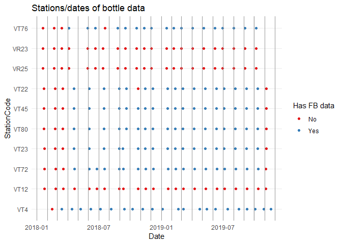<!-- -->

## Check ferrybox *log* data
