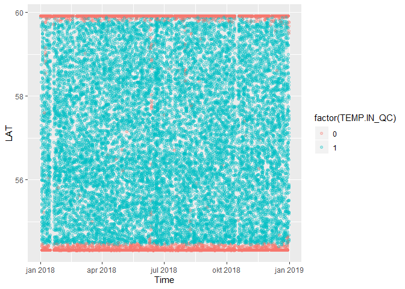
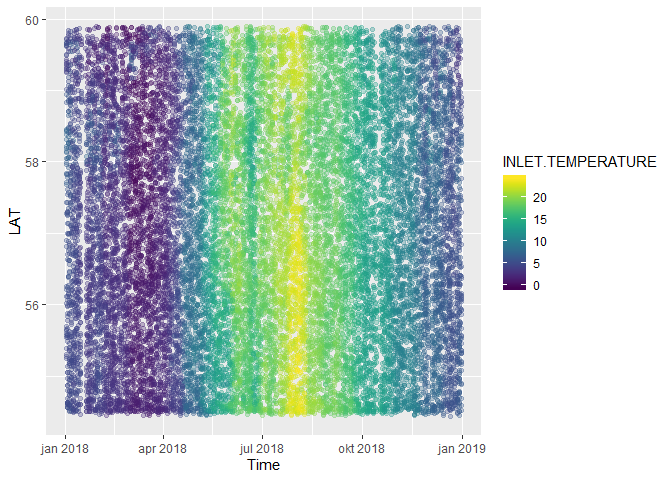
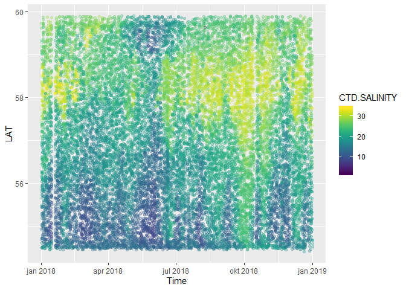
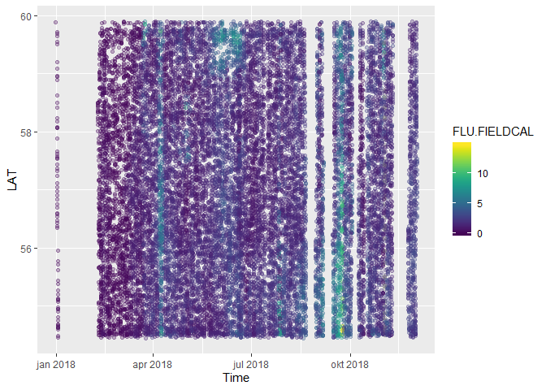
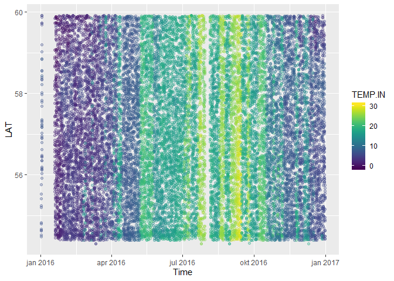
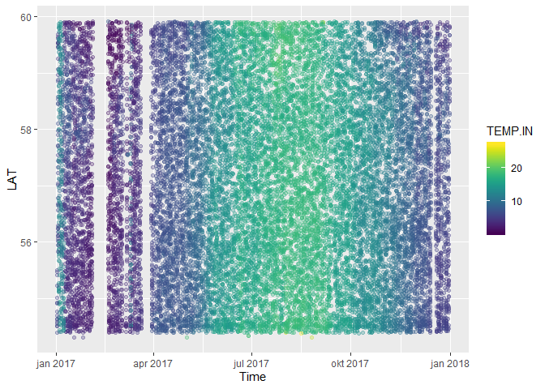
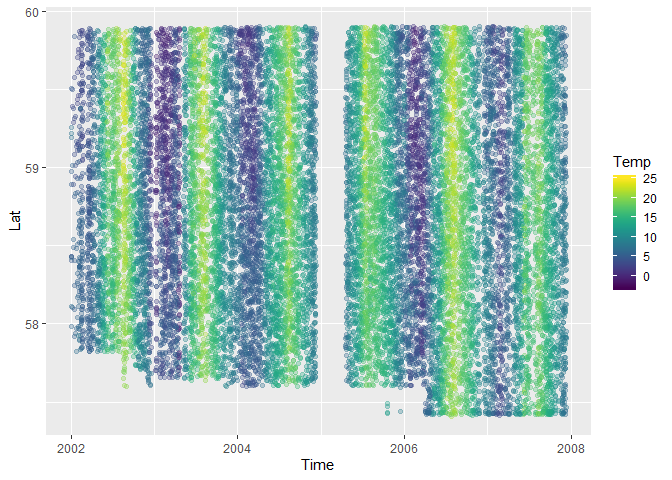
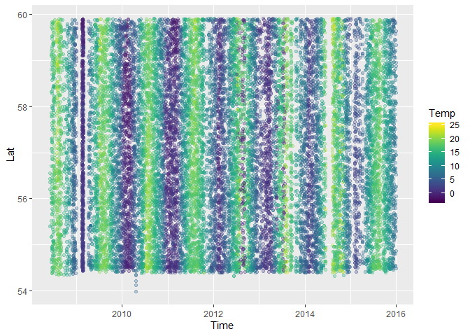
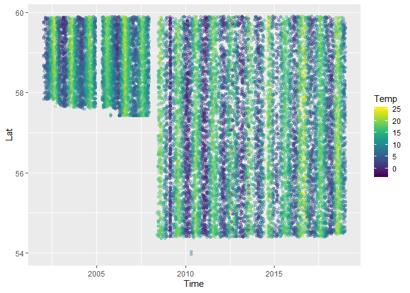
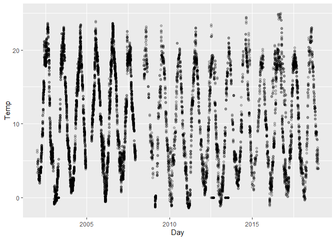

## 1. Libraries  

```r
library(R.matlab)     # read matlab files
```

```
## Warning: package 'R.matlab' was built under R version 3.6.2
```

```
## R.matlab v3.6.2 (2018-09-26) successfully loaded. See ?R.matlab for help.
```

```
## 
## Attaching package: 'R.matlab'
```

```
## The following objects are masked from 'package:base':
## 
##     getOption, isOpen
```

```r
library(dplyr)
```

```
## 
## Attaching package: 'dplyr'
```

```
## The following objects are masked from 'package:stats':
## 
##     filter, lag
```

```
## The following objects are masked from 'package:base':
## 
##     intersect, setdiff, setequal, union
```

```r
library(purrr)
library(ggplot2)
library(viridis)
```

```
## Loading required package: viridisLite
```

```r
library(readr)
library(lubridate)
```

```
## 
## Attaching package: 'lubridate'
```

```
## The following object is masked from 'package:base':
## 
##     date
```

## 2. Test read from Matlab (Fantasy 2018)   
### Read  

```r
X <- R.matlab::readMat("Datasett/FB matlab/FA2018.mat")

# Check object
str(X, 1)
```

```
## List of 4
##  $ QC    :List of 1
##   ..- attr(*, "dim")= int [1:3] 1 1 1
##   ..- attr(*, "dimnames")=List of 3
##  $ cal   :List of 3
##   ..- attr(*, "dim")= int [1:3] 3 1 1
##   ..- attr(*, "dimnames")=List of 3
##  $ sample:List of 3
##   ..- attr(*, "dim")= int [1:3] 3 1 1
##   ..- attr(*, "dimnames")=List of 3
##  $ sensor:List of 33
##   ..- attr(*, "dim")= int [1:3] 33 1 1
##   ..- attr(*, "dimnames")=List of 3
##  - attr(*, "header")=List of 3
```

```r
str(X$QC, 3)
```

```
## List of 1
##  $ :List of 16
##   ..$ : num [1:515151, 1] 0 0 0 0 0 0 0 0 0 0 ...
##   ..$ : num [1:515151, 1] 0 0 0 0 0 0 0 0 0 0 ...
##   ..$ : num [1:515151, 1] 0 0 0 0 0 0 0 0 0 0 ...
##   ..$ : num [1:515151, 1] 0 0 0 0 0 0 0 0 0 0 ...
##   ..$ : num [1:515151, 1] 0 0 0 0 0 0 0 0 0 0 ...
##   ..$ : num [1:515151, 1] 1 1 1 1 1 0 0 0 0 0 ...
##   ..$ : num [1:515151, 1] 1 1 1 1 1 0 0 0 0 0 ...
##   ..$ : num [1:515151, 1] 1 1 1 1 1 0 0 0 0 0 ...
##   ..$ : num [1:515151, 1] 1 1 1 1 1 0 0 0 0 0 ...
##   ..$ : num [1:515151, 1] 1 1 1 1 1 0 0 0 0 0 ...
##   ..$ : num [1:515151, 1] 1 1 1 1 1 0 0 0 0 0 ...
##   ..$ : num [1:515151, 1] 1 1 1 1 1 0 0 0 0 0 ...
##   ..$ : num [1:515151, 1] 1 1 1 1 1 0 0 0 0 0 ...
##   ..$ : num [1:515151, 1] 1 1 1 1 1 1 1 1 1 1 ...
##   ..$ : num [1:515151, 1] 1 1 1 1 1 1 1 1 1 1 ...
##   ..$ : num [1, 1:515151] 1 1 1 1 1 0 0 0 0 0 ...
##   ..- attr(*, "dim")= int [1:3] 16 1 1
##   ..- attr(*, "dimnames")=List of 3
##   .. ..$ : chr [1:16] "VALPORTS" "AUTOCO2" "AUTOPH" "AUTOCDOM" ...
##   .. ..$ : NULL
##   .. ..$ : NULL
##  - attr(*, "dim")= int [1:3] 1 1 1
##  - attr(*, "dimnames")=List of 3
##   ..$ : chr "DM"
##   ..$ : NULL
##   ..$ : NULL
```

```r
str(X$cal, 3)
```

```
## List of 3
##  $ :List of 2
##   ..$ : num [1, 1] 0.802
##   ..$ : num [1, 1] 0
##   ..- attr(*, "dim")= int [1:3] 2 1 1
##   ..- attr(*, "dimnames")=List of 3
##   .. ..$ : chr [1:2] "slope" "offset"
##   .. ..$ : NULL
##   .. ..$ : NULL
##  $ :List of 2
##   ..$ : num [1, 1] 1
##   ..$ : num [1, 1] 0
##   ..- attr(*, "dim")= int [1:3] 2 1 1
##   ..- attr(*, "dimnames")=List of 3
##   .. ..$ : chr [1:2] "slope" "offset"
##   .. ..$ : NULL
##   .. ..$ : NULL
##  $ :List of 2
##   ..$ : num [1, 1] 1
##   ..$ : num [1, 1] 0
##   ..- attr(*, "dim")= int [1:3] 2 1 1
##   ..- attr(*, "dimnames")=List of 3
##   .. ..$ : chr [1:2] "slope" "offset"
##   .. ..$ : NULL
##   .. ..$ : NULL
##  - attr(*, "dim")= int [1:3] 3 1 1
##  - attr(*, "dimnames")=List of 3
##   ..$ : chr [1:3] "FLUCAL" "CDOMCALDOC" "CDOMCALACDOM"
##   ..$ : NULL
##   ..$ : NULL
```

```r
str(X$sensor, 2)
```

```
## List of 33
##  $ : num [1:515151, 1] 737060 737060 737060 737060 737060 ...
##  $ : num [1:515151, 1] 59.9 59.9 59.9 59.9 59.9 ...
##  $ : num [1:515151, 1] 10.6 10.6 10.6 10.7 10.7 ...
##  $ : num [1:515151, 1] 1 1 1 1 1 1 1 1 1 1 ...
##  $ : num [1:515151, 1] 0 0 0 0 0 0 0 0 0 0 ...
##  $ : num [1:515151, 1] 0 0 0 0 0 0 0 0 0 0 ...
##  $ : num [1:515151, 1] 1 1 1 1 1 1 1 1 1 1 ...
##  $ : num [1:515151, 1] 10998 10998 10998 10998 10998 ...
##  $ : num [1:515151, 1] -999 -999 -999 -999 -999 -999 -999 -999 -999 -999 ...
##  $ : num [1:515151, 1] 0.015 0.015 0 0.015 0.015 0 0 0 0 0 ...
##  $ : num [1:515151, 1] 4.23 4 3.54 3.62 3.62 ...
##  $ : num [1:515151, 1] 4.43 4.51 4.67 4.51 4.29 ...
##  $ : num [1:515151, 1] 27.3 27.4 27.5 27.3 27.1 ...
##  $ : num [1:515151, 1] 0 0 0 0 0 0 0 0 0 0 ...
##  $ : num [1:515151, 1] 0 0 0 0 0 0 0 0 0 0 ...
##  $ : num [1:515151, 1] 0.25 0.3 0.3 0.1 0 0.3 0.2 0.25 0.3 0.35 ...
##  $ : num [1:515151, 1] 3.61 3.46 3.34 3.65 3.29 ...
##  $ : num [1:243585, 1] NaN 18 17.9 NaN 17.9 17.9 NaN 17.9 17.8 NaN ...
##  $ : num [1:243585, 1] NaN 27.5 27.3 NaN 27.1 ...
##  $ : num [1:515151, 1] 77.1 76.5 75.6 75.8 75.8 ...
##  $ : num [1:515151, 1] 296 294 291 292 292 ...
##  $ : num [1:515151, 1] NaN 835 838 NaN 843 ...
##  $ : num [1:515151, 1] NaN 0.3 0.3 NaN 0.3 0.3 NaN 0.3 0.3 NaN ...
##  $ : num [1:515151, 1] NaN 0.85 0.83 NaN 0.84 0.84 NaN 0.83 0.83 NaN ...
##  $ : num [1:515151, 1] NaN 18 17.9 NaN 17.9 17.9 NaN 17.9 17.8 NaN ...
##  $ : num [1:515151, 1] NaN 14 14.4 NaN 14.3 ...
##  $ : num [1:515151, 1] NaN 17.3 17.3 NaN 17.2 17.2 NaN 17.2 17.2 NaN ...
##  $ : num [1:515151, 1] NaN 1008 1007 NaN 1008 ...
##  $ : num [1:515151, 1] 1 2 3 4 5 6 7 8 9 10 ...
##  $ : num [1:515151, 1] 0.015 0.015 0 0.015 0.015 0 0 0 0 0 ...
##  $ : num [1:515151, 1] 0.012 0.012 0 0.012 0.012 ...
##  $ : num [1:515151, 1] 0.25 0.3 0.3 0.1 0 0.3 0.2 0.25 0.3 0.35 ...
##  $ : num [1:515151, 1] 0.25 0.3 0.3 0.1 0 0.3 0.2 0.25 0.3 0.35 ...
##  - attr(*, "dim")= int [1:3] 33 1 1
##  - attr(*, "dimnames")=List of 3
##   ..$ : chr [1:33] "TIME" "LAT" "LON" "PUMP" ...
##   ..$ : NULL
##   ..$ : NULL
```

```r
# Check each variable
# PCO2.TEMPERATURE and PCO2.SALINITY have only length 243858, the others 515151
nrows <- map_int(X$sensor, ~dim(.)[1])
data.frame(dimnames(X$sensor)[[1]], nrows)
```

```
##    dimnames.X.sensor...1..  nrows
## 1                     TIME 515151
## 2                      LAT 515151
## 3                      LON 515151
## 4                     PUMP 515151
## 5                      MAN 515151
## 6                      AUT 515151
## 7                 DATAFLAG 515151
## 8              TRIP.NUMBER 515151
## 9                     TURB 515151
## 10                     FLU 515151
## 11       INLET.TEMPERATURE 515151
## 12         CAB.TEMPERATURE 515151
## 13            CTD.SALINITY 515151
## 14              OXYGEN.CAB 515151
## 15           OXYGENSAT.CAB 515151
## 16                    CDOM 515151
## 17                   CYANO 515151
## 18        PCO2.TEMPERATURE 243585
## 19           PCO2.SALINITY 243585
## 20            OXYGENSAT.IN 515151
## 21               OXYGEN.IN 515151
## 22                    PCO2 515151
## 23         PCO2.WATER.FLOW 515151
## 24     PCO2.WATER.PRESSURE 515151
## 25  PCO2.WATER.TEMPERATURE 515151
## 26                   Tdiff 515151
## 27    PCO2.AIR.TEMPERATURE 515151
## 28       PCO2.AIR.PRESSURE 515151
## 29                      ID 515151
## 30               FLU.BCORR 515151
## 31            FLU.FIELDCAL 515151
## 32                     DOC 515151
## 33                   ACDOM 515151
```

```r
# Make data frame
sel <- nrows == max(nrows)   # pick only variables with length 515151
FA2018 <- bind_cols(X[["sensor"]][sel])
names(FA2018) <- dimnames(X$sensor)[[1]][sel]

# Convert from matlab time
FA2018$Time <- as.POSIXct((FA2018$TIME - 719529)*86400, origin = "1970-01-01", tz = "UTC")

# Add QC for some vars
# Variable 16 has dimensions [1, 1:515151] so we pick only 1-15
QC <- bind_cols(X$QC[[1]][1:15])
names(QC) <- dimnames(X$QC[[1]])[[1]][1:15]
# Pick QC vars
# dimnames(X$QC[[1]])[[1]] %>% dput()
vars <- c("TEMP.IN", "TURB", "SAL", "TEMP", "FLU", "CDOM", "PCO2")
QC_foradd <- QC[vars]
names(QC_foradd) <- paste0(names(QC_foradd), "_QC")

# Add QC to FA2018
FA2018 <- bind_cols(FA2018, QC_foradd)
```


```r
names(FA2018)
```

```
##  [1] "TIME"                   "LAT"                    "LON"                   
##  [4] "PUMP"                   "MAN"                    "AUT"                   
##  [7] "DATAFLAG"               "TRIP.NUMBER"            "TURB"                  
## [10] "FLU"                    "INLET.TEMPERATURE"      "CAB.TEMPERATURE"       
## [13] "CTD.SALINITY"           "OXYGEN.CAB"             "OXYGENSAT.CAB"         
## [16] "CDOM"                   "CYANO"                  "OXYGENSAT.IN"          
## [19] "OXYGEN.IN"              "PCO2"                   "PCO2.WATER.FLOW"       
## [22] "PCO2.WATER.PRESSURE"    "PCO2.WATER.TEMPERATURE" "Tdiff"                 
## [25] "PCO2.AIR.TEMPERATURE"   "PCO2.AIR.PRESSURE"      "ID"                    
## [28] "FLU.BCORR"              "FLU.FIELDCAL"           "DOC"                   
## [31] "ACDOM"                  "Time"                   "TEMP.IN_QC"            
## [34] "TURB_QC"                "SAL_QC"                 "TEMP_QC"               
## [37] "FLU_QC"                 "CDOM_QC"                "PCO2_QC"
```

### Test plots   

```r
FA2018 %>% 
  filter(LAT > 45 & LAT < 60) %>% 
  sample_n(20000) %>%
  ggplot(aes(Time, LAT, color = factor(TEMP.IN_QC))) + 
  geom_point(alpha = 0.3)
```

<!-- -->

```r
FA2018 %>% 
  filter(TEMP.IN_QC == 1 & LAT > 45 & LAT < 60) %>% 
  sample_n(20000) %>%
  ggplot(aes(Time, LAT, color = INLET.TEMPERATURE)) + 
  geom_point(alpha = 0.3) +
  scale_color_viridis()
```

<!-- -->

```r
FA2018 %>% 
  filter(SAL_QC == 1 & LAT > 45 & LAT < 60) %>% 
  sample_n(20000) %>%
  ggplot(aes(Time, LAT, color = CTD.SALINITY)) + 
  geom_point(alpha = 0.3) +
  scale_color_viridis()
```

<!-- -->

```r
FA2018 %>% 
  filter(FLU_QC == 1 & LAT > 45 & LAT < 60) %>% 
  sample_n(20000) %>%
  ggplot(aes(Time, LAT, color = FLU.FIELDCAL)) + 
  geom_point(alpha = 0.3) +
  scale_color_viridis()
```

<!-- -->

## 3. Read Matlab files  2016-2017  

### Make FA2016 and FA2017  
Note: QC variables differ  

```r
#
# 2016
#
X <- R.matlab::readMat("Datasett/FB matlab/FA2016.mat")
# Length of each variable
nrows <- map_int(X$sensor, ~dim(.)[1])
# data.frame(dimnames(X$sensor)[[1]], nrows)
# Make data frame
sel <- nrows == max(nrows)   # pick only long variables (actually all are long in this case)
FA2016 <- bind_cols(X[["sensor"]][sel])
names(FA2016) <- dimnames(X$sensor)[[1]][sel]
# Convert from matlab time
FA2016$Time <- as.POSIXct((FA2016$TIME - 719529)*86400, origin = "1970-01-01", tz = "UTC")
# Add QC for some vars
# but only TURB and FLU has any 1's
QC <- bind_cols(X$QC[[1]][1:15])
names(QC) <- dimnames(X$QC[[1]])[[1]][1:15]
# map(QC, table)

# Pick QC vars
# dimnames(X$QC[[1]])[[1]] %>% dput()
vars <- c("TURB", "FLU")
QC_foradd <- QC[vars]
names(QC_foradd) <- paste0(names(QC_foradd), "_QC")
# Add QC to FA2016
FA2016 <- bind_cols(FA2016, QC_foradd)

#
# 2017
#
X <- R.matlab::readMat("Datasett/FB matlab/FA2017.mat")
# Length of each variable
nrows <- map_int(X$sensor, ~dim(.)[1])
# data.frame(dimnames(X$sensor)[[1]], nrows)
# Make data frame
sel <- nrows == max(nrows)   # pick only long variables (actually all are long in this case)
FA2017 <- bind_cols(X[["sensor"]][sel])
names(FA2017) <- dimnames(X$sensor)[[1]][sel]
# Convert from matlab time
FA2017$Time <- as.POSIXct((FA2017$TIME - 719529)*86400, origin = "1970-01-01", tz = "UTC")
# Add QC for some vars
# but only VAL, TURB and FLU has any 1's
QC <- bind_cols(X$QC[[1]][1:15])
names(QC) <- dimnames(X$QC[[1]])[[1]][1:15]
# map(QC, table)
# Pick QC vars
# dimnames(X$QC[[1]])[[1]] %>% dput()
vars <- c("VAL", "TURB", "FLU")
QC_foradd <- QC[vars]
names(QC_foradd) <- paste0(names(QC_foradd), "_QC")
# Add QC to FA2016
FA2017 <- bind_cols(FA2017, QC_foradd)
```

### Test plots of temperature  

```r
# names(FA2016)
# names(FA2017)
# names(FA2018)
# 
# xtabs(~TURB_QC + FLU_QC, FA2016)
# xtabs(~PUMP + FLU_QC + OBSTR, FA2016)

FA2016 %>% 
  filter(PUMP == 1 & OBSTR == 0 & LAT > 45 & LAT < 60) %>% 
  sample_n(20000) %>%
  ggplot(aes(Time, LAT, color = TEMP.IN)) + 
  geom_point(alpha = 0.3) +
  scale_color_viridis()
```

<!-- -->

```r
FA2017 %>% 
  filter(PUMP == 1 & OBSTR == 0 & LAT > 45 & LAT < 60) %>% 
  sample_n(20000) %>%
  ggplot(aes(Time, LAT, color = TEMP.IN)) + 
  geom_point(alpha = 0.3) +
  scale_color_viridis()
```

<!-- -->

## 4. Read csv files 2002-2007  
Color Festival  

### Read all   
15 seconds or so

```r
yrs <- 2002:2007
fn_pattern <- "K:/Avdeling/214-Oseanografi/DHJ/Data/Ferrybox csv/CF%i.csv"
fns <- sprintf(fn_pattern, yrs)

# Check
# read_csv(fns[1], n_max = 100)

# Don't actually know what the two FLU are, probably raw numbers and field-calibrated ones
names(fns) <- yrs
dat_list1 <- fns %>% map(read_csv, 
                         col_names = c("TIME", "Lon", "Lat", "Temp", 
                                       "Sal", "Flu1", "Flu"))   

dat1 <- bind_rows(dat_list1)

# Convert from matlab time
dat1$Time <- as.POSIXct((dat1$TIME - 719529)*86400, origin = "1970-01-01", tz = "UTC")

# Check variable names:  
# dat_list1 %>% map(names)

# dat_list[[8]] %>% head()

# summary(dat1)

dat1 <- dat1 %>%
  mutate(d_seconds = (Time - lag(Time))/dseconds(1),
         d_lat = Lat - lag(Lat),
         Northbound = case_when(
           is.na(d_lat) ~ as.logical(NA),
           d_seconds > 300 ~ as.logical(NA),
           d_lat >= 0 ~ TRUE,
           d_lat < 0 ~ FALSE)
         ) %>%
  select(Time, Lat, Lon, Temp, Sal, Northbound)
```

### Test plot

```r
dat1 %>% 
  sample_n(20000) %>%
  ggplot(aes(Time, Lat, color = Temp)) + 
  geom_point(alpha = 0.3) +
  scale_color_viridis(limits = c(-3, 25))
```

<!-- -->

```r
# dat1 %>% 
#   sample_n(20000) %>%
#   ggplot(aes(Time, Lat, color = Northbound)) + 
#   geom_point(alpha = 0.3)
```

## 5. Read csv files 2008-2015 

### Read all  
Already cleaned  

```r
yrs <- 2008:2015

fn_pattern <- "K:/Avdeling/214-Oseanografi/DHJ/Data/Fantasy_clean_csv/Fantasy_%i.csv"
fns <- sprintf(fn_pattern, yrs)

names(fns) <- yrs
dat_list2 <- fns %>% map(read_csv)

dat2 <- bind_rows(dat_list2) %>%
  select(Time, Lat, Lon, Temp, Sal, Northbound)

# Check variable names:  
# dat_list2 %>% map(names)

# dat_list[[8]] %>% head()
```

### Test plot

```r
dat2 %>% 
  filter(Temp > (-4) & Temp <= 25) %>%
  sample_n(20000) %>%
  ggplot(aes(Time, Lat, color = Temp)) + 
  geom_point(alpha = 0.3) +
  scale_color_viridis(limits = c(-3, 25))
```

<!-- -->

## 6. Prepare 2016-2018 data  

### 2016-2017  

```r
dat3 <- bind_rows(FA2016, FA2017) %>%
  filter(PUMP == 1 & OBSTR == 0 & LAT > 45 & LAT < 60) %>% 
  rename(Lat = LAT, Lon = LON, Temp = TEMP.IN, Sal = SAL) %>%
  mutate(d_seconds = (Time - lag(Time))/dseconds(1),
         d_lat = Lat - lag(Lat),
         Northbound = case_when(
           is.na(d_lat) ~ as.logical(NA),
           d_seconds > 300 ~ as.logical(NA),
           d_lat >= 0 ~ TRUE,
           d_lat < 0 ~ FALSE)
         ) %>%
  select(Time, Lat, Lon, Temp, Sal, Northbound)
```

### 2018  

```r
dat4 <- FA2018 %>%
  filter(TEMP.IN_QC == 1 & LAT > 45 & LAT < 60) %>% 
  rename(Lat = LAT, Lon = LON, Temp = INLET.TEMPERATURE, Sal = CTD.SALINITY) %>%
  mutate(Sal = ifelse(SAL_QC == 0, NA, Sal)) %>%
  mutate(d_seconds = (Time - lag(Time))/dseconds(1),
         d_lat = Lat - lag(Lat),
         Northbound = case_when(
           is.na(d_lat) ~ as.logical(NA),
           d_seconds > 300 ~ as.logical(NA),
           d_lat >= 0 ~ TRUE,
           d_lat < 0 ~ FALSE)
         ) %>%
  select(Time, Lat, Lon, Temp, Sal, Northbound)
```

## 7. Combine  

```r
dat <- bind_rows(dat1, dat2, dat3, dat4)
```

## 8. Check   

### Temperature, all latitudes  

```r
dat %>% 
  filter(Temp > (-4) & Temp <= 25) %>%
  sample_n(20000) %>%
  ggplot(aes(Time, Lat, color = Temp)) + 
  geom_point(alpha = 0.3) +
  scale_color_viridis(limits = c(-3, 25))
```

<!-- -->

### Temp at ca Dk1  
Ca 59.832  
Note some suspicious zero values in 2012-2013 + high values inb 2016  

```r
df <- dat %>%
  filter(Lat > 59.827 & Lat < 59.837) %>%
  filter(Temp > (-4) & Temp <= 25) %>%
  mutate(Day = round_date(Time),
         North = Lat > lag(Lat)) %>%
  group_by(Day, Northbound) %>%
  summarise(Temp = mean(Temp, na.rm = TRUE))

ggplot(df, aes(Day, Temp)) +
  geom_point(alpha = 0.2)
```

<!-- -->

## 9. Save  

```r
saveRDS(dat, "Data/31_Colorline_2002_2018.rds")
```

